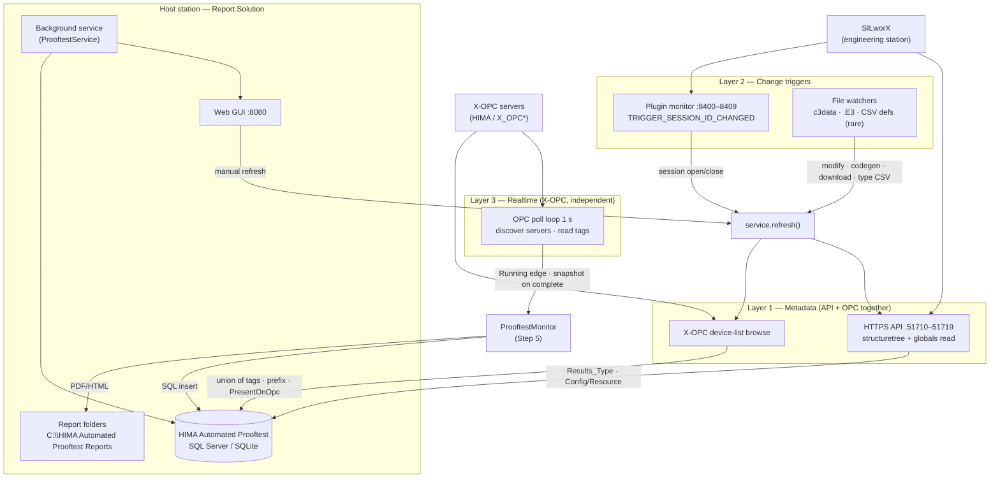

# Architecture overview (G-22)

Three parallel layers on the host station. Device-list refresh queries SILworX API and X-OPC **at the same time**.

## One-line summary

**REST API** and **X-OPC** both feed the device list on every refresh, then merge. **Plugin + file watchers** detect when metadata may have changed. **X-OPC poll** runs independently for live values, prooftest detection, snapshots, and reports.
