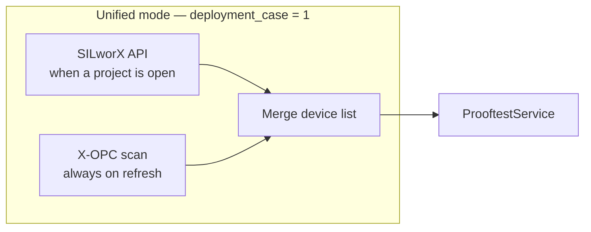

# Unified mode (engineering or HMI)

Former Case 1 vs Case 2 is one operating mode. Device list always starts **API and OPC together**.

| Station | SILworX | Device list source |
|---------|---------|-------------------|
| Engineering, project open | Same PC | API + OPC together (`api+opc`) |
| No project / API down / HMI | Optional or absent | OPC (`opc_fallback`); API still attempted in parallel |

Configured via `solution.ini` → `deployment_case = 1` (legacy `2` is ignored).
