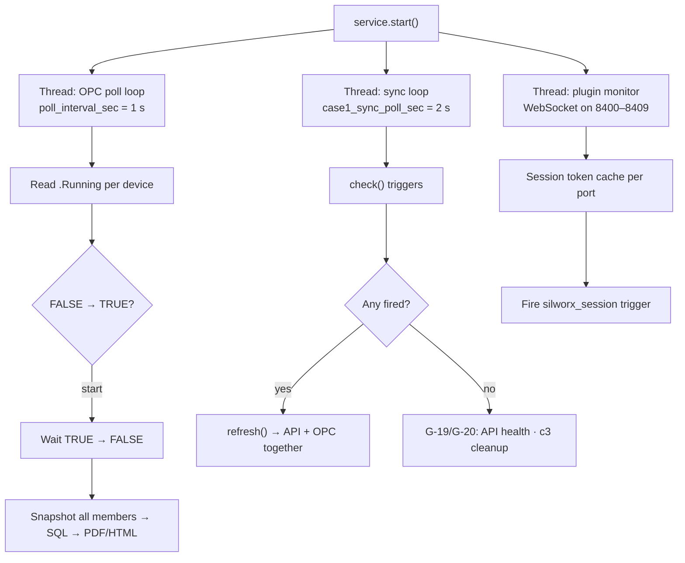

# Service threads

The background service runs three concurrent activities after `service.start()`.

| Thread | Interval | Purpose | Blocks SILworX API? |
|--------|----------|---------|---------------------|
| OPC poll | 1 s | Realtime reads, prooftest edges, reports | No |
| Sync loop | 2 s | Triggers, refresh, API health, c3 cleanup | Can call API on refresh |
| Plugin monitor | Continuous | Session open/close on all 10 plugin ports | No (WebSocket only) |
