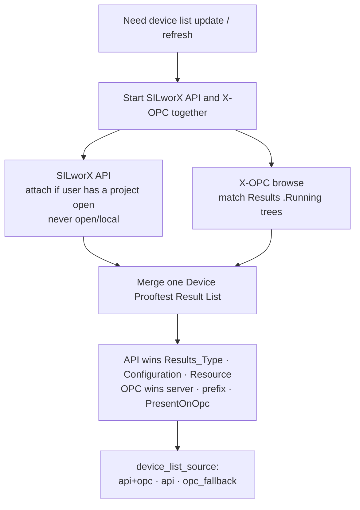

# Device list path — Step 3 (API and OPC together)

## API session

| Situation | How session token is obtained |
|-----------|------------------------------|
| Engineer has project open | Plugin WebSocket `TRIGGER_SESSION_ID_CHANGED` |
| No GUI project open | API contribution is empty — **never** `POST /project/open/local` |

## What counts as a device

A top-level **global variable** whose **data type** is one of the nine `*_Results` structures, **or** an X-OPC `.Running` tree that matches a Results type.  
Those types are defined by the Results Structures CSV **type catalogue** (members for SQL/OPC).  
**Adding a device** = create that global in SILworX (and/or download so it appears on OPC) — do **not** edit the CSV files.
