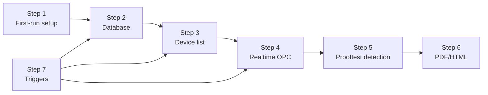

# Steps 1–7 summary

## Step reference

| Step | What | Main source |
|------|------|-------------|
| **1** | First-run folders, case detection | Config / filesystem |
| **2** | SQL schema from Results Structure **type-catalogue** CSVs | Database |
| **3** | Device Prooftest Result List (**SILworX globals** + **X-OPC** together) | **REST API and OPC** |
| **4** | Realtime values | **X-OPC only** |
| **5** | Detect prooftest start/end, snapshot, SQL insert | **X-OPC** |
| **6** | PDF/HTML report after SQL row | Report templates |
| **7** | Detect SILworX project/session changes (new globals) → re-run Steps 2–4; CSV watch = rare type defs | Plugin monitor + file watchers |

## Step 7 triggers (Case 1)

| Trigger | Detection |
|---------|-----------|
| Session open/close | Plugin monitor on ports 8400–8409 |
| Project modify / save | `c3data` mtime on all open sessions |
| Code generation | `c3data` mtime on all open sessions |
| Project download | `.E3` mtime when SILworX closed |
| **New / changed globals (device add)** | Indirect via session / project / download / manual → API + OPC together |
| Results Structure CSV (type catalogue) | Folder mtime — **definition maintenance only**, not day-to-day device add |
| Manual | Web UI Refresh or `POST /api/refresh` |

On any Case 1 device trigger → `service.refresh()` → **SILworX API and X-OPC together** (Layer 1).
