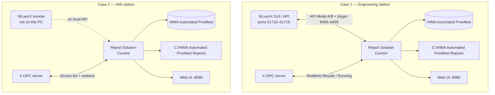
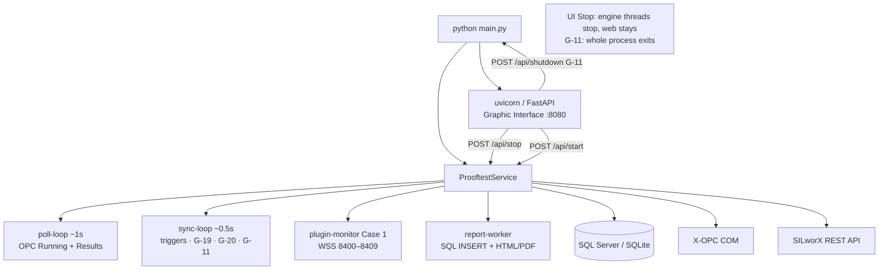
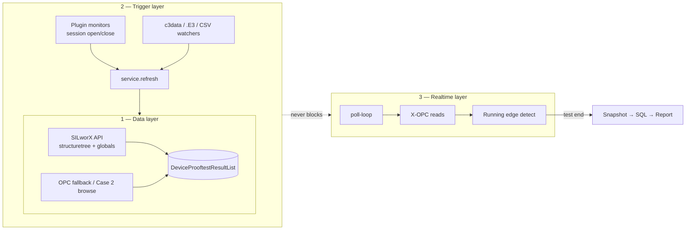
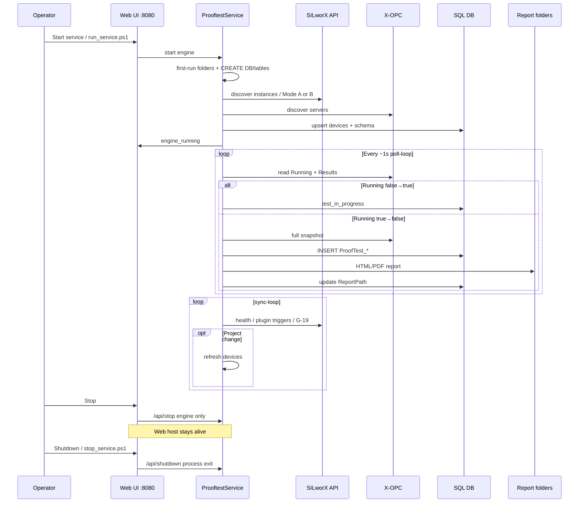
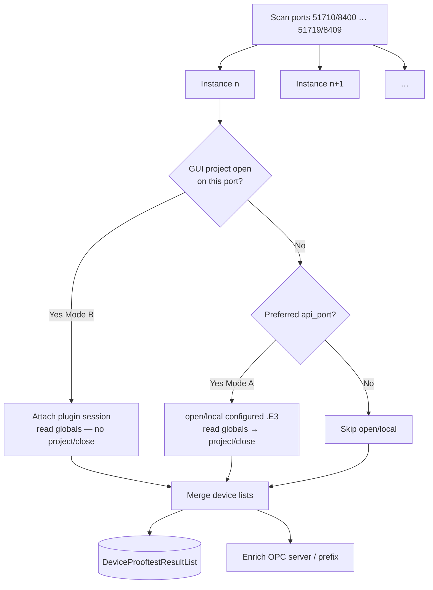
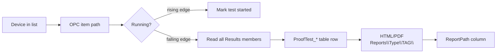
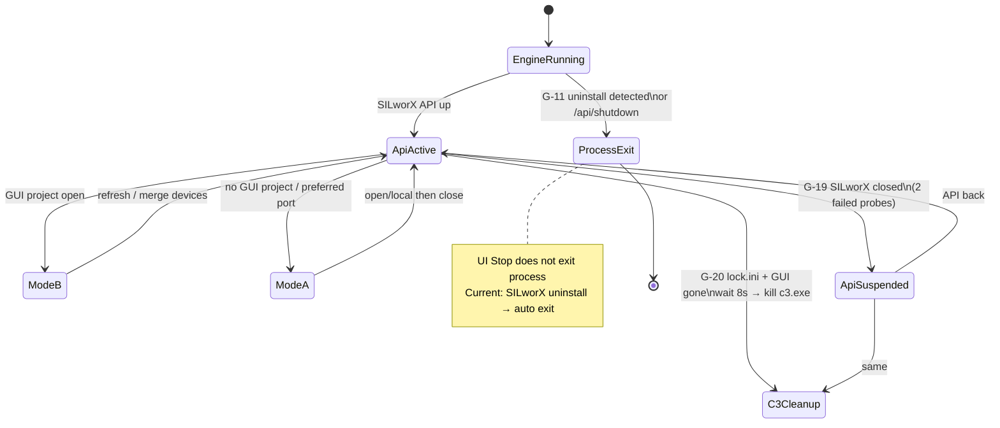
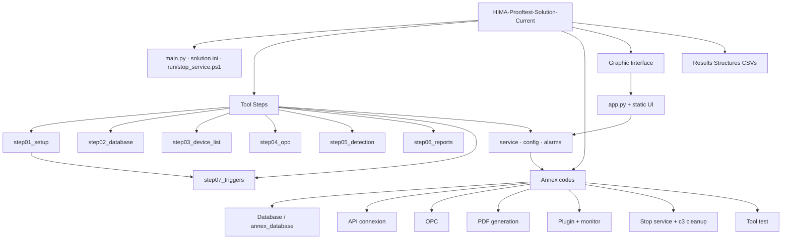
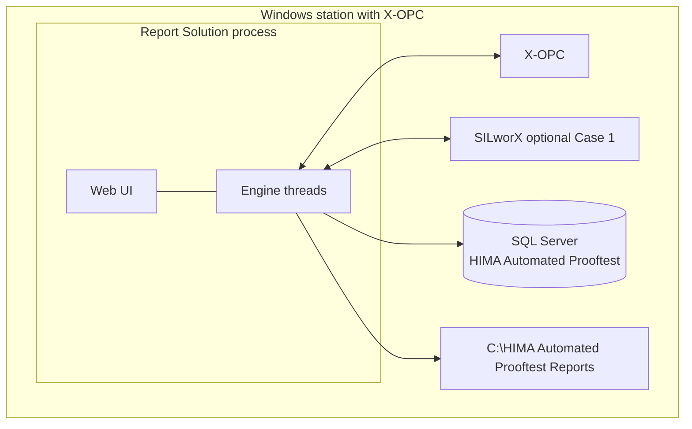

# HIMA Automated Prooftest — Mermaid Architecture

| Field | Value |
|-------|--------|
| **Document** | Architecture diagrams (Mermaid) |
| **Runtime** | `HIMA-Prooftest-Solution-Current` |
| **Paired SPEC** | SPEC-001 v1.44 |
| **Related** | [HIMA-Prooftest-Functionality-and-Architecture.md](./HIMA-Prooftest-Functionality-and-Architecture.md) |
| **Updated** | 2026-08-13 |

> Render in any Mermaid-capable viewer (GitHub, VS Code Markdown preview, Spec docs, etc.).

---

## 1. System context (Case 1 vs Case 2)

---

## 2. Process and thread architecture

---

## 3. G-22 three-layer architecture

---

## 4. End-to-end runtime pipeline

---

## 5. Multi-instance SILworX (Mode A / Mode B)

---

## 6. Prooftest data flow

---

## 7. SILworX lifecycle vs solution (Case 1 today)

---

## 8. Code / folder architecture

---

## 9. Component deployment view

---

*End of document*
