# HIMA Automated Prooftest — Mermaid Architecture

| Field | Value |
|-------|--------|
| **Document** | Architecture diagrams (Mermaid) |
| **Runtime** | `HIMA-Prooftest-Solution-Current` |
| **Paired SPEC** | SPEC-001 v1.59 |
| **Related** | [HIMA-Prooftest-Functionality-and-Architecture.md](./HIMA-Prooftest-Functionality-and-Architecture.md) |
| **Pictures** | [architecture-diagrams/](./architecture-diagrams/) |
| **Updated** | 2026-08-18 |

> Render in any Mermaid-capable viewer. PNGs/SVGs under `architecture-diagrams\` match these diagrams (`01`–`11`).

---

## 1. System context (unified mode)

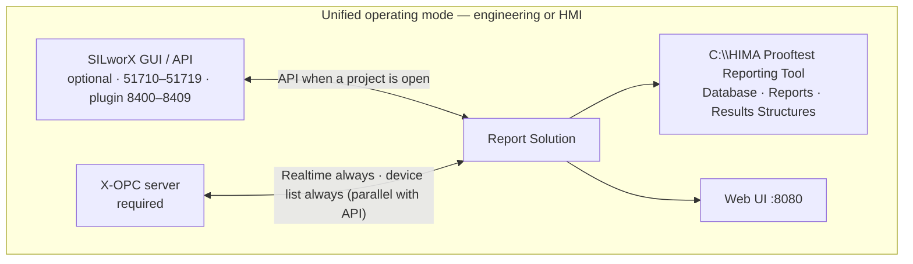

---

## 2. Process and thread architecture

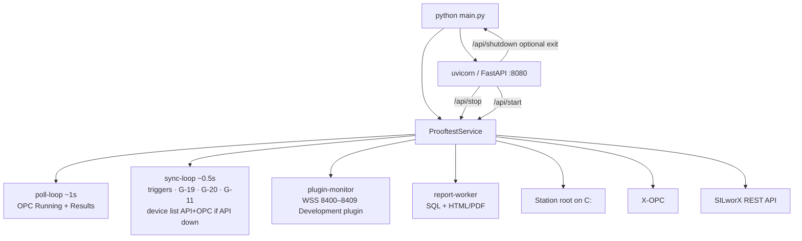

---

## 3. G-22 three-layer architecture

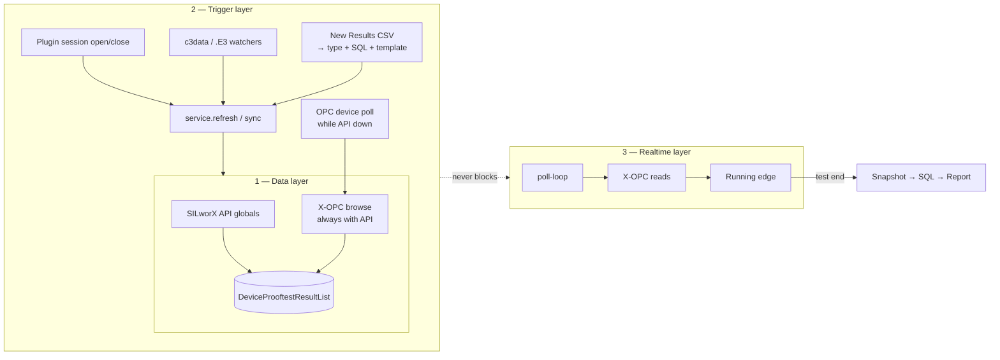

---

## 4. Device list (API and OPC together)

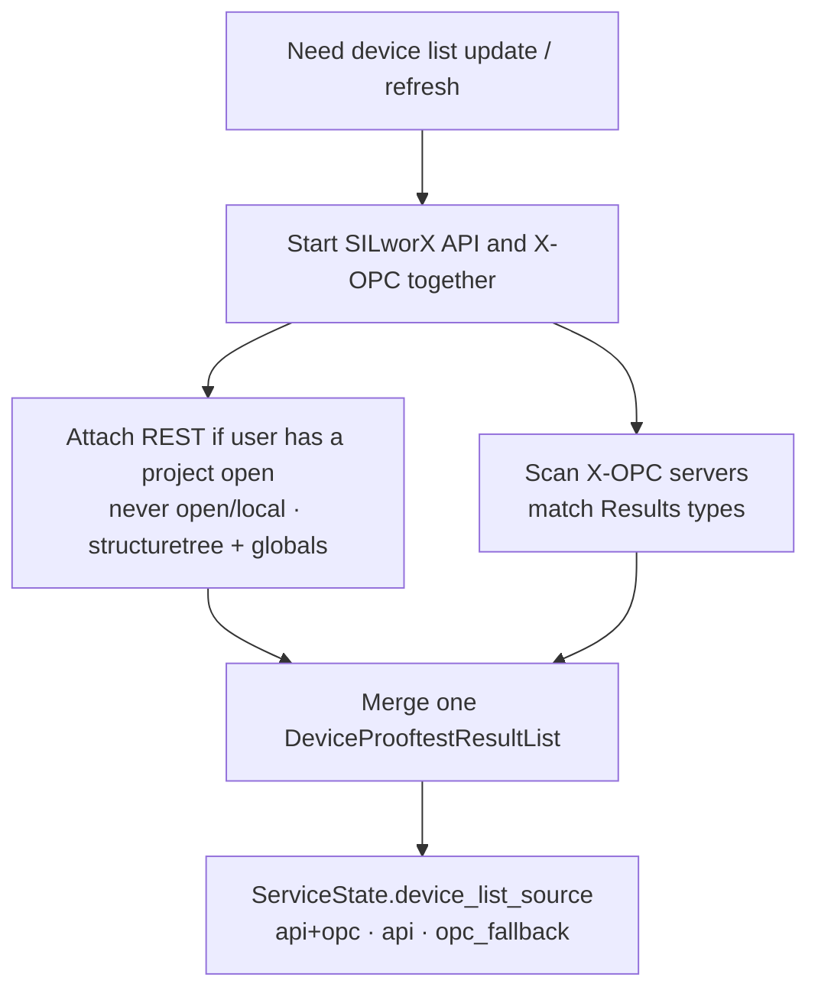

---

## 5. End-to-end runtime pipeline

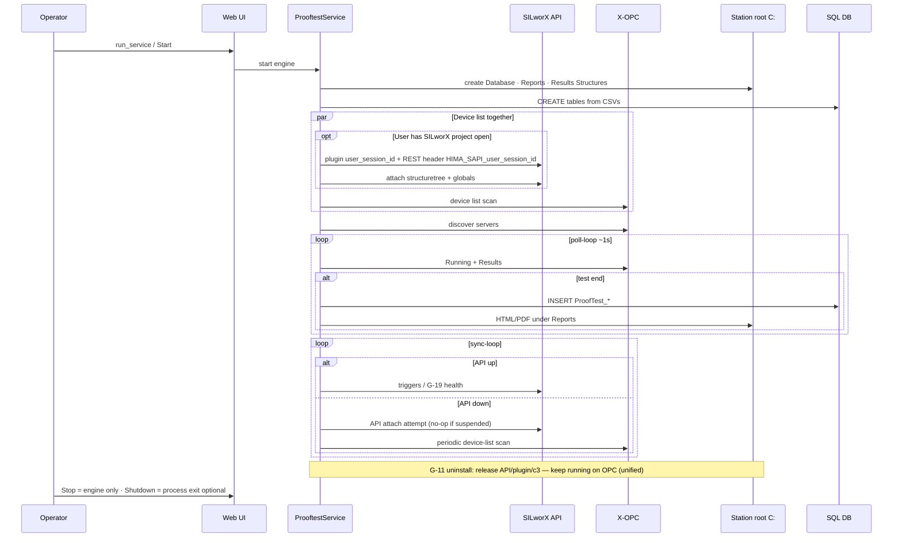

---

## 6. Multi-instance SILworX (attach only)

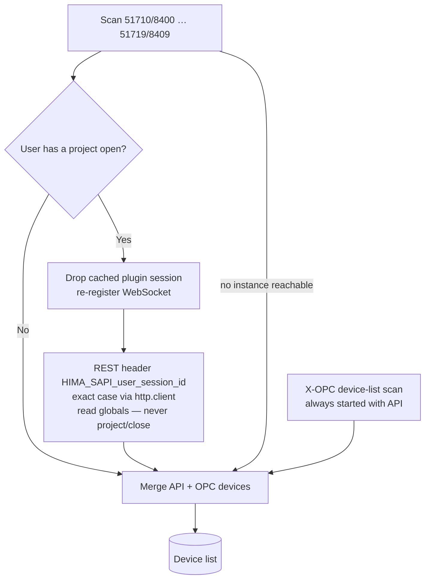

---

## 7. Prooftest data flow

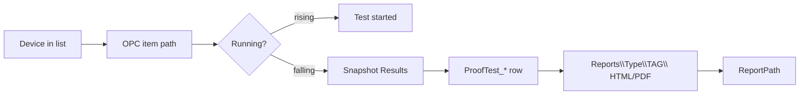

---

## 8. SILworX lifecycle vs solution

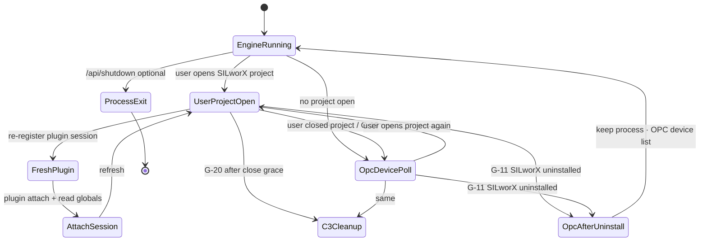

---

## 9. Station folder architecture

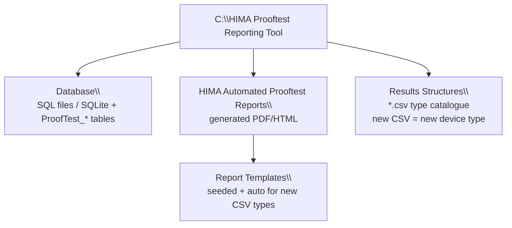

---

## 10. Code / folder architecture

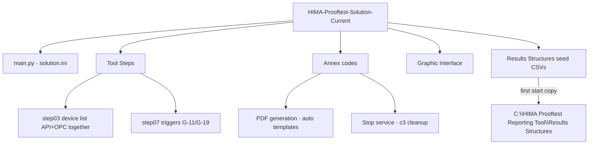

---

## 11. Component deployment view

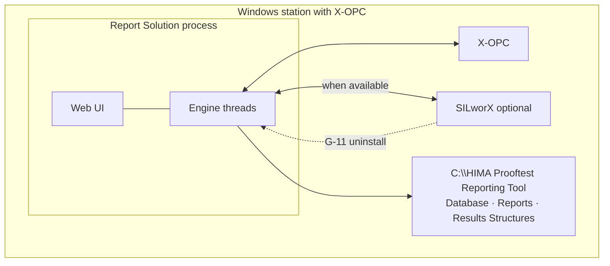

---

*End of document*
