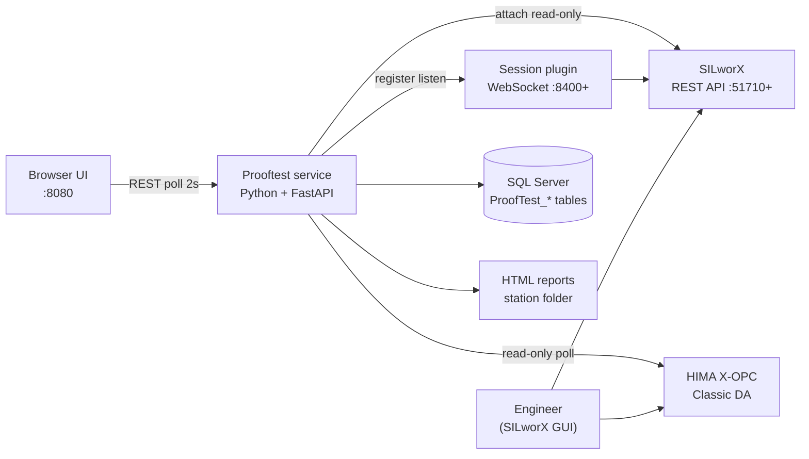
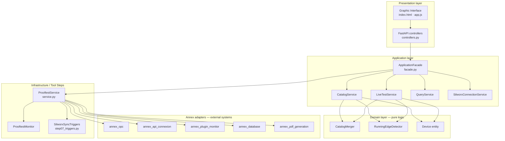
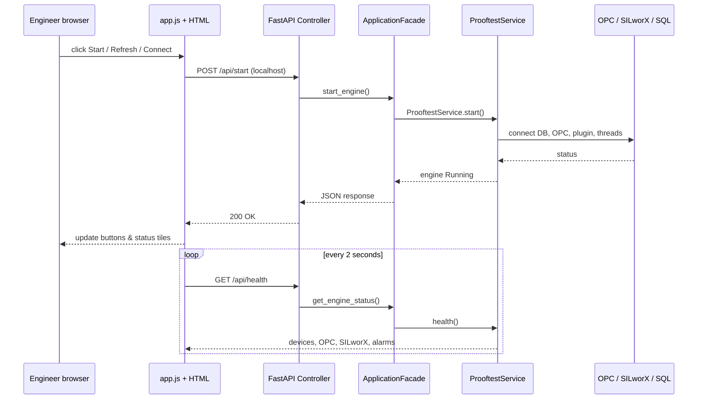
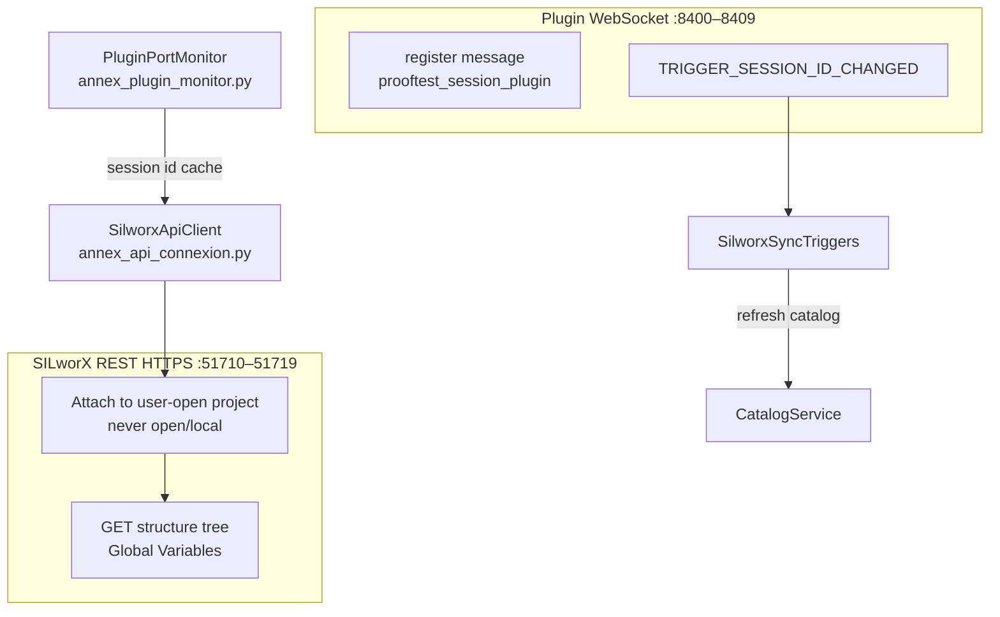
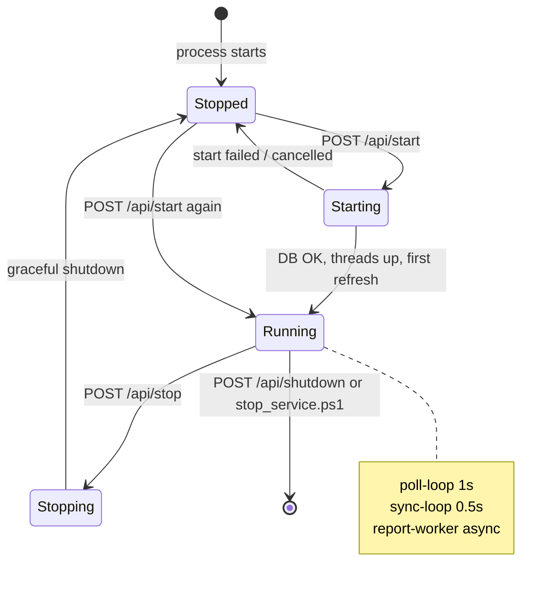
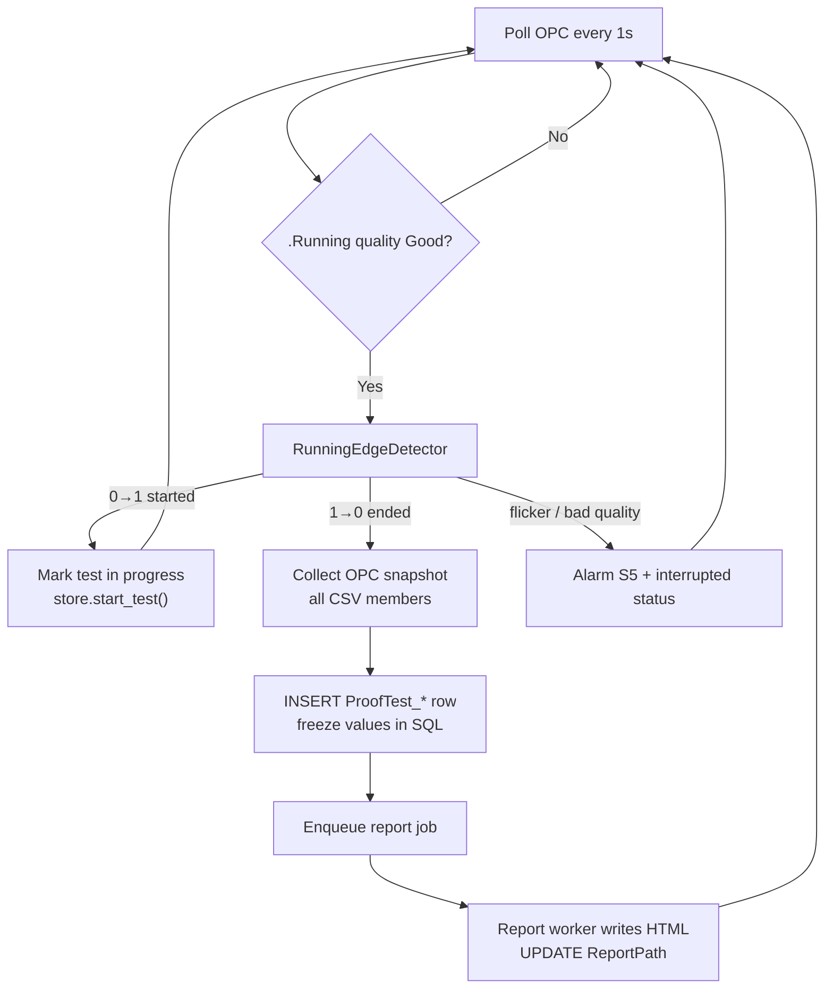
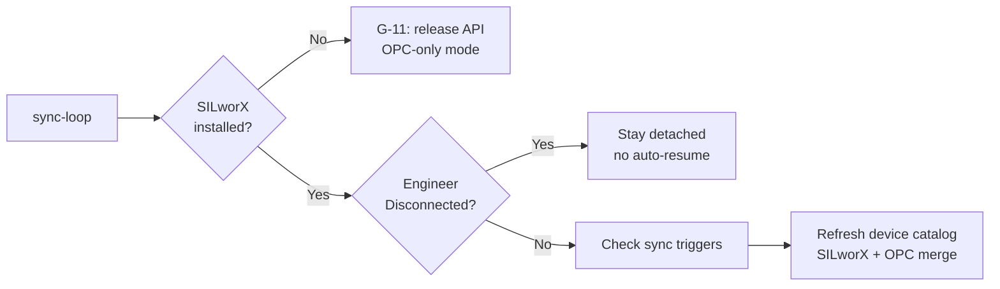
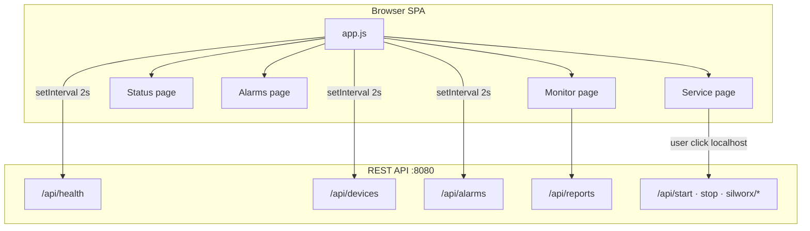
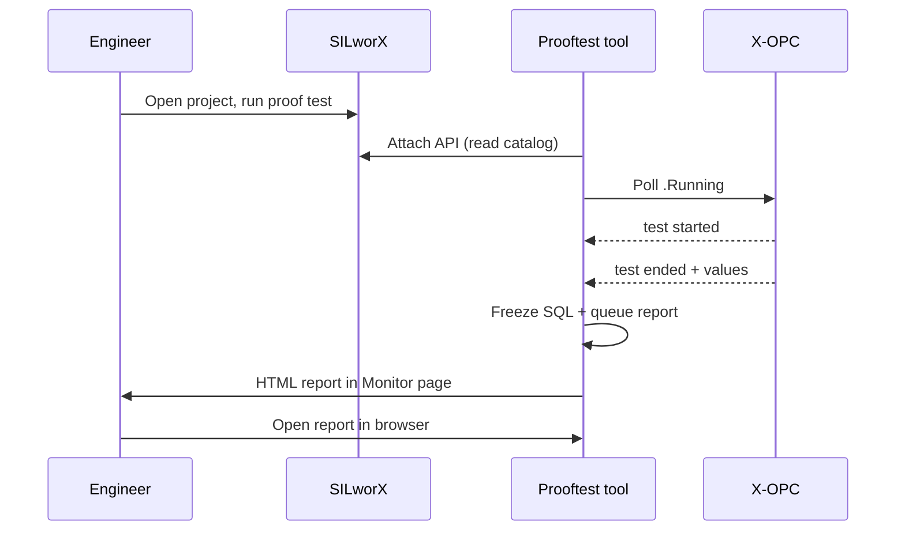

# HIMA Automated Prooftest
## How the tool works — architecture for developers & managers

**Audience:** medium-level developers, project managers, integrators  
**Spec:** SPEC-001 v1.64 · **Runtime UI:** v1.80.54  
**Web UI:** http://127.0.0.1:8080/

---

## What this tool does (30 seconds)

- Watches **HART proof tests** running in **SILworX** via **OPC** (read-only)
- When a test **starts** and **ends**, it **freezes** all result values into **SQL Server**
- Generates **HTML proof-test reports** from frozen data (no second OPC read)
- Offers a **local web dashboard**: devices, status, alarms, service control

> The engineer’s SILworX project stays open — the tool **attaches**, it does not take over the GUI.

---

## System context — who talks to whom

---

## Layer architecture (clean separation)

**Rule:** UI and REST **never** call OPC or SQL directly — only through **ApplicationFacade**.

---

## Folder map (where code lives)

| Layer | Path | Role |
|-------|------|------|
| Entry | `main.py`, `solution.ini` | Start service, load config |
| UI | `Graphic Interface/static/` | Browser pages & polling |
| REST | `Annex codes/layers/presentation/` | HTTP API |
| Use cases | `Annex codes/layers/application/facade.py` | Orchestration |
| Domain | `Annex codes/layers/domain/` | Merge, edge detection |
| Engine | `Tool Steps/service.py` | Poll loop, sync loop, health |
| Integrations | `Annex codes/OPC`, `API connexion`, `Plugin`, `Database`, `PDF generation` | External I/O |

**Station data** (reports, DB files): `C:\HIMA Prooftest Reporting Tool\` (from `solution.ini`)

---

## MVC-style request flow (UI)

---

## How connections are made (1/3) — OPC

**Purpose:** Live proof-test signals (`.Running` bit + result members)

| Step | What happens |
|------|----------------|
| Discover | Find HIMA X-OPC servers (`HIMA.*` filter) |
| Browse | Map each device tag to OPC item paths |
| Poll | Every **1 s** read `.Running` and result members |
| Snapshot | On test **end**, read all CSV-defined members once |
| Rule | **Read-only** — never write OPC tags |

**Modules:** `Annex codes/OPC/annex_opc.py`, `connection_opc.py`  
**Config:** `[OPC]` in `solution.ini` — `poll_interval_sec`, shape gate

---

## How connections are made (2/3) — SILworX API + Plugin

- **Attach-only:** tool uses engineer’s already-open project  
- **Header:** `HIMA_SAPI_user_session_id` from plugin events  
- **Multi-instance:** one API port pair per open SILworX project

---

## How connections are made (3/3) — Database & Web UI

| Connection | Technology | Notes |
|------------|------------|-------|
| **SQL Server** | ODBC Driver 17 | Primary store; `ProofTest_*` tables per device type |
| **SQLite fallback** | Local file | If SQL unavailable (`fallback_sqlite = true`) |
| **Web UI** | FastAPI + uvicorn | `127.0.0.1:8080`, static files under `/static/` |
| **Auth (optional)** | Token header | `X-Prooftest-Token`; localhost can bypass |

**Schema sync:** `sync_schema_case2()` runs **once per process** at first engine start (avoids hang on Stop→Start).

---

## Configuration — single source of truth

**File:** `solution.ini` (next to `main.py`)

| Section | Controls |
|---------|----------|
| `[Paths]` | Station root, report folders, Results Structures |
| `[Database]` | SQL Server instance, catalog DB name |
| `[SILworX]` | API host, port range, plugin name |
| `[OPC]` | Server filter, poll interval, shape gate |
| `[Web]` | Port, optional auth token |
| `[Service]` | Auto-start, deployment case, sync triggers |

Changing paths or ports = edit INI + restart service.

---

## Business rules & safety constraints

| Rule | Why |
|------|-----|
| **OPC read-only** | Cannot disturb running safety logic |
| **Attach-only SILworX** | Engineer keeps control of project open/close |
| **Disconnect ≠ quit SILworX** | Detaches tool only; no `c3.exe` kill |
| **Release SILworX** | Special path for uninstall — kills locks, OPC-only mode |
| **Localhost-only mutations** | Start/Stop/Connect/Archive only from 127.0.0.1 |
| **Freeze at test end** | SQL insert **before** report queue — data never lost |
| **Operator detach flag** | After Disconnect, no auto-reconnect until Connect |
| **Windows only** | OPC Classic DA requires Windows + pywin32 |

---

## Decision flow — engine lifecycle

**Stop** ends engine threads; **web page stays open**.  
**Shutdown** exits the whole Python process.

---

## Decision flow — proof test detection

**Key decision:** report uses **frozen SQL row**, not a second OPC read.

---

## Decision flow — background sync & catalog

Every **2 s** (`case1_sync_poll_sec`):

**Sync triggers** (`solution.ini`): `silworx_session`, `code_generation`, `download`, `results_structures`

---

## Decision flow — health & alarms

**Health** (`GET /api/health`):
- **Stopped:** fast cached answer (no OPC block)
- **Running:** OPC servers, device counts, plugin sessions, queue depth
- **2 s cache** — prevents UI pile-up

**Alarms** (`AlarmManager`):
- Steps **S1–S7** = setup phases (folders, DB, catalog, OPC, snapshot, report, SILworX)
- **G-11** = SILworX released for uninstall
- Persisted in DB; UI shows list + popup toasts

---

## User interface — four pages

| Page | Purpose |
|------|---------|
| **Monitor** | Device list, reports, archive import/export |
| **Status** | Live health tiles — OPC, SILworX, DB, plugins |
| **Alarms** | Active errors, acknowledge, reset |
| **Service** | Start/Stop engine, Connect/Disconnect SILworX, Release/Re-integrate |

**Sidebar:** running tests, prooftest history, theme, version  
**Top bar:** quick chips → Devices, OPC count, Service state, SILworX attach

---

## UI architecture — polling model

No WebSocket to browser — simple **poll + POST** pattern.

---

## UI → API map (main endpoints)

| Action | Method | Endpoint |
|--------|--------|----------|
| Live status | GET | `/api/health` |
| Device table | GET | `/api/devices?view=` |
| Reports list | GET | `/api/reports` |
| Open report | GET | `/api/reports/open?path=` |
| Start engine | POST | `/api/start` |
| Stop engine | POST | `/api/stop` |
| Connect SILworX | POST | `/api/silworx/connect` |
| Disconnect | POST | `/api/silworx/disconnect` |
| Refresh catalog | POST | `/api/refresh` |
| Alarms | GET | `/api/alarms` |

Full list in `Annex codes/layers/presentation/controllers.py`

---

## Deployment modes

| Mode | Behaviour |
|------|-----------|
| **Normal** | SILworX API + OPC when both available |
| **OPC fallback** | SILworX down or Disconnect → devices from OPC Running bit |
| **Released (G-11)** | After Release SILworX → OPC-only until Re-integrate |
| **Auto-start** | Windows scheduled task at logon (`install_auto_start.ps1`) |

**Case 1 (unified)** is the only supported deployment case in Current.

---

## Typical day — sequence for managers

Engineer workflow unchanged — tool runs **beside** SILworX, not inside it.

---

## Operations checklist

| Task | How |
|------|-----|
| Start service | `run_service.ps1` or auto-start task |
| Open UI | http://127.0.0.1:8080/ |
| Stop engine (keep UI) | Service page → **Stop service** |
| Full exit | `stop_service.ps1` or `POST /api/shutdown` |
| Before SILworX uninstall | **Release SILworX** then stop process |
| After SILworX reinstall | **Re-integrate SILworX** → Connect |
| Config change | Edit `solution.ini` → restart |

---

## Testing & quality gates

- **62 layer tests** + hardening suite in `Annex codes/Tool test/`
- Run: `python test_step13_hardening.py`
- Spec traceability: **SPEC-001** in `Report Solution/Specifications/`

---

## Summary — three things to remember

1. **Layers:** UI → Facade → Service → Annex adapters (never skip layers)
2. **Connections:** OPC read-only + SILworX attach + plugin WebSocket + SQL freeze
3. **Decisions:** Edge on `.Running`, sync triggers refresh catalog, localhost guards mutations

---

## Appendix — export this deck to PowerPoint

**Option A — Marp (recommended, keeps Mermaid diagrams)**  
1. Install [Marp for VS Code](https://marketplace.visualstudio.com/items?itemName=marp-team.marp-vscode)  
2. Open this `.md` file → Marp: Export Slide Deck → **PPTX**

**Option B — Native file**  
Use `HIMA-Prooftest-Architecture-Presentation.pptx` in the same folder (text slides; paste Mermaid renders from [mermaid.live](https://mermaid.live) for diagram slides).

**Option C — Copy to corporate template**  
One `---` block = one slide in Marp; copy title + bullets into your company PPT template.

---

# Questions?

**Docs:** `Report Solution/Specifications/SPEC-001-…`  
**Code:** `Codes/HIMA-Prooftest-Solution-Current/`  
**Support contact:** HIMA project team
