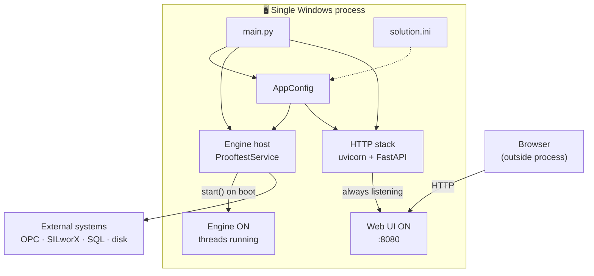
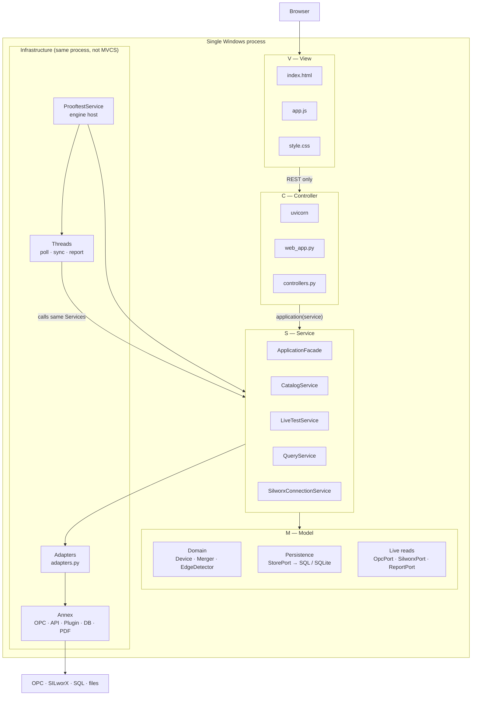
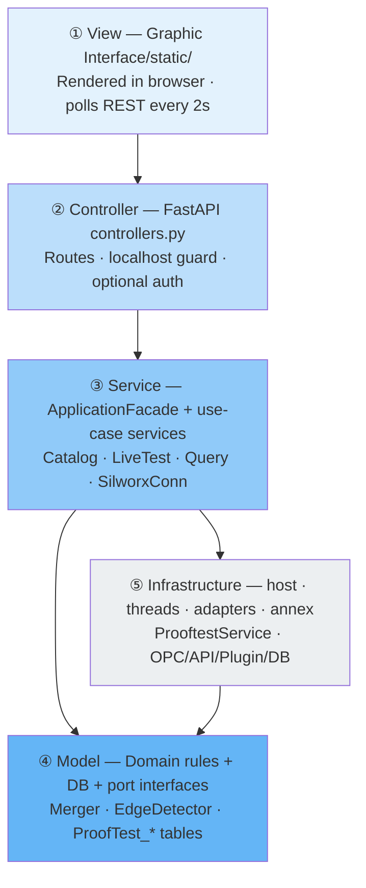
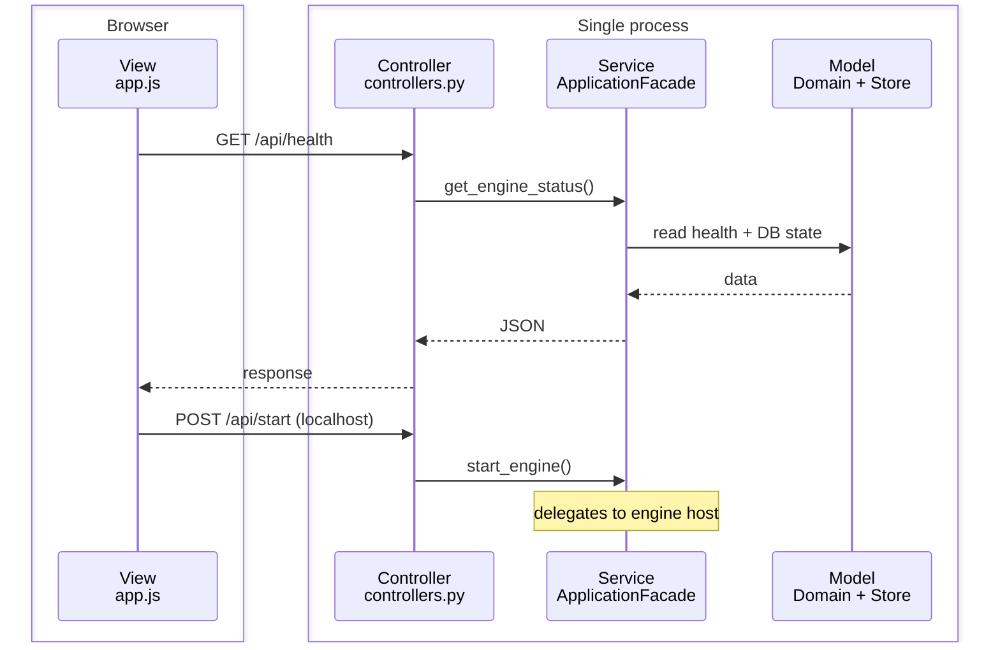
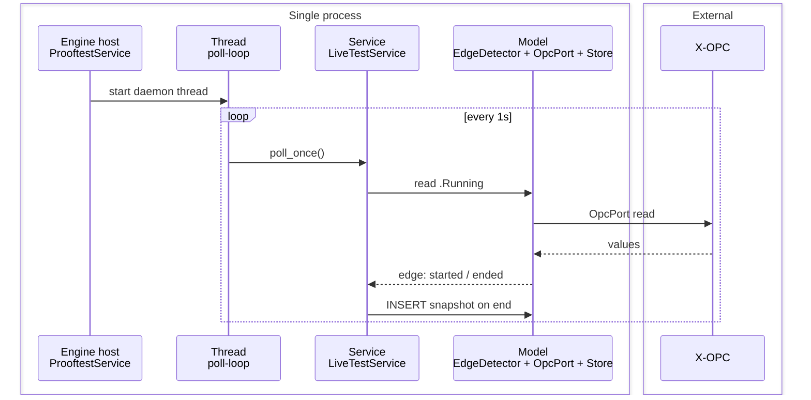
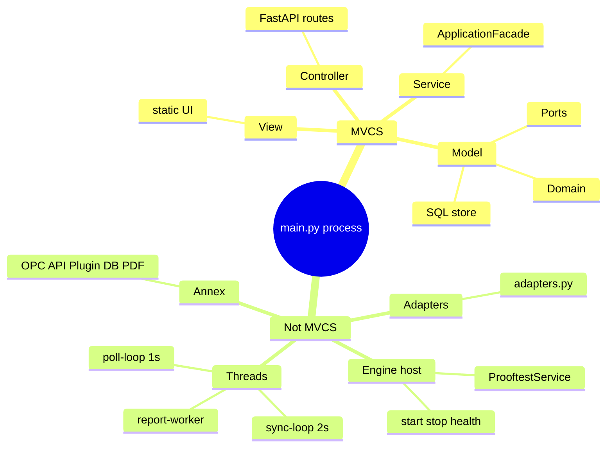

# HIMA Automated Prooftest — Single Process Architecture

One Windows process started by `main.py`. Everything below runs together; MVCS describes **roles**, not separate executables.

---

## 1. Process shell — what `main.py` owns

| Started by `main.py` | Purpose |
|----------------------|---------|
| `ProoftestService` | Engine lifecycle, background threads, health |
| `create_app()` → uvicorn | Serves UI + REST API |
| `service.start()` | Engine starts immediately (poll + sync) |

---

## 2. MVCS inside the process (clean map)

Four roles **inside the same process**. Infrastructure sits **below** Service/Model — not a fifth MVCS letter.

---

## 3. Layer stack (top → bottom)

Easier to read as a **vertical stack**:

**Rule:** arrows go **down** only for MVCS requests. Infrastructure **calls up** into Service (threads), never into Controller.

---

## 4. Two paths through the same process

### A) User / UI path (classic MVCS)

### B) Background path (no Controller)

---

## 5. MVCS quick reference (files)

| MVCS | Folder / file | In process? |
|------|----------------|-------------|
| **V** | `Graphic Interface/static/` | Served by process; runs in browser |
| **C** | `layers/presentation/controllers.py`, `web_app.py` | Yes |
| **S** | `layers/application/facade.py`, `*_service.py` | Yes |
| **M** | `layers/domain/`, `StorePort`, DB via adapters | Yes |
| Host | `Tool Steps/service.py` | Yes — **not** C or S |
| Annex | `Annex codes/OPC`, `API connexion`, … | Yes — **Model I/O** |

---

## 6. What is NOT MVCS (but lives in the process)

---

## 7. One-line summary

**`main.py` starts one process containing:** browser-served **View**, FastAPI **Controller**, **ApplicationFacade** Service, **Domain + DB** Model, plus an **engine host + threads + annex adapters** that keep calling the same Service/Model without going through HTTP.
