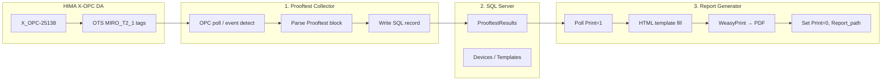
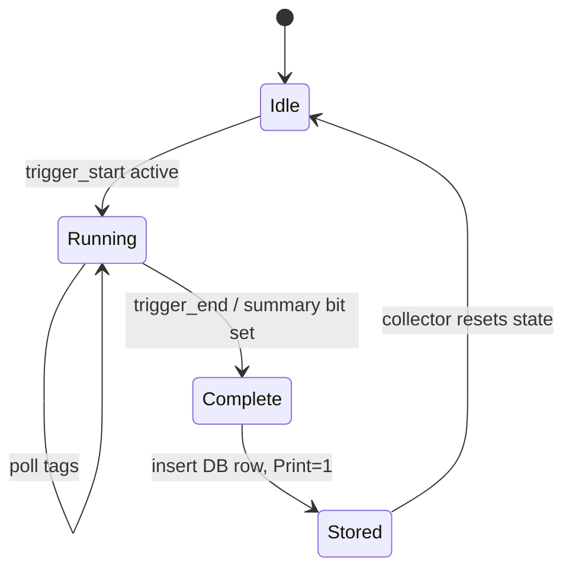

# SPEC-001 — HART Device Prooftest Collection, Database Storage, and PDF Reporting

| Field | Value |
|-------|--------|
| **Document ID** | SPEC-001 |
| **Title** | HART Device Prooftest — OPC Collection to Database to PDF Report |
| **Version** | 1.0 |
| **Date** | 2026-05-20 |
| **Status** | Superseded by v1.1 |
| **Project** | Report Solution |
| **Location** | `Z:\Project\Report Solution` |
| **Filename** | `SPEC-001-v1.0-HART-Prooftest-OPC-Collection-and-PDF-Reporting.md` |

> **Versioning:** Updates require a new file (e.g. `SPEC-001-v1.1-...`). See [README.md](./README.md).

---

## 1. Purpose

This specification defines a software solution that:

1. **Collects** HART device Prooftest results from a HIMA OPC DA server.
2. **Stores** structured Prooftest records in a SQL database.
3. **Generates** PDF Prooftest reports from database records using device-specific templates.

The solution supports plant documentation and compliance by producing standardized proof-test reports (e.g. Endress+Hauser Cerabar PM and similar HART field devices) after automated or operator-initiated tests on a HIMA safety/OTS system.

---

## 2. Scope

### 2.1 In scope

- OPC Classic DA data acquisition from **HIMA X-OPC DA (`X_OPC-25138`)**.
- Parsing and normalization of Prooftest-related OPC items under branch **`OTS MIRO_T2_1`**.
- Persistence of one database row (or related row set) per completed Prooftest.
- Triggering and generation of PDF reports from stored data.
- Reuse of existing **Alternative Reporting** concepts (HTML templates → PDF via WeasyPrint, `settings.ini`, demand-based printing flag).
- Configuration via INI/environment files (no hard-coded credentials in source code).

### 2.2 Out of scope (initial release)

- OPC UA migration (current plant OPC server is DA, not UA).
- Remote multi-site aggregation.
- Web-based operator UI (optional HTTP trigger may reuse existing pattern).
- Direct HART modem communication (data is assumed to arrive via HIMA/OTS logic into OPC tags).
- Editing or re-running Prooftests from the reporting tool.

---

## 3. Background and current state

### 3.1 Existing assets

| Asset | Location | Relevance |
|-------|----------|-----------|
| OPC DA client (validated) | `Codes\Report-Tool\Connection-opc.py` | Connects to `HIMA.X_OPC-25138-DA.1`, browses `OTS MIRO_T2_1.*`, reads leaf tags (`.IN1`, `.PV`, `.STA1`, etc.) |
| Alternative Reporting | `Alternative Reporting\2025-07-28\11-10\` | Report generator (`main.py`), HTML templates, PDF output, SQL polling |
| Cerabar PM template | `Templates\Cerabar_PMx7xB_V1_3\report.html` | Reference layout for HART Prooftest PDF |
| Database prototypes | `DB LOG.py`, `Data logger` | Early OPC → SQL logging experiments |
| OPC prerequisites | `OPCDAAuto.dll` in `SysWOW64` | Required COM wrapper for OpenOPC on Windows |

### 3.2 Validated OPC environment

- **Server ProgID:** `HIMA.X_OPC-25138-DA.1`
- **Host:** `localhost`
- **Item branch:** `OTS MIRO_T2_1`
- **Tag pattern:** `OTS MIRO_T2_1.<device_block>.<leaf>`  
  Example: `OTS MIRO_T2_1.200S2503-I11_IN.IN1` (value `0`, quality `Good`)
- **Browse filter:** `OTS MIRO_T2_1.*` (flat browse; branch name alone returns no items)

### 3.3 Problem statement

Prooftest results currently exist in the DCS/safety system and are visible in OPC clients (e.g. Softing OPC Toolbox), but they are not reliably captured in a queryable database nor automatically converted into archival PDF reports. Operators need a repeatable pipeline from **test completion → database record → PDF file**.

---

## 4. Solution overview

The solution comprises three cooperating components:



| Component | Role | Execution |
|-----------|------|-----------|
| **Prooftest Collector** | Monitors OPC for Prooftest completion; writes structured rows | Windows service or scheduled Python process |
| **SQL Database** | System of record for Prooftest data and report status | Microsoft SQL Server (Express or full) |
| **Report Generator** | Produces PDF when a row is marked for printing | Existing tray/background app pattern |

---

## 5. Functional requirements

### 5.1 OPC collection (FR-OPC)

| ID | Requirement |
|----|-------------|
| FR-OPC-01 | Connect to `HIMA.X_OPC-25138-DA.1` on configurable host using OpenOPC (32-bit Python). |
| FR-OPC-02 | Support configurable list of device tag prefixes under `OTS MIRO_T2_1` (e.g. `200S2503-I11_IN`). |
| FR-OPC-03 | Read leaf OPC items required for Prooftest (inputs, status, configuration, timestamps). |
| FR-OPC-04 | Detect **Prooftest start** and **Prooftest end** from OPC state transitions (configurable trigger tags). |
| FR-OPC-05 | On Prooftest completion, snapshot all configured tags for that device into a single logical record. |
| FR-OPC-06 | Log OPC quality; reject or flag records where critical tags are not `Good`. |
| FR-OPC-07 | Retry OPC connection with backoff; resume polling after server restart. |
| FR-OPC-08 | Avoid duplicate database inserts for the same Prooftest run (idempotency key). |

### 5.2 Database storage (FR-DB)

| ID | Requirement |
|----|-------------|
| FR-DB-01 | Store one primary Prooftest result row per completed test. |
| FR-DB-02 | Support fields required by report templates (see §7.2). |
| FR-DB-03 | Set `Print = 1` when a new record is ready for report generation. |
| FR-DB-04 | Store `Report_path` after PDF generation. |
| FR-DB-05 | Retain raw OPC tag map (JSON or child table) for audit/debug. |
| FR-DB-06 | Record collection timestamp, OPC server name, and source tag list version. |

### 5.3 Report generation (FR-RPT)

| ID | Requirement |
|----|-------------|
| FR-RPT-01 | Poll database at configurable interval for rows where `Print = 1`. |
| FR-RPT-02 | Select HTML template by `Device_type_extended` (or equivalent column). |
| FR-RPT-03 | Substitute `$(column_name)` placeholders from database row (existing template convention). |
| FR-RPT-04 | Generate PDF to configured output directory using WeasyPrint. |
| FR-RPT-05 | Set `Print = 0` and write `Report_path` on success (acknowledgement). |
| FR-RPT-06 | Support filename mask: `{HIMA_system_tag}__{Device_type_extended}_{Prooftest_starttime:...}__{ID}`. |
| FR-RPT-07 | Optional toast notification on success/failure (existing feature). |
| FR-RPT-08 | Optional HTTP trigger to force immediate report run. |

---

## 6. OPC data model

### 6.1 Tag naming convention (HIMA / OTS MIRO_T2_1)

HIMA exposes hierarchical items. **Only leaf nodes are readable.**

| Pattern | Example | Typical meaning |
|---------|---------|-----------------|
| `<block>.IN1` / `.IN2` | `200S2503-I11_IN.IN1` | Digital input / test step state |
| `<block>.STAT.PV` | `200S2503-I11_STAT.PV` | Process value / status word |
| `<block>.STAT.STA1` | `200S2503-I11_STAT.STA1` | Status detail |
| `<block>_KONF.*` | `200S2503-I11_KONF.KONFIG` | Configuration / HART-related parameters |

> **Assumption:** Exact mapping from OPC leaves to Prooftest semantics (pass/fail, channel OK, simulation errors) must be confirmed with HIMA application logic documentation and aligned with existing `report.html` fields.

### 6.2 Configurable tag map (per device type)

Each device type entry in configuration defines:

```ini
[Device.Cerabar_PMx7xB]
opc_branch = OTS MIRO_T2_1
tag_prefix = 200S2503-I11
trigger_end = OTS MIRO_T2_1.200S2503-I11_STAT.STA1
fields = Serial_number:..._KONF.MBA, Device_tag:..._IN.IN1, ...
device_type_extended = Cerabar PMx7xB
template = Cerabar_PMx7xB_V1_3
```

The collector resolves short names to full OPC item IDs using the same rules as `Connection-opc.py` (`build_item_id`, `resolve_readable_item_id`).

### 6.3 Prooftest lifecycle detection



**Default detection strategy (configurable):**

- **Start:** rising edge on designated “test active” tag.
- **End:** falling edge on “test active” OR specific summary/status code in `STAT.PV` / `STAT.STA1`.
- **Debounce:** ignore spurious transitions shorter than configurable minimum duration.

---

## 7. Database design

### 7.1 Database name

Recommended: `ProofTest` or `HIMA_Automated_Prooftest` (align with existing prototypes).

### 7.2 Primary table: `dbo.ProoftestResults`

Columns aligned with Cerabar PM template and Alternative Reporting `settings.ini`:

| Column | Type | Description |
|--------|------|-------------|
| `ID` | `INT IDENTITY` | Primary key |
| `HIMA_system_tag` | `NVARCHAR(64)` | Plant tag (e.g. `200S2503-I11`) |
| `Device_tag` | `NVARCHAR(128)` | HART / field device tag |
| `Device_type_extended` | `NVARCHAR(128)` | Template selector (e.g. `Cerabar PMx7xB`) |
| `Serial_number` | `NVARCHAR(64)` | Device serial from HART/OPC |
| `Act_User` | `NVARCHAR(64)` | Operator if available from OPC |
| `Prooftest_starttime` | `DATETIME2` | Test start (UTC or local per config) |
| `Prooftest_endtime` | `DATETIME2` | Test end |
| `Proof_summary` | `BIT` / `INT` | Overall result (maps to template CSS classes) |
| `Summary` | `INT` | HIMA summary code (e.g. 809 = successful) |
| `Channel_not_OK_before` | `BIT` | Fault flags for report checklist |
| `Channel_not_OK_after` | `BIT` | |
| `Low_error_current_sim_error` | `BIT` | |
| `High_error_current_sim_error` | `BIT` | |
| `Print` | `BIT` | `1` = pending report; `0` = done |
| `Report_path` | `NVARCHAR(512)` | Full path to generated PDF |
| `OPC_quality_ok` | `BIT` | All critical tags Good at snapshot |
| `Collected_at` | `DATETIME2` | When collector wrote the row |
| `OPC_snapshot_json` | `NVARCHAR(MAX)` | Optional raw tag/value dump |

Additional device-specific columns may be added as nullable fields or stored only in `OPC_snapshot_json` until template requirements stabilize.

### 7.3 Reference table: `dbo.DeviceCatalog` (optional)

| Column | Type | Description |
|--------|------|-------------|
| `HIMA_system_tag` | `NVARCHAR(64)` PK | |
| `Device_type_extended` | `NVARCHAR(128)` | |
| `Template_folder` | `NVARCHAR(256)` | Subfolder under `Templates\` |
| `OPC_tag_prefix` | `NVARCHAR(128)` | |
| `Enabled` | `BIT` | |

---

## 8. Report generation

### 8.1 Template engine

Reuse **Alternative Reporting** approach:

- HTML templates with `$(Column_name)` substitution.
- CSS in `img/report.css`; device logos in `img/`.
- PDF via **WeasyPrint** (`HTML.write_pdf()`).
- Enum styling via CSS classes (e.g. `.proof-summary-False` → “Successful”).

### 8.2 Template selection

1. Read `Device_type_extended` from database row.
2. Resolve folder `Templates\<Device_type_extended>\report.html`.
3. Fallback to `Templates\example\` if device template missing (log warning).

### 8.3 Output

| Setting | Default |
|---------|---------|
| Output directory | `Reports\` |
| Format | PDF |
| Keep HTML | `False` |
| Inline assets | `True` |
| Overwrite | `True` |

---

## 9. System architecture (deployment)

```text
┌─────────────────────────────────────────────────────────────┐
│  Windows PC (OTS / HIMA station)                            │
│                                                             │
│  ┌──────────────────┐    ┌─────────────────────────────┐  │
│  │ X_OPC-25138      │    │ Prooftest Collector         │  │
│  │ (HIMA X-OPC DA)  │◄───│ Python 3.11 32-bit service  │  │
│  └──────────────────┘    │ Connection-opc / collector  │  │
│                          └──────────────┬──────────────┘  │
│                                         │ pyodbc          │
│                          ┌──────────────▼──────────────┐  │
│                          │ SQL Server Express          │  │
│                          │ ProofTest / HIMA_Automated… │  │
│                          └──────────────┬──────────────┘  │
│                                         │ poll Print=1    │
│                          ┌──────────────▼──────────────┐  │
│                          │ Report Generator (tray app) │  │
│                          │ WeasyPrint → PDF            │  │
│                          └─────────────────────────────┘  │
└─────────────────────────────────────────────────────────────┘
```

### 9.1 Software stack

| Layer | Technology |
|-------|------------|
| OPC DA client | OpenOPC-DA 1.5.1, pywin32, OPCDAAuto.dll (32-bit registered) |
| Collector / orchestration | Python 3.11 **32-bit** |
| Database | SQL Server + ODBC Driver 17 |
| Reporting | Python 3.x, pyodbc, WeasyPrint, Jinja2 or existing `SafeFormatter` |
| Configuration | `settings.ini`, `collector.ini` |

### 9.2 Security

- Database credentials in `settings.ini` or Windows credential store — **not** in source code.
- OPC/DCOM: run collector as user with same DCOM rights as Softing OPC Toolbox.
- Report output path: restrict write access to service account and operators.
- Remove plaintext passwords from prototype scripts (`DB LOG.py`) before production.

---

## 10. Non-functional requirements

| ID | Category | Requirement |
|----|----------|-------------|
| NFR-01 | Availability | Collector auto-restarts on failure (Windows Service or Task Scheduler). |
| NFR-02 | Performance | Support ≥ 50 devices with poll interval ≥ 2 s without blocking report generator. |
| NFR-03 | Latency | PDF available within 60 s of `Print=1` under normal load. |
| NFR-04 | Reliability | No data loss on single OPC read failure; retry before marking record bad quality. |
| NFR-05 | Audit | Each PDF links to `ID` and `Collected_at`; DB row immutable after ack. |
| NFR-06 | Maintainability | Tag map and templates editable without code change. |
| NFR-07 | Logging | Rotating file log for collector and report generator (INFO/ERROR). |

---

## 11. Configuration files

### 11.1 `collector.ini` (new)

```ini
[OPC]
server_prog_id = HIMA.X_OPC-25138-DA.1
host = localhost
branch = OTS MIRO_T2_1
poll_interval_sec = 2
devices_ini = devices.ini

[Database]
driver = ODBC Driver 17 for SQL Server
server = localhost\SQLEXPRESS
database = ProofTest
; use trusted_connection = yes OR uid/pwd in separate secrets file
```

### 11.2 `settings.ini` (report generator — existing)

Reuse structure from `Alternative Reporting\...\settings.ini` (`[Database]`, `[Demand]`, `[Templates]`, `[Reports]`).

---

## 12. Implementation phases

| Phase | Deliverable | Description |
|-------|-------------|-------------|
| **P1** | Database schema | Create `ProoftestResults`, migration script, test data |
| **P2** | OPC collector MVP | Extend `Connection-opc.py` → poll one device, insert one row on test end |
| **P3** | Multi-device config | `devices.ini` / `DeviceCatalog`, all OTS MIRO_T2_1 HART devices |
| **P4** | Report integration | Wire SQL `Print` flag to existing `main.py` report generator |
| **P5** | Template validation | Cerabar PM PDF matches reference layout; field mapping verified |
| **P6** | Service deployment | Install collector as service; documentation and operator guide |

---

## 13. Acceptance criteria

1. Collector connects to `HIMA.X_OPC-25138-DA.1` and reads configured leaf tags with quality `Good`.
2. Simulated or real Prooftest completion creates exactly one row in `ProoftestResults` with `Print = 1`.
3. Report generator produces a PDF within 60 s; `Print = 0` and `Report_path` populated.
4. PDF contains correct `HIMA_system_tag`, timestamps, serial number, and pass/fail summary per template.
5. Re-running report generator does not duplicate rows (idempotent on `Print` flag).
6. System recovers automatically after OPC server restart.
7. No credentials stored in Git/source repository.

---

## 14. Risks and assumptions

| Item | Type | Mitigation |
|------|------|------------|
| OPC tag semantics differ per device block | Assumption | Document per-device map with HIMA/OTS team; validate against Softing browse |
| 32-bit Python required for OPC DA | Constraint | Standardize on `py -3.11-32` venv for collector only |
| HART data exposed only via specific `_KONF` / `_STAT` leaves | Assumption | Confirm with one Cerabar device before scaling |
| WeasyPrint system dependencies (GTK/Cairo) | Risk | Bundle or document install steps used by existing report generator |
| Legacy prototype uses OPC UA URL | Risk | Production collector must use **OPC DA** (`Connection-opc.py`), not `asyncua` |

---

## 15. Related documents and code

| Reference | Path |
|-----------|------|
| OPC client (working) | `Z:\Project\Report Solution\Codes\Report-Tool\Connection-opc.py` |
| Report generator | `Z:\Project\Report Solution\Alternative Reporting\2025-07-28\11-10\main.py` |
| Cerabar template | `...\Templates\Cerabar_PMx7xB_V1_3\report.html` |
| Report settings | `...\settings.ini` |
| This specification | `Z:\Project\Report Solution\Specifications\SPEC-001-v1.0-HART-Prooftest-OPC-Collection-and-PDF-Reporting.md` |
| Versioning policy | `Z:\Project\Report Solution\Specifications\README.md` |

---

## 16. Open items (to be resolved)

- [ ] Final list of HART device types and `HIMA_system_tag` prefixes on `OTS MIRO_T2_1`.
- [ ] Exact OPC tags for Prooftest **start** and **end** detection per device type.
- [ ] Mapping table: OPC values → `Proof_summary`, `Summary`, and checklist bits in template.
- [ ] Production SQL Server instance name and authentication method.
- [ ] UTC vs local time for `Prooftest_starttime` / `Prooftest_endtime` on PDF.
- [ ] Whether collector runs on same PC as SQL Server or remote.

---

## 17. Document history

| Version | Date | Author | Changes |
|---------|------|--------|-----------|
| 1.0 | 2026-05-20 | Report Solution / AI-assisted draft | Initial specification based on validated OPC client and existing reporting codebase |

---

*End of document*
