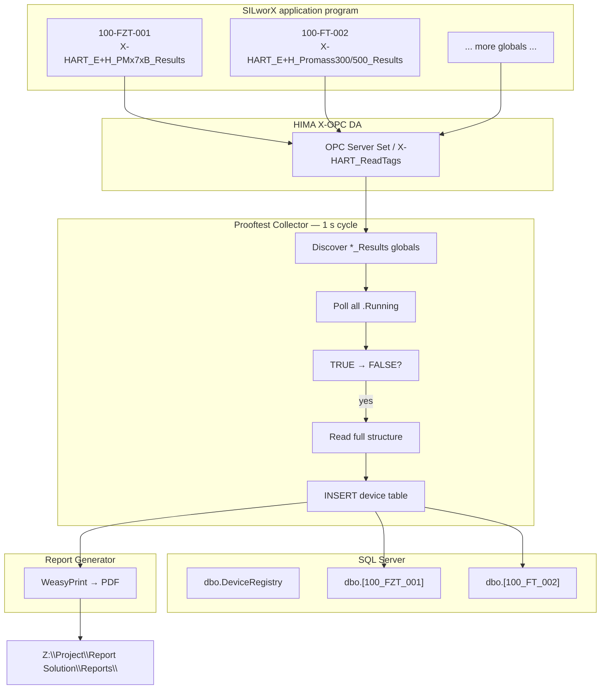
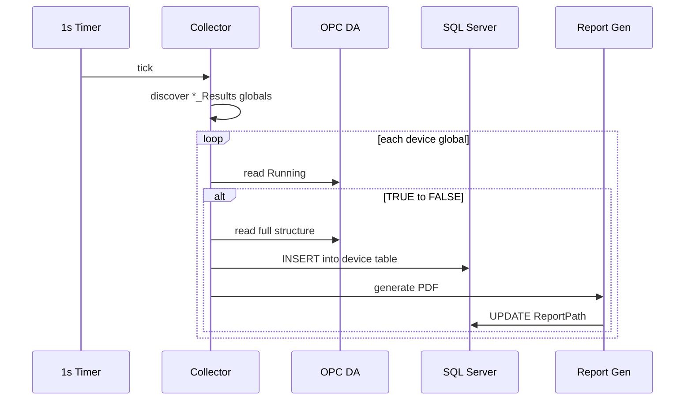

# SPEC-001 — HART Device Prooftest Collection, Database Storage, and PDF Reporting

| Field | Value |
|-------|--------|
| **Document ID** | SPEC-001 |
| **Title** | HART Device Prooftest — SILworX Global Variables to SQL to PDF Report |
| **Version** | 1.1 |
| **Date** | 2026-05-20 |
| **Status** | Superseded by v1.2 |
| **Project** | Report Solution |
| **Location** | `Z:\Project\Report Solution` |
| **Filename** | `SPEC-001-v1.1-HART-Prooftest-OPC-Collection-and-PDF-Reporting.md` |
| **Supersedes** | v1.0 (OPC-centric single-table design) |

> **Versioning:** Updates require a new file (e.g. `SPEC-001-v1.2-...`). See [README.md](./README.md).

---

## 1. Purpose

This specification defines a **flexible** reporting solution that:

1. Works with **different SILworX application programs** where many HART field devices from **different manufacturers** are connected and proof-tested.
2. Reads **Prooftest result structures** defined in the **HIMax HART Package (SILworX library)** as global variables in the application program.
3. Persists each completed test in **SQL Server** using a **dedicated table per device instance**, with schema matching the device’s result data type.
4. **Generates a PDF report** automatically whenever a new result row is stored.

The solution supports plant documentation and compliance (e.g. Endress+Hauser Cerabar PM, Promass, ABB, Emerson, SAMSON, WIKA, and other HART devices).

---

## 2. Design principles

| # | Principle | Description |
|---|-----------|-------------|
| **1** | **Application-agnostic** | The collector/reporting stack is not tied to one OTS project. Any SILworX application that declares global variables of the supported `*_Results` types can be monitored. |
| **2** | **Library-driven data model** | Result layouts come from SILworX data types in the HART library, not from ad-hoc OPC tag guessing. |
| **3** | **One table per device** | Each global result variable (e.g. `100-FZT-001`) gets its own SQL table with columns aligned to that type’s structure. |
| **4** | **Running-edge trigger** | A completed test is captured when the structure member **`Running`** changes from **`TRUE` to `FALSE`**. |
| **5** | **Report on insert** | Every new row written to a device table triggers immediate PDF generation. |

---

## 3. Scope

### 3.1 In scope

- Discovery of global variables of supported HART `*_Results` types in the active SILworX application program.
- Polling global variable list every **1 second**.
- Monitoring `.Running` on all discovered result variables.
- Snapshot of full result structure on **Running: TRUE → FALSE**.
- SQL table creation/migration per result **type**; runtime table per **device instance** (global variable).
- PDF generation to `Z:\Project\Report Solution\Reports` on each insert.
- Device-specific HTML/PDF templates (reuse Alternative Reporting engine).
- OPC DA as **read path** for global variable values exposed via HIMA X-OPC / OPC Server Set (validated: `HIMA.X_OPC-25138-DA.1`, branch `OTS MIRO_T2_1`).

### 3.2 Out of scope (initial release)

- Initiating or controlling Prooftests from the reporting tool.
- Direct HART modem / fieldbus access outside SILworX.
- Editing SILworX application logic.
- Multi-site central aggregation.

### 3.3 Reference application program

| Item | Path |
|------|------|
| **ProofTest-Reporting solution** | `Z:\Project\SILworX\OTS Demo\ProofTest-Reporting solution\` |
| Main program | `ProofTest-Reporting solution.E3` |
| HART read support | `X-HART_ReadTags.A3` |
| Example global variable | `100-FZT-001` (type: one of `*_Results` below) |
| HART library source | `Z:\Project\SILworX\HART FS_Test\HART-Library\V2.0\` |

---

## 4. Supported HART result data types (SILworX library)

Each type is a SILworX **structure** used as the data type of a **global variable** in the application program. The reporting solution must support all of the following:

| # | SILworX data type | Typical manufacturer / device |
|---|-------------------|-------------------------------|
| 1 | `X-HART_ABB_FCB400_Results` | ABB FCB400 |
| 2 | `X-HART_Emerson_3051S_Results` | Emerson 3051S |
| 3 | `X-HART_E+H_PMx7xB_Results` | Endress+Hauser Cerabar PMx7xB |
| 4 | `X-HART_E+H_FTL5xB/6x_Results` | Endress+Hauser FTL5xB / FTL6x |
| 5 | `X-HART_E+H_FMR6xB_Results` | Endress+Hauser FMR6xB |
| 6 | `X-HART_E+H_Promass300/500_Results` | Endress+Hauser Promass 300/500 |
| 7 | `X-HART_SAMSON_Results` | SAMSON |
| 8 | `X-HART_WIKA_T32_Results` | WIKA T32 |
| 9 | `X-HART_WIKA_T38_Results` | WIKA T38 |

> **Note:** Type names use SILworX syntax. Slash in `FTL5xB/6x` and `Promass300/500` must be handled in configuration (escaped name or alias).

### 4.1 Common structure member: `Running`

All result structures include a **`Running`** member (`BOOL`):

- **`TRUE`** — Prooftest is in progress.
- **`FALSE`** — Prooftest has finished (success, error, or abort).

The reporting solution polls **only** `Running` continuously for edge detection. When **`Running`** transitions **TRUE → FALSE**, it reads and stores **all other members** of that global variable’s result structure.

### 4.2 Example documented structure: `X-HART_E+H_Promass300/500_Results`

Source: `...\PROMASS\Help\X-HART_E+H_Promass300_500_ProofTest\Help.html`

Representative fields (full list in HIMax HART Package manual):

| Field | Type | Notes |
|-------|------|-------|
| Enabled | BOOL | |
| Device Type | WORD | |
| Device / Software / Hardware Revision | various | |
| Device ID | DWORD | |
| **Running** | **BOOL** | **Trigger field** |
| Error | BOOL | |
| Current Step | UINT | |
| Tag, Long Tag, Serial Number | ASCII structures | |
| Parameters Before/After Test | nested structure | |
| Start / End Timestamp | UDINT | Unix time |
| Heartbeat Verification Result | UINT | 809 = Successful |
| Test Point 1…5, Actual Value 1…5 | REAL | Loop check (mA) |
| Precision | REAL | |
| Error Code | DWORD | |

Other `*_Results` types follow the same pattern (device-specific fields). Authoritative field lists: SILworX IDE → Data Types, or **HI 801 089 E User Manual HIMax HART Package V2.00**.

---

## 5. Solution overview



| Component | Role |
|-----------|------|
| **Prooftest Collector** | 1 s scan of globals; Running edge detection; structure snapshot; SQL insert |
| **SQL Server** | One table per device global variable; schema per result type |
| **Report Generator** | On INSERT → PDF with template matched to result type |

---

## 6. Functional requirements

### 6.1 Flexibility across application programs (FR-APP)

| ID | Requirement |
|----|-------------|
| FR-APP-01 | Support any SILworX application that uses HIMax HART Package `*_Results` global variables. |
| FR-APP-02 | Application program identity configurable (project path, OPC branch, global variable export path). |
| FR-APP-03 | Adding a new device instance = new global variable in SILworX only; collector auto-creates table if type is known. |
| FR-APP-04 | Adding a new device **type** = new `*_Results` schema definition + report template; no change to core collector logic. |

### 6.2 Global variable discovery (FR-GV)

| ID | Requirement |
|----|-------------|
| FR-GV-01 | Every **1 second**, refresh the list of global variables from the application program. |
| FR-GV-02 | Identify variables whose data type is one of the nine supported `*_Results` types (§4). |
| FR-GV-03 | Maintain an in-memory registry: global name, result type, SQL table name, last `Running` state, OPC item prefix. |
| FR-GV-04 | Accept global variable list from SILworX export (CSV) and/or runtime OPC browse under configured branch. |
| FR-GV-05 | Example instance: `100-FZT-001` → type `X-HART_E+H_PMx7xB_Results` (confirm in SILworX export). |

### 6.3 Running monitor and snapshot (FR-RUN)

| ID | Requirement |
|----|-------------|
| FR-RUN-01 | Every **1 second**, read `Running` for **every** registered result global variable. |
| FR-RUN-02 | On transition **TRUE → FALSE**, read **all remaining fields** of that structure in one snapshot. |
| FR-RUN-03 | Ignore FALSE → TRUE (test start) for storage; optional log only. |
| FR-RUN-04 | Debounce: require `Running` stable FALSE for one cycle before insert (avoid partial reads). |
| FR-RUN-05 | One INSERT per completed test; use `End Timestamp` + global name as idempotency key. |
| FR-RUN-06 | If OPC read quality is not Good for critical fields, insert row with `Quality_OK = 0` and flag in log. |

### 6.4 Database (FR-DB)

| ID | Requirement |
|----|-------------|
| FR-DB-01 | Define **one SQL schema template per result type** (§4 list) matching SILworX structure members. |
| FR-DB-02 | Create **one physical table per global variable** (device instance), e.g. `dbo.[100_FZT_001]`. |
| FR-DB-03 | Each device table inherits columns from its type schema plus metadata: `RecordID`, `GlobalVariableName`, `ResultType`, `CollectedAt`, `ReportPath`. |
| FR-DB-04 | Auto-provision tables when a new global variable appears in discovery. |
| FR-DB-05 | Store each completed test as a **new row** (history); do not overwrite prior rows. |
| FR-DB-06 | Registry table `dbo.DeviceRegistry` maps global variable name ↔ result type ↔ table name ↔ template. |

### 6.5 Report generation (FR-RPT)

| ID | Requirement |
|----|-------------|
| FR-RPT-01 | **Every time** a device table receives a new row, generate a PDF report immediately. |
| FR-RPT-02 | Output directory: **`Z:\Project\Report Solution\Reports`** (configurable). |
| FR-RPT-03 | Filename: **`{GlobalVariableName}_{ChangeTimestamp}.pdf`**  
  Example: `100-FZT-001_2026-05-20_14-32-05.pdf`  
  (`ChangeTimestamp` = time of insert / Running FALSE edge, format configurable). |
| FR-RPT-04 | Select HTML template by result type (e.g. `Cerabar_PMx7xB_V1_3` for `X-HART_E+H_PMx7xB_Results`). |
| FR-RPT-05 | Map SQL columns → `$(placeholder)` fields in template (existing Alternative Reporting convention). |
| FR-RPT-06 | Write `ReportPath` back to the inserted row. |
| FR-RPT-07 | On PDF failure, log error; row remains in DB; optional retry queue. |

### 6.6 OPC integration (FR-OPC)

| ID | Requirement |
|----|-------------|
| FR-OPC-01 | Read global variable values via **OPC Classic DA** (`HIMA.X_OPC-25138-DA.1` or configurable). |
| FR-OPC-02 | Map global variable `100-FZT-001` to OPC items (via OPC Server Set / `X-HART_ReadTags` flattening). |
| FR-OPC-03 | Use leaf-only reads (validated pattern: `OTS MIRO_T2_1.<block>.<member>`). |
| FR-OPC-04 | Poll interval for **Running** and discovery: **1 second** (per requirement). |

---

## 7. Database design

### 7.1 Database name

Recommended: **`ProofTest`** (align with `Alternative Reporting\settings.ini`).

### 7.2 Registry: `dbo.DeviceRegistry`

| Column | Type | Description |
|--------|------|-------------|
| `GlobalVariableName` | `NVARCHAR(128)` PK | e.g. `100-FZT-001` |
| `ResultType` | `NVARCHAR(128)` | e.g. `X-HART_E+H_PMx7xB_Results` |
| `TableName` | `NVARCHAR(128)` | e.g. `100_FZT_001` |
| `TemplateFolder` | `NVARCHAR(256)` | e.g. `Cerabar_PMx7xB_V1_3` |
| `OPC_ItemPrefix` | `NVARCHAR(256)` | OPC path prefix for this global |
| `LastRunning` | `BIT` NULL | Last polled Running state |
| `Enabled` | `BIT` | Default 1 |
| `CreatedAt` | `DATETIME2` | |

### 7.3 Type schemas: `dbo.SchemaDefinition`

Stores column definitions per result type (generated from SILworX export or manual seed):

| Column | Type | Description |
|--------|------|-------------|
| `ResultType` | `NVARCHAR(128)` | |
| `MemberName` | `NVARCHAR(128)` | Structure field name |
| `SqlColumnName` | `NVARCHAR(128)` | Sanitized SQL identifier |
| `SqlDataType` | `NVARCHAR(64)` | `BIT`, `INT`, `REAL`, `NVARCHAR(n)`, etc. |
| `MemberPath` | `NVARCHAR(256)` | OPC suffix or nested path |
| `SortOrder` | `INT` | |

### 7.4 Per-device tables

**Naming rule:** `dbo.[{GlobalVariableName}]` with characters sanitized for SQL (`100-FZT-001` → `100_FZT_001`).

**Columns:**

1. All members from the type schema (§7.3) for that device’s `ResultType`.
2. Metadata columns on every device table:

| Column | Type | Description |
|--------|------|-------------|
| `RecordID` | `BIGINT IDENTITY` | PK |
| `GlobalVariableName` | `NVARCHAR(128)` | Redundant for joins/audit |
| `ResultType` | `NVARCHAR(128)` | |
| `Running_Previous` | `BIT` | TRUE before edge |
| `Running_Current` | `BIT` | FALSE at snapshot |
| `CollectedAt` | `DATETIME2` | Insert time |
| `ReportPath` | `NVARCHAR(512)` | PDF path after generation |
| `Quality_OK` | `BIT` | OPC quality summary |

### 7.5 Type-to-table matrix (example)

| Global variable | Result type | SQL table |
|-----------------|-------------|-----------|
| `100-FZT-001` | `X-HART_E+H_PMx7xB_Results` | `dbo.[100_FZT_001]` |
| `100-FT-002` | `X-HART_E+H_Promass300/500_Results` | `dbo.[100_FT_002]` |
| `200-PT-015` | `X-HART_Emerson_3051S_Results` | `dbo.[200_PT_015]` |

Tables are created automatically when a new global appears in the 1 s discovery scan.

---

## 8. Collector algorithm (1 second cycle)

```text
every 1 second:
  1. Load / refresh global variable list from SILworX export or OPC registry
  2. For each variable with type in SUPPORTED_RESULT_TYPES:
       a. If not in DeviceRegistry → register, create table from SchemaDefinition
       b. Read Running via OPC
       c. If previous Running == TRUE and current Running == FALSE:
            - Read all structure members for this global
            - INSERT one row into device table
            - Trigger report generator for this RecordID
       d. Update LastRunning in registry
```



---

## 9. Report generation

### 9.1 Trigger

**Event-driven:** fired by collector immediately after successful INSERT (not only by `Print=1` polling).

Optional: retain `Print` column for compatibility with existing `main.py` demand workflow.

### 9.2 Output

| Setting | Value |
|---------|--------|
| Directory | `Z:\Project\Report Solution\Reports` |
| Format | PDF |
| Filename | `{GlobalVariableName}_{yyyy-MM-dd_HH-mm-ss}.pdf` |
| Engine | WeasyPrint (existing Alternative Reporting) |

### 9.3 Template mapping

| Result type | Template folder (example) |
|-------------|---------------------------|
| `X-HART_E+H_PMx7xB_Results` | `Cerabar_PMx7xB_V1_3` |
| `X-HART_E+H_Promass300/500_Results` | `Promass300_500_V1_x` (to be created) |
| Others | One template per type; `Templates\example\` fallback |

---

## 10. Configuration

### 10.1 `collector.ini`

```ini
[Application]
silworx_project = Z:\Project\SILworX\OTS Demo\ProofTest-Reporting solution\ProofTest-Reporting solution.E3
global_variables_export = globals.csv
poll_interval_sec = 1

[OPC]
server_prog_id = HIMA.X_OPC-25138-DA.1
host = localhost
branch = OTS MIRO_T2_1

[Database]
driver = ODBC Driver 17 for SQL Server
server = localhost\SQLEXPRESS
database = ProofTest

[Reports]
output_directory = Z:\Project\Report Solution\Reports
filename_pattern = {GlobalVariableName}_{CollectedAt:yyyy-MM-dd_HH-mm-ss}.pdf
```

### 10.2 `result_types.ini`

Maps SILworX type names to SQL schema seed and template:

```ini
[X-HART_E+H_PMx7xB_Results]
template = Cerabar_PMx7xB_V1_3
schema_seed = schemas/PMx7xB_Results.sql

[X-HART_E+H_Promass300/500_Results]
template = Promass300_500_V1_x
schema_seed = schemas/Promass300_500_Results.sql
; ... one section per type in §4
```

---

## 11. Non-functional requirements

| ID | Requirement |
|----|-------------|
| NFR-01 | 1 s poll cycle for ≤ 200 device globals without missing Running edges. |
| NFR-02 | PDF generated within 30 s of INSERT under normal load. |
| NFR-03 | Collector survives OPC/SQL transient errors; resumes without duplicate inserts. |
| NFR-04 | New application program = configuration change only (no code fork). |
| NFR-05 | Full audit trail: all historical tests kept in per-device tables. |

---

## 12. Implementation phases

| Phase | Deliverable |
|-------|-------------|
| **P1** | Export global variables from ProofTest-Reporting solution; confirm `100-FZT-001` type |
| **P2** | `SchemaDefinition` + SQL DDL for all nine result types |
| **P3** | Collector: 1 s discovery + Running monitor for one device |
| **P4** | Auto table creation + INSERT on TRUE→FALSE for all types |
| **P5** | Report on INSERT → `Z:\Project\Report Solution\Reports` |
| **P6** | Templates for all manufacturers; acceptance test on OTS Demo |

---

## 13. Acceptance criteria

1. Solution connects to ProofTest-Reporting application globals via OPC (or configured read path).
2. All nine `*_Results` types are recognized when present as global variables.
3. Each global variable has its own SQL table with type-correct columns.
4. `Running` TRUE→FALSE produces exactly one new row with full structure snapshot.
5. PDF appears in `Z:\Project\Report Solution\Reports` named `{GlobalVariableName}_{timestamp}.pdf`.
6. PDF content matches device-type template for `100-FZT-001` (or equivalent test device).
7. Adding a second application program requires only config changes (FR-APP-01).

---

## 14. Risks and open items

| Item | Notes |
|------|-------|
| SILworX `.E3` binary | Export global variable CSV from IDE; project may be locked while open |
| OPC mapping per global | Confirm `X-HART_ReadTags` / OPC Server Set maps structure members to leaves |
| Nine type field lists | Promass documented in Help.html; others from HIMax manual / SILworX Data Types |
| Slash in type names | `FTL5xB/6x`, `Promass300/500` — use config aliases |
| 1 s poll vs OPC load | May need batch read groups for large device counts |

### Open items

- [ ] Export and attach global variable list from ProofTest-Reporting solution.
- [ ] Confirm OPC item path for `100-FZT-001.Running` and sibling members.
- [ ] Complete `SchemaDefinition` rows for all nine types.
- [ ] Create report templates for types other than Cerabar PMx7xB.
- [ ] Decide: SILworX export file watch vs pure OPC discovery for global list.

---

## 15. Related documents

| Reference | Path |
|-----------|------|
| SILworX application | `Z:\Project\SILworX\OTS Demo\ProofTest-Reporting solution\` |
| HART library | `Z:\Project\SILworX\HART FS_Test\HART-Library\V2.0\` |
| Promass Results docs | `...\PROMASS\Help\X-HART_E+H_Promass300_500_ProofTest\Help.html` |
| OPC client | `Z:\Project\Report Solution\Codes\Report-Tool\Connection-opc.py` |
| Report generator | `Z:\Project\Report Solution\Alternative Reporting\2025-07-28\11-10\main.py` |
| Cerabar template | `...\Templates\Cerabar_PMx7xB_V1_3\report.html` |
| Reports output | `Z:\Project\Report Solution\Reports` |
| Previous spec | [SPEC-001-v1.0](./SPEC-001-v1.0-HART-Prooftest-OPC-Collection-and-PDF-Reporting.md) |
| Versioning policy | [README.md](./README.md) |

---

## 16. Document history

| Version | Date | Author | Changes |
|---------|------|--------|-----------|
| 1.0 | 2026-05-20 | Report Solution | Initial OPC-centric specification |
| 1.1 | 2026-05-20 | Report Solution | SILworX library `*_Results` types; per-device SQL tables; 1 s global variable scan; Running TRUE→FALSE trigger; PDF on insert to `Reports\`; multi-application flexibility |

---

*End of document*
