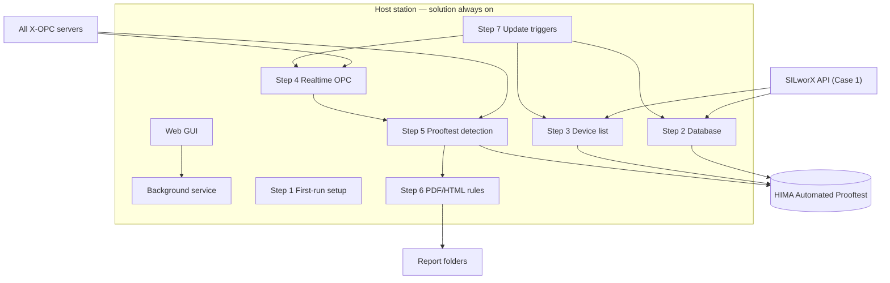

# SPEC-001 — HIMA Automated Prooftest Reporting Solution

| Field | Value |
|-------|--------|
| **Document ID** | SPEC-001 |
| **Title** | HIMA Automated Prooftest — Background Service, SILworX API, Multi-OPC, SQL, PDF/HTML, Web GUI |
| **Version** | 1.14 |
| **Date** | 2026-06-16 |
| **Status** | Draft |
| **Project** | Report Solution |
| **Location** | `Z:\Project\Report Solution` |
| **Filename** | `SPEC-001-v1.14-HART-Prooftest-OPC-Collection-and-PDF-Reporting.md` |
| **Supersedes** | v1.13 |

> **Versioning:** Updates require a new file (e.g. `SPEC-001-v1.15-...`). See [README.md](./README.md). Code changes require a new folder per [Codes/README.md](../Codes/README.md).

---

## 1. Purpose

To obtain **realtime CPU data**, this solution **must run on the same station where the X-OPC server is running**.

Two deployment architectures (**cases**) are supported with a **selection philosophy**:

| Case | SILworX | X-OPC server | This solution |
|------|---------|--------------|---------------|
| **Case 1** | Engineering station | Engineering station (same PC) | Engineering station |
| **Case 2** | Engineering station (remote) | HMI station | **HMI station** (with OPC) |

The report solution must support **both cases** via configuration (`deployment_case = 1` or `2`) and, on first run, **automatic case detection** (see Step 1).

---

## 2. General specifications of the Report Solution

| # | Requirement |
|---|-------------|
| **G-01** | The solution/code must run **continuously in the background** (Windows Service or equivalent daemon). |
| **G-02** | The solution must be **flexible** across different SILworX application programs: multiple device manufacturers, multiple X-OPC servers, multiple **Configurations**, and multiple **Resources**. |
| **G-03** | The solution is divided into **Steps 1–7** (see §4). |
| **G-04** | If an error occurs in any Step, an **error message** must be generated and shown in the graphical interface, naming the **Step** and the **specific action** that failed. |
| **G-05** | On **first start** on a station, create the folder **`C:\HIMA Automated Prooftest Reports`** (see Step 1 for internal structure). |
| **G-06** | The solution must provide a **web server graphical interface**. |
| **G-07** | The solution must support **automatic and manual** update of the device list, X-OPC server list, and SQL database. |
| **G-08** | The solution must **automatically detect** when a Prooftest is initiated, **wait until the test ends**, take a **snapshot** of the Results structure, and store it in the dedicated SQL table. |
| **G-09** | **Immediately after** the database table row is written, generate a **PDF or HTML** report automatically and store it under the report folder structure (§4 Step 5–6). |
| **G-10** | To identify the device list, device types, and updates, the solution must use the **SILworX integrated API** where applicable (details per Step below). Realtime values are always read from **X-OPC**. |
| **G-11** | The background service **must stop** (release OPC, SILworX API sessions, and worker threads) so the user can **uninstall SILworX** without the Prooftest process blocking files or COM/API resources. The service must expose a **graceful shutdown** path for uninstallers and operators (see §5.5). |
| **G-12** | **Solution code versioning:** when a new specification version requires code changes, **do not modify** the previous version’s code folder. Copy the latest `HIMA-Prooftest-Solution-v{x.y}` tree to a new folder matching the new spec version and implement changes **only** there. Prior code folders remain **frozen** (see [Codes/README.md](../Codes/README.md)). |
| **G-13** | **No globals CSV export:** the solution must **not** export, read, or depend on a global-variables CSV file (e.g. `Globale variable.csv`, `data/globals.csv`). Case 1 device discovery uses **SILworX OpenAPI only** (`structuretree/info` + `globalvariables/content/read`). Remove all export scripts, plugins, and config keys for globals CSV. |
| **G-14** | **SPEC step-based code layout:** organize implementation under `prooftest/steps/` with one consolidated module per Step 1-7 (`step01_setup.py` ... `step07_triggers.py`). Legacy module names are retained only as thin re-export shims for compatibility. |



---

## 3. SILworX projects and Prooftest Results structures

### 3.1 Supported Results data types (library)

Each device type/manufacturer has a dedicated Prooftest **Results** structure in the SILworX library (name ends with `_Results`):

| # | SILworX data type |
|---|-------------------|
| 1 | `X-HART_ABB_FCB400_Results` |
| 2 | `X-HART_Emerson_3051S_Results` |
| 3 | `X-HART_E+H_PMx7xB_Results` |
| 4 | `X-HART_E+H_FTL5xB/6x_Results` |
| 5 | `X-HART_E+H_FMR6xB_Results` |
| 6 | `X-HART_E+H_Promass300/500_Results` |
| 7 | `X-HART_SAMSON_Results` |
| 8 | `X-HART_WIKA_T32_Results` |
| 9 | `X-HART_WIKA_T38_Results` |

**CSV definitions** for each structure:

- Primary path: `Z:\Project\Report Solution\3- Results Structures\`
- Alternate reference path: `Z:\Project\Report Solution\Results Structures\` (if deployed)

### 3.2 Global variables

1. Each device’s Prooftest Results must be declared as a **global variable** in the SILworX application program.
2. The library Results structures are used as the **data type** of those global variables.
3. A SILworX project may contain **several Configurations**; each Configuration may contain **several Resources**. Each Configuration may have one **Global Variables** node; each Resource may have its own Global Variables node.
   - *Example:* Two configurations — first with two resources, second with one resource — yields up to **five** Global Variable elements in the project tree.
4. **All Results structure realtime values** are published on the **X-OPC servers** (read in Step 4).

### 3.3 SQL table naming

Replace prefix `X-HART_` with `ProofTest_` and sanitize `/` → `_` for SQL identifiers.

| SILworX structure | SQL table name |
|-------------------|----------------|
| `X-HART_ABB_FCB400_Results` | `ProofTest_ABB_FCB400_Results` |
| `X-HART_Emerson_3051S_Results` | `ProofTest_Emerson_3051S_Results` |
| `X-HART_E+H_PMx7xB_Results` | `ProofTest_E+H_PMx7xB_Results` |
| `X-HART_E+H_FTL5xB/6x_Results` | `ProofTest_E+H_FTL5xB_6x_Results` |
| `X-HART_E+H_FMR6xB_Results` | `ProofTest_E+H_FMR6xB_Results` |
| `X-HART_E+H_Promass300/500_Results` | `ProofTest_E+H_Promass300_500_Results` |
| `X-HART_SAMSON_Results` | `ProofTest_SAMSON_Results` |
| `X-HART_WIKA_T32_Results` | `ProofTest_WIKA_T32_Results` |
| `X-HART_WIKA_T38_Results` | `ProofTest_WIKA_T38_Results` |

Use bracket-quoted names where required: `dbo.[ProofTest_E+H_Promass300_500_Results]`.

**SAMSON 3730 / 3793:** Both device types share the **same** Results structure (`X-HART_SAMSON_Results`) and **one** SQL table (`ProofTest_SAMSON_Results`). There is **no** separate `ProofTest_SAMSON_3730_*` table. The SQL template file `Prooftest_SAMSON_3793_V1_5.sql` is the canonical DDL source for this single table.

### 3.4 SAMSON FST / PST and report templates

SAMSON valve devices may appear as separate global variables (e.g. `100-XV-001_FST`, `100-XV-001_PST`) with the **same** Results data type (`X-HART_SAMSON_Results`).

| Concern | Rule |
|---------|------|
| **Database** | One row per `Device_TAG` in `ProofTest_SAMSON_Results` |
| **Device list** | Each FST/PST tag is a separate device if declared as a top-level global |
| **Report template (Step 6)** | Select FST vs PST **HTML/PDF template** from the related HART function block type (e.g. `X-HART_SAMSON_3793_FST`, `X-HART_SAMSON_3793_PST`) — **report layout only**, not separate DB tables |

---

## 4. Part 1 — Solution code (Steps 1–7)

### Implementation gates (Steps 0–6)

Development follows **gated steps** with user approval before each coding phase. The table below maps implementation gates to functional spec sections and records status as of **2026-06-15**:

| Gate | Scope | Spec section | Status |
|------|--------|--------------|--------|
| **0** | SPEC v1.9 baseline (Steps 1–7 structure, Cases 1/2, error catalog) | Entire document | **Done** |
| **1** | Environment baseline: 32-bit Python, OpenSSL, SILworX v16, API port, nine Results CSVs | §6, §9 | **Done** (`_step1_audit.py`) |
| **2** | Background service smoke test, `solution.ini`, SQL Server / SQLite fallback | §4 Step 1 (partial) | **Done** (`test_smoke.py`) |
| **3** | `SilworxApiClient` REST wrapper | §4 Step 3.1 | **Done** (`prooftest/steps/step03_device_list.py`, `test_silworx_api.py`) |
| **4** | First-run folders (nine Results-type folders + per-device subfolders), `deployment_case` | §4 Step 1 | **Done** (`prooftest/steps/step01_setup.py`, `test_step4_install.py`) |
| **5** | All nine `ProofTest_*` SQL tables; generate missing `.sql` from CSV | §4 Step 2 | **Done** (`prooftest/steps/step02_database.py`, `test_step5_sql.py`) |
| **6** | Case 1 device list via API globals + OPC fallback; persist `device_list_source` | §4 Step 3.1 | **Code done** — API path pending valid session on target station (`test_step6_devices.py`) |
| **7+** | Update triggers, prooftest detection, reports, Case 2 hardening | §4 Steps 5–7, Part 2 | **Not started** (await approval) |

**Resolved open items (gates 0–6):** OI-2 code-gen trigger = `c3data` mtime watch; OI-3 API conflict = Warning + OPC fallback; OI-4/5 = create all five missing SQL templates; SAMSON = single DB table; SAMSON FST/PST = report template selection by related HART FB type only.

---
### Step 1 — First use / station setup (run once per station)

Executed on **first start** of the solution on a station (recorded in `installation.json`).

#### 1.1 Use-case selection

| Check | Result |
|-------|--------|
| SILworX installation detected on host (e.g. `Program Files\HIMA\SILworX_*` or active `ProgramData\SILworX_v*`) | Select **Case 1** |
| SILworX **not** detected | Select **Case 2** |

Persist `deployment_case` in `solution.ini` and `dbo.ServiceState`. Allow manual override in config if auto-detection is wrong.

#### 1.2 Report root folder

Create folder:

```text
C:\HIMA Automated Prooftest Reports\
```

This folder stores all generated Prooftest PDF/HTML report files.

**Internal structure** (created at first run and maintained when the device list changes):

```text
C:\HIMA Automated Prooftest Reports\
  X-HART_ABB_FCB400_Results\
    <Device_TAG>\          ← one subfolder per device of this Results type
  X-HART_E+H_Promass300-500_Results\   ← `/` in type name → `-` on disk (Windows)
    <Device_TAG>\
  … (one folder per Results type — 09 total)
  X-HART_WIKA_T38_Results\
    <Device_TAG>\
```

On Windows, replace `/` in Results type folder names with `-` (e.g. `X-HART_E+H_Promass300-500_Results`). Sanitize invalid path characters in `Device_TAG` when creating device subfolders.

*Example:* Inside `X-HART_WIKA_T32_Results\`, create `200-TT-1001\` for each WIKA T32 device in the Device Prooftest Result List.

**Mirror / working copy (configurable):** Reports may also be written under:

```text
Z:\Project\Report Solution\Reports\<Results_Type>\<Device_TAG>\
```

per `solution.ini` `[Reports] output_directory`.

---

### Step 2 — Database creation and update

#### 2.1 Initial creation

1. Create SQL database **`HIMA Automated Prooftest`** on SQL Server (if not exists).
2. For each of the **nine** Results types, create a table named per §3.3 (e.g. `ProofTest_E+H_Promass300_500_Results`).
3. Use SQL table templates from:

   ```text
   Z:\Project\Report Solution\2- SQL Tables template\
   ```

   *(User reference path `C:\Project\Report Solution\2- SQL Tables template\` applies when the project is deployed to `C:\`.)*

4. Create system table **`dbo.DeviceProoftestResultList`** (Step 3) and supporting tables (`AlarmLog`, `SchemaVersion`, `ServiceState`) per implementation.

**Template map (implementation Step 5):** Each of the nine Results types maps to a `.sql` file under `2- SQL Tables template\` via `TEMPLATE_MAP` in `prooftest/steps/step02_database.py`. If a template file is missing, generate it from the Results Structure CSV before `CREATE TABLE`. SAMSON 3730 and 3793 both use `Prooftest_SAMSON_3793_V1_5.sql` → `ProofTest_SAMSON_Results`.

**Mandatory metadata columns** on each Results table (add if not in template):

| Column | Type | Description |
|--------|------|-------------|
| `Device_TAG` | `NVARCHAR(128)` | Device identifier |
| `Configuration` | `NVARCHAR(64)` NULL | SILworX configuration |
| `Resource` | `NVARCHAR(64)` NULL | SILworX resource |
| `OPC_Server` | `NVARCHAR(128)` NULL | Source X-OPC ProgID |
| `CollectedAt` | `DATETIME2` | Snapshot timestamp |
| `ReportPath` | `NVARCHAR(512)` NULL | Generated report path |
| `SequenceInBatch` | `INT` NULL | Parallel test order (Step 5) |

#### 2.2 Database update — Case 1

When triggered by **Step 7**, update `HIMA Automated Prooftest` by:

- Detecting **new** Results structures (via SILworX API / project scan).
- Creating tables for new types using templates or CSV-derived DDL.
- `ALTER TABLE` for new columns from updated CSV/templates.

#### 2.3 Database update — Case 2

Every **1 second**, check `2- SQL Tables template\` for **new template files**; create corresponding tables in `HIMA Automated Prooftest` when a new template appears.

---

### Step 3 — Prooftest Device List (`dbo.DeviceProoftestResultList`)

Central list columns (minimum):

| Column | Description |
|--------|-------------|
| `Device_TAG` | Device identifier (PK) |
| `Results_Type` | SILworX Results structure name |
| `Configuration` | NULL allowed — Case 1 from API |
| `Resource` | NULL allowed — Case 1 from API |
| `OPC_Server` | Resolved X-OPC ProgID (Step 4) |
| `OPC_ItemPrefix` | OPC branch prefix for this device |
| `IsActive` | `0` = removed from list |
| `LastSeenAt` | Last successful sync |
| `LastRunning` | Edge detection helper |
| `TestInProgress` | `1` while `Running` is TRUE |

**Service state:** Persist `device_list_source` in `dbo.ServiceState` as `api` or `opc_fallback` after each Case 1 sync.

#### 3.1 Case 1 — Engineering station (SILworX API + OPC)

**Primary path — SILworX OpenAPI (no CSV export):**

1. Obtain a valid **`HIMA_SAPI_user_session_id`** (see §3.5).
2. `POST /project/structuretree/info` — locate all **Global Variables** nodes (per Configuration and per Resource — see §3.2).
3. For each Global Variables node, `POST /node/globalvariables/content/read?internal_address=...` and scan variables:
   - **Top-level globals only** — variable name must not contain `.` (nested members are not devices).
   - If the variable **data type** matches one of the nine `_Results` structures, add an entry to **Device Prooftest Result List**.
   - Use the global variable **name** as **`Device_TAG`**.
   - Store **`Results_Type`** = data type name.
   - Store **Configuration** / **Resource** from the structure-tree path.
4. **Enrich** each row with **`OPC_Server`** and **`OPC_ItemPrefix`** by browsing X-OPC (Step 4 bindings). API globals alone do not provide OPC addresses.
5. On each **Step 7** trigger: **add** new devices, **mark inactive** (`IsActive = 0`) devices no longer present, sync per-device report subfolders.

**Not used for Case 1 device list (forbidden — G-13):**

- CSV export of global variables to any file (`Globale variable.csv`, `data/globals.csv`, SILworX plugin CSV export).
- Reading device list from an exported globals file.
- `globals_export` path in `solution.ini`.
- `POST /project/open/local` when a GUI project is already open (returns HTTP 417 — *"A project is still open"*).
- `POST /project/close` when attached to an engineer’s open GUI session (would close their project).

**Fallback path — OI-3 (API conflict / unavailable):**

When the API session cannot be obtained or validated:

1. Log alarm **S2-C1** (Warning, optional popup).
2. Build the device list from **OPC tag matching** (prior v1.8 behaviour).
3. Set `Configuration` / `Resource` to **NULL**; set `device_list_source = opc_fallback`.
4. Continue service operation — **do not crash**.

#### 3.5 SILworX API session acquisition

| Item | Value |
|------|--------|
| Base URL | `https://{api_host}:{api_port}/api/v1` (e.g. `https://127.0.0.1:51711/api/v1` on this station) |
| Default port | `51710` (SILworX default); **per-instance** — match the running SILworX process |
| Plugin WebSocket port | `api_plugin_port` = `8400 + (api_port - 51710)` (e.g. `8401` when `api_port = 51711`) |
| Development plugin name | `api_plugin_name` = `prooftest_session_plugin` in `solution.ini`; register in `settings.ini` `[Plugin_Server] Development=` — **session bridge only**, no globals CSV export |
| Server CA | `C:\ProgramData\SILworX_v{version}\settings\api_cert.pem` |
| Client certificate | **Extras → Create SILworX-API certificate** or `hima.ssl_certificates_creator --default-api-cert` |
| Session header | `HIMA_SAPI_user_session_id` on all `/project/*` and `/node/*` calls |
| `POST /silworx/info` | **No JSON body** (empty POST) |
| Session timeout | `SessionTimeoutSec` in SILworX `settings.ini` (default 300 s) |
| API open timeout | `api_open_timeout_sec` in `solution.ini` (default 600 s) |

**Mode A — No GUI project open (headless / API-only):**

1. `POST /project/open/local?projectfile=...&suppress_ldap_login=true`
2. Use returned `user_session_id` for structuretree and globals read.
3. On context exit: `POST /project/close` (**API-opened session only**).

**Mode B — GUI project already open:**

1. `open/local` is blocked → `SilworxProjectConflictError` (HTTP 417).
2. Obtain session via SILworX **plugin WebSocket** `TRIGGER_SESSION_ID_CHANGED` (`prooftest/silworx_session_bridge.py`).
3. Plugin name in `settings.ini` `[Plugin_Server] Development=` must match `api_plugin_name` (default `prooftest_session_plugin` — see `session_bridge_plugin.py`).
4. Validate session with `structuretree/info` before use.
5. **Do not** call `project/close` — engineer’s project stays open.

**Session facts:**

- The `lock.ini` session folder name (e.g. `0x7990`) is **not** the API `user_session_id` token.
- Multiple SILworX instances may run on different ports (e.g. `51710/8400` headless vs `51711/8401` GUI) — `api_port` / `api_plugin_port` must target the instance serving the open project.
- Prefer the versioned project file for API open (e.g. `ProofTest-Reporting solution - V16.0.0.E3`).

**Reference implementation:** `5- API Application Example\sapi.py`, `prooftest/steps/step03_device_list.py`.

#### 3.2 Case 2 — HMI station (OPC only)

1. Compare **realtime OPC tags** on all running X-OPC servers to each Results structure definition in the **CSV files** (§3.1).
2. On structural match, add to Device Prooftest Result List:
   - **`Device_TAG`** = OPC variable name (parent of `.Running` or matched leaf).
   - **`Results_Type`** = matched structure name.
3. **Poll every 2 seconds** (`device_list_poll_sec`): add new devices, deactivate removed ones.

---

### Step 4 — Realtime data reading (X-OPC)

1. **Identify all running X-OPC servers** on the host (`discover_all_servers = true`; filter `*X_OPC*`, `*HIMA*`).
2. For every device in **Device Prooftest Result List**, read realtime values from OPC when required by **Step 5** (all members of the Results structure, especially **`Running`**).
3. **Re-discover** and refresh the X-OPC server list when triggered by **Step 7**.

**Technical requirements:**

- Use **32-bit Python** for OPC Classic DA.
- Browse **Prooftest branches** (`OTS ProofTest`, `OPC ProofTest`) and full tree per server.
- Poll interval default **1 s** (`poll_interval_sec`).

---

### Step 5 — Prooftest execution detection, SQL snapshot, report file

1. Continuously monitor the **`Running`** member for every active device:
   - **FALSE → TRUE** → Prooftest **started** (`TestInProgress = 1`).
   - **TRUE → FALSE** → Prooftest **ended** → take snapshot.
2. When the test ends, copy **all other Results members** (excluding transient flags per report rules) into the device’s **`ProofTest_*`** SQL table row.
3. **Immediately after** the INSERT completes, generate PDF/HTML (Step 6) and store under:

   ```text
   Z:\Project\Report Solution\Reports\<Results_Type>\<Device_TAG>\
   ```

   and mirror to:

   ```text
   C:\HIMA Automated Prooftest Reports\<Results_Type>\<Device_TAG>\
   ```

   **Filename** must include **`Device_TAG`** and generation **date/time** (e.g. `100-FZH-001_2026-06-12_15-30-00.pdf`).

#### 5.1 Parallel Prooftests (same Results table)

When multiple devices finish tests concurrently and target the **same** `ProofTest_*` table:

1. **Preferred:** Create **staging copies** of the table (or per-test staging rows), generate reports in **order** (first, second, third, …), then **delete staging copies**.
2. **Fallback:** If staging fails (disk space, lock timeout), process **sequentially**: fill table for test 1 → generate report → fill for test 2 → generate report → until all complete.

Record `SequenceInBatch` on each row.

---

### Step 6 — Prooftest PDF/HTML report generation (rules and design)

1. Report content is derived from the **SQL snapshot row** written in Step 5.
2. **Writing rules** (examples):
   - If `Error` member is **TRUE** → result line shows **“Prooftest Unsuccessful”**.
   - Map BOOL/REAL/STRING members per device-type template (`result_types.ini` / HTML template).
   - Decimal places configurable (`decimal_places` in `solution.ini`).
3. Output format: `pdf`, `html`, or `both` (`[Reports] format`).
4. Templates reference: `Z:\Project\Report Solution\Alternative Reporting\` (implementation).

---

### Step 7 — Update triggering

Monitor continuously for events that require refresh of **Steps 2, 3, and 4**:

| Trigger | Detection | Actions |
|---------|-----------|---------|
| **SILworX code generation** | SILworX Plugin / codegen completion signal *(interim: watch session `c3data` mtime — OI-2)* | Step 2 schema sync, Step 3 device list rebuild (API), Step 4 OPC re-discovery |
| **SILworX session / project save** | Session `c3data` mtime change while project open (Case 1) | Same as above |
| **Project download** | `.E3` mtime when SILworX closed (Case 1) | Step 2 + 3 |
| **New Results Structures CSV** | Folder mtime under `3- Results Structures` | Step 2 |
| **New SQL template (Case 2)** | 1 s poll on template folder | Step 2 |
| **Manual refresh** | Web UI **Refresh / Reset** or `POST /api/refresh` | All of Steps 2–4 |

Default Case 1 background poll: **2 s** (`case1_sync_poll_sec`).

Config example (`solution.ini`):

```ini
[SILworX]
sync_triggers = silworx_session, code_generation, download, results_structures
```

---

### 4.8 Code layout (G-14)

Implementation modules are organized by SPEC step under `prooftest/steps/`:

```text
prooftest/
  config.py, alarms.py, results_csv.py, database.py
  service.py
  steps/
    step01_setup.py
    step02_database.py
    step03_device_list.py
    step04_opc.py
    step05_detection.py
    step06_reports.py
    step07_triggers.py
  web/
```

Each step file consolidates helper/branch logic for that step. Legacy module names
remain only as thin compatibility shims that re-export the step implementation.

## 5. Part 2 — Graphical interface, errors, and alarms

### 5.1 Web UI components

| # | Component | Behavior |
|---|-----------|----------|
| **1** | **Device list** (scrolling) | All tags from the latest **Device Prooftest Result List** (`IsActive = 1`); user selects one device |
| **2** | **Report list** (scrolling) | PDF/HTML reports for the **selected device** (newest first) |
| **3** | **Open report** button | Opens selected report (HTML in browser / PDF download) |
| **4** | **Refresh / Reset** button | Manual update: Steps 2–4 + clear transient errors |
| **5** | **Alarm / Error** zone | Persistent panel: active alarms, last error, health summary |
| **6** | **Error popups** | Modal on **first occurrence**; re-shown on **Refresh** if error persists |

### 5.2 Error popup content

Each popup must state:

1. **Step and action** (e.g. Step 1 — create `C:\HIMA Automated Prooftest Reports`, Step 4 — OPC read).
2. **Reason** when known (exception, SQL code, OPC quality).
3. **Possible solutions** (actionable checklist).

**De-duplication:** Same error key shown once until cleared or Refresh while still failing.

Log to `dbo.AlarmLog` (`Timestamp`, `Severity`, `Step`, `Device_TAG`, `Message`, `SolutionHint`).

### 5.3 Diagnostic and troubleshooting catalog

| Step | Error condition | Likely cause | Possible solutions |
|------|-----------------|--------------|-------------------|
| **Step 1** | Cannot create `C:\HIMA Automated Prooftest Reports` | Permissions, disk full | Grant write access on `C:\`; free disk space |
| **Step 1** | Cannot create Results-type subfolder | Invalid path character in `Device_TAG` | Sanitize tag for filesystem; check alarm |
| **Step 2** | Cannot create database | SQL Server stopped, login failed | Start SQL Server; verify `solution.ini` |
| **Step 2** | Table creation failed | Template syntax, permissions | Review SQL log; check `CREATE TABLE` rights |
| **Step 2-C1** | No new Results type detected | API session failed, project not open | Close/reopen project via API; check client certificate; verify `api_port` |
| **Step 2-C2** | Template folder missing | Path not deployed on HMI | Copy `2- SQL Tables template` to station |
| **Step 3-C1** | SILworX API `open/local` failed | Project already open in GUI | Use Mode B plugin session bridge (§3.5); or close project for Mode A |
| **Step 3-C1** | No globals with Results types | No devices configured in SILworX | Add globals; run code generation |
| **Step 3-C2** | No OPC device match | Tags not on CPU, wrong branch | Verify download; check `prooftest_branches` |
| **Step 3-C3** | API session id rejected | Stale plugin session, wrong `api_port` | Restart SILworX; align `api_port`/`api_plugin_port`; re-register plugin |
| **Step 3-C4** | OPC fallback active (OI-3) | API session unavailable | Informational Warning — devices discovered without Configuration/Resource |
| **Step 4** | No X-OPC server | Service stopped | Start X-OPC Windows service; use 32-bit Python |
| **Step 4** | OPC connect/read failed | DCOM, wrong ProgID, stale cache | Fix DCOM; browse OPC tree; refresh prefixes |
| **Step 5** | Snapshot skipped | `Running` still TRUE | Expected guard; verify poll interval |
| **Step 5** | SQL INSERT failed | Schema mismatch | Re-run Step 2 sync |
| **Step 5** | Staging table copy failed | Disk full | Free space; use sequential fallback |
| **Step 6** | PDF/HTML generation failed | Missing template engine | Install WeasyPrint / check template path |
| **Step 6** | Report folder not writable | Missing `Z:\` or `C:\` path | Create folders; fix permissions |
| **Part 2** | Web port in use | Conflict on 8080 | Change `[Web] port` |
| **G-11** | SILworX uninstall blocked | Prooftest service still running | Run `stop_service.ps1` or `POST /api/shutdown`; wait for process exit |

### 5.4 Web API (minimum)

| Endpoint | Purpose |
|----------|---------|
| `GET /api/health` | DB, OPC, SILworX, queue status |
| `GET /api/devices` | Device Prooftest Result List |
| `GET /api/reports?device={tag}` | Reports for device |
| `GET /api/reports/open?path=...` | Open/download report |
| `POST /api/refresh` | Manual Steps 2–4 sync |
| `POST /api/shutdown` | Graceful service stop (localhost only; for SILworX uninstall) |
| `GET /api/alarms` | Alarm zone data |

**Known issue (gate 2):** `GET /api/health` may block when OPC is busy; hardening deferred to post–Step 7.

### 5.5 Service shutdown (SILworX uninstall)

The background Prooftest process holds resources that can block or interfere with SILworX uninstall (OPC DA COM, HTTPS API calls to SILworX, periodic reads under `ProgramData`).

| Requirement | Behaviour |
|-------------|-----------|
| **Graceful stop** | On shutdown: stop background threads, disconnect OPC, release SILworX API session id, close database connection, exit process |
| **Operator / uninstaller** | `POST /api/shutdown` on **localhost only** (`127.0.0.1` / `::1`) — companion script `stop_service.ps1` |
| **Signals** | `SIGINT`, `SIGTERM`, `SIGBREAK` (Windows) trigger the same shutdown path |
| **SILworX removed** | Case 1: when `is_silworx_installed()` becomes false, service **auto-stops** (SILworX uninstall in progress) |
| **Before SILworX uninstall** | Run `stop_service.ps1` (or `POST /api/shutdown`) and confirm the Python process has exited |

**Uninstall pre-step (recommended):**

```powershell
cd "Z:\Project\Report Solution\Codes\HIMA-Prooftest-Solution-v1.14"
.\stop_service.ps1
```

---

## 6. Configuration (`solution.ini`)

```ini
[Service]
run_mode = background
auto_start = false
deployment_case = 1          ; 1 = Engineering, 2 = HMI (auto-set in Step 1)
auto_detect_case = false     ; set true to re-run SILworX presence check on start

[Paths]
first_run_folder = C:\HIMA Automated Prooftest Reports
results_structures = Z:\Project\Report Solution\3- Results Structures
sql_templates = Z:\Project\Report Solution\2- SQL Tables template

[Database]
name = HIMA Automated Prooftest
server = DESKTOP-U961SG0\SQLEXPRESS   ; instance name varies per station

[SILworX]
programdata_root = C:\ProgramData
projects = Z:\Project\SILworX\OTS Demo\ProofTest-Reporting solution\ProofTest-Reporting solution.E3
api_host = 127.0.0.1
api_port = 51711             ; must match running SILworX API instance
api_plugin_port = 8401       ; 8400 + (api_port - 51710)
api_plugin_name = prooftest_session_plugin
api_timeout_sec = 30
api_open_timeout_sec = 600
api_client_cert_dir = C:\ProgramData\SILworX_v16.0.0 R3326\settings\api_client
sync_triggers = silworx_session, code_generation, download, results_structures

[OPC]
discover_all_servers = true
server_filter = *X_OPC*;*HIMA*
poll_interval_sec = 1
case1_sync_poll_sec = 2
device_list_poll_sec = 2       ; Case 2
template_poll_sec = 1          ; Case 2

[Reports]
format = pdf                   ; pdf | html | both
output_directory = Z:\Project\Report Solution\Reports
local_mirror = C:\HIMA Automated Prooftest Reports
filename_pattern = {Device_TAG}_{DateTime:yyyy-MM-dd_HH-mm-ss}
decimal_places = 3

[Web]
host = 127.0.0.1
port = 8080
```

---

## 7. Implementation alignment notes (gates 0–6)

| Area | v1.9 requirement | Implementation (2026-06-15) | Status |
|------|------------------|----------------------------|--------|
| Case 1 device list | SILworX API global variables | `steps/step03_device_list.py` — structuretree + globals read | **Code done** |
| API session (GUI open) | Coordinate API workflow | `api_session()` + plugin WebSocket bridge | **Code done** |
| API conflict (OI-3) | Not specified in v1.9 | Warning + OPC fallback; `device_list_source` | **Done** |
| OPC fallback | N/A in v1.9 | 11 devices on station; Configuration/Resource NULL | **Verified** |
| API path on station | Full Configuration/Resource | Pending valid `user_session_id` on `51711` | **Open** |
| First-run folders | 09 type folders + device subfolders | `steps/step01_setup.py`; `/` → `-` on disk | **Done** |
| SQL templates (all 9) | Step 2 | `steps/step02_database.py` + `TEMPLATE_MAP` | **Done** |
| SAMSON DB | Not explicit in v1.9 | Single `ProofTest_SAMSON_Results` table | **Done** |
| SAMSON FST/PST | Open in v1.9 | Report template by HART FB type only | **Specified** |
| Case auto-detect | Auto-detect SILworX in Step 1 | `steps/step01_setup.py` + `auto_detect_case` | **Done** |
| Globals CSV file | Not required | **Removed (G-13)** — no export/read; API only | **Done** |
| Globals export plugin | `export_globals_plugin` | **`prooftest_session_plugin`** — session id only | **Done** |
| Code-gen trigger (OI-2) | SILworX Plugin signal | `c3data` mtime watch (interim) | **Interim** |
| `/api/health` hang | N/A | Blocks when OPC busy | **Known issue** |

**Production session strategy (choose one):**

| Option | Description |
|--------|-------------|
| **A** | Dedicated API-only SILworX instance (e.g. port `51710`) for background service; GUI on separate port |
| **B** | Development plugin passes `session_id` while engineer’s GUI project stays open |
| **C** | OPC fallback when API session unavailable (**implemented** as OI-3) |

---

## 8. Open items

- [x] Complete SQL templates for ABB, Emerson, FMR, WIKA Results types (gate 5).
- [x] SAMSON 3730 / 3793 — single `ProofTest_SAMSON_Results` table (gate 5).
- [x] SAMSON FST/PST — report template selection by related HART FB type (§3.4).
- [x] OI-3 — API conflict → Warning + OPC fallback.
- [ ] Verify Case 1 API device list on station (`device_list_source = api`, Configuration/Resource populated).
- [ ] Deploy `prooftest_session_plugin` on engineering stations (`settings.ini` `[Plugin_Server] Development=`).
- [ ] Full column mapping OPC/CSV → SQL for all nine types in HTML report templates (Steps 9–10).
- [ ] Web UI authentication on plant networks.
- [ ] Fix `/api/health` blocking when OPC is busy.
- [ ] Step 7+ gated implementation (triggers, prooftest detection, reports, Case 2).

---

## 9. References

| Item | Path |
|------|------|
| Solution code (active, v1.14) | `Z:\Project\Report Solution\Codes\HIMA-Prooftest-Solution-v1.14\` |
| Solution code (frozen, v1.13) | `Z:\Project\Report Solution\Codes\HIMA-Prooftest-Solution-v1.13\` |
| Session bridge plugin (no CSV) | `HIMA-Prooftest-Solution-v1.14\session_bridge_plugin.py` |
| Step-based code layout (G-14) | `HIMA-Prooftest-Solution-v1.14\prooftest\steps\` |
| Code versioning policy | [Codes/README.md](../Codes/README.md) |
| OPC client | `Z:\Project\Report Solution\Codes\Report-Tool\Connection-opc.py` |
| Results CSVs | `Z:\Project\Report Solution\3- Results Structures\` |
| SQL templates | `Z:\Project\Report Solution\2- SQL Tables template\` |
| Versioning | [README.md](./README.md) |

---

## 10. Document history

| Version | Date | Author | Changes |
|---------|------|--------|---------|
| 1.0 | 2026-05-20 | Report Solution | Initial OPC-centric specification |
| 1.1 | 2026-05-20 | Report Solution | SILworX globals; per-device tables; Running edge |
| 1.2 | 2026-05-20 | Report Solution | Background service; multi-OPC; CSV-driven tables |
| 1.3 | 2026-05-20 | Report Solution | Web GUI; Case 1/2; Refresh; PDF/HTML |
| 1.4 | 2026-06-11 | Report Solution | All X-OPC servers scanned |
| 1.5 | 2026-06-12 | Report Solution | OPC Prooftest tree; Device_TAG rules |
| 1.6 | 2026-06-12 | Report Solution | Case 1 globals CSV sync triggers |
| 1.7 | 2026-06-12 | Report Solution | SILworX session detection via `lock.ini` |
| 1.8 | 2026-06-12 | Report Solution | Case 1 device list from OPC only |
| **1.9** | **2026-06-12** | **Report Solution** | **User requirements rewrite:** Steps 1–7 structure; first-run folder hierarchy (09 Results types + device subfolders); **Case 1 device list via SILworX API**; Case 2 OPC+CSV; Step 7 codegen triggers; error catalog by Step; auto case detection |
| **1.10** | **2026-06-15** | **Report Solution** | **Gates 0–6 implementation record:** full §3.3 SQL table map; §3.4 SAMSON FST/PST rules; §3.5 API session modes (open/local vs GUI plugin bridge); OI-3 OPC fallback; `api_port`/`api_plugin_port`; no CSV export for device list; `TEMPLATE_MAP` / all nine SQL templates; implementation status table; updated `solution.ini`; closed open items from gates 0–6 |
| **1.11** | **2026-06-15** | **Report Solution** | **G-11:** background service must stop for SILworX uninstall; §5.5 graceful shutdown (`POST /api/shutdown`, `stop_service.ps1`, signal handlers, auto-stop when SILworX uninstalled) |
| **1.12** | **2026-06-15** | **Report Solution** | **G-12:** solution code versioning — new spec version → new `HIMA-Prooftest-Solution-v{x.y}` folder; prior code trees frozen; [Codes/README.md](../Codes/README.md); active code path `HIMA-Prooftest-Solution-v1.12` |
| **1.13** | **2026-06-15** | **Report Solution** | **G-13:** no globals CSV export or file dependency; removed `globals_export` config, export scripts/plugins; `prooftest_session_plugin` for API session bridge only; active code `HIMA-Prooftest-Solution-v1.13` |
| **1.14** | **2026-06-16** | **Report Solution** | **G-14:** organize code by SPEC steps under `prooftest/steps` with one file per step and compatibility shims for legacy imports; active code `HIMA-Prooftest-Solution-v1.14` |

---

*End of document*
