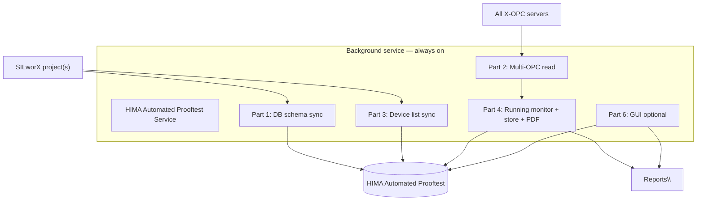
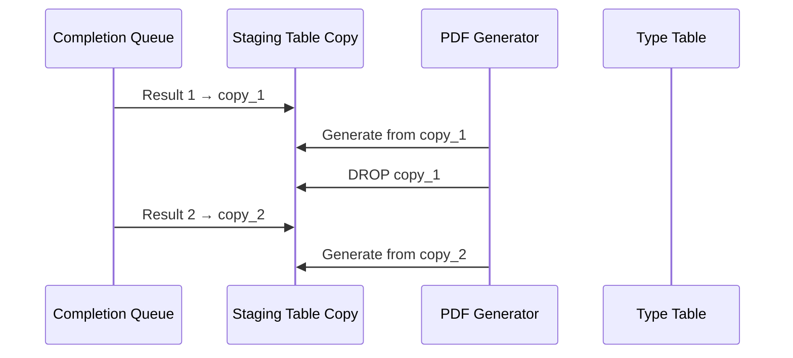

# SPEC-001 — HIMA Automated Prooftest Reporting Solution

| Field | Value |
|-------|--------|
| **Document ID** | SPEC-001 |
| **Title** | HIMA Automated Prooftest — Background Service, Multi-OPC, SQL, PDF, GUI |
| **Version** | 1.2 |
| **Date** | 2026-05-20 |
| **Status** | Draft |
| **Project** | Report Solution |
| **Location** | `Z:\Project\Report Solution` |
| **Filename** | `SPEC-001-v1.2-HART-Prooftest-OPC-Collection-and-PDF-Reporting.md` |
| **Supersedes** | v1.1 |

> **Versioning:** Updates require a new file (e.g. `SPEC-001-v1.3-...`). See [README.md](./README.md).

---

## 1. Purpose

Define a **continuously running** reporting solution that:

1. Works with **any SILworX application program** (project), supporting multiple manufacturers, **multiple X-OPC servers**, and **multiple system architectures** (configurations and resources).
2. Maintains the **`HIMA Automated Prooftest`** SQL Server database from SILworX **Results** structure definitions (CSV).
3. Builds and updates a **Device Prooftest Result List** from SILworX global variables.
4. Reads **realtime** result values from **all X-OPC servers** on the host.
5. Detects completed Prooftests via **`Running` TRUE → FALSE**, stores results, and generates **PDF reports**.
6. Provides a **graphical interface** for device selection, report browsing, and error/alarm indication.

---

## 2. Solution operating mode

| Requirement | Implementation |
|-------------|----------------|
| Run continuously in background | Windows Service (primary) or tray application with hidden main loop; auto-start on boot |
| Survive restarts | Service recovery policy; persistent state in SQL + config files |
| No operator action required | Default: fully automatic collect → store → PDF |
| Optional operator UI | Part 6 GUI connects to same service via local API or shared DB |



---

## 3. Flexibility requirements

The solution **must not** be hard-coded to a single plant project.

| Dimension | Requirement |
|-----------|-------------|
| **SILworX projects** | Configurable list of project paths; active project(s) selectable; support project switch after download |
| **Device manufacturers** | All nine HART `*_Results` types (§4); extensible when new CSV appears in Results Structures |
| **X-OPC servers** | Enumerate **all** OPC DA servers on host at runtime; search realtime values across every server |
| **Configurations** | Support multiple SILworX **configurations** (e.g. different OTS setups); map config → OPC branch / resource set |
| **Resources** | Support multiple **resources** (HIMA resource / OPC mapping contexts); store `Configuration`, `Resource`, `OPC_Server` per device in registry |

Configuration file: `solution.ini` — lists projects, OPC discovery mode, configuration/resource bindings.

---

## 4. Supported Results structures (SILworX library)

| # | SILworX data type | CSV file (`Results Structures\`) |
|---|-------------------|----------------------------------|
| 1 | `X-HART_ABB_FCB400_Results` | `ABB_FCB400_Results.csv` |
| 2 | `X-HART_Emerson_3051S_Results` | `Emerson_3051S_Results.csv` |
| 3 | `X-HART_E+H_PMx7xB_Results` | `E+H_PMx7xB_Results.csv` |
| 4 | `X-HART_E+H_FTL5xB/6x_Results` | `X-HART_E+H_FTL5xB-6x_Results.csv` |
| 5 | `X-HART_E+H_FMR6xB_Results` | `X-HART_E+H_FMR6xB_Results.csv` |
| 6 | `X-HART_E+H_Promass300/500_Results` | `X-HART_E+H_Promass300-500_Results.csv` |
| 7 | `X-HART_SAMSON_Results` | `X-HART_SAMSON_Results.csv` |
| 8 | `X-HART_WIKA_T32_Results` | `X-HART_WIKA_T32_Results.csv` |
| 9 | `X-HART_WIKA_T38_Results` | `X-HART_WIKA_T38_Results.csv` |

**CSV root:** `Z:\Project\Report Solution\Results Structures\`

**CSV format** (all files):

```text
Name, Data type, Initial Value, Sequence Number
X-HART_..._Results.<Member>, <SILworX type>, , <seq>
```

Example member: `X-HART_E+H_Promass300/500_Results.Running` → `BOOL`

**CSV → SQL type mapping** (implementation rule):

| SILworX type | SQL type |
|--------------|----------|
| BOOL | `BIT` |
| BYTE, USINT | `TINYINT` |
| WORD, UINT | `INT` |
| DWORD, UDINT | `BIGINT` |
| REAL | `FLOAT` |
| DINT | `INT` |
| X-HART_ASCII_32, nested structures | `NVARCHAR(MAX)` or flattened child columns per template rules |

---

# Part 1 — Database creation and update

## P1.1 Database

| Rule | Detail |
|------|--------|
| Name | **`HIMA Automated Prooftest`** (exact; create if not exists, else connect and use) |
| Engine | Microsoft SQL Server |
| Collation | Project default |

## P1.2 Results type tables

For **each** Results structure in §4:

1. Read the corresponding **CSV** from `Results Structures\`.
2. Create (or verify) one SQL table named after the **SILworX structure name**.

**Table naming:** `dbo.[{StructureName}]` with special characters sanitized if required, e.g.:

| Structure name | SQL table name (example) |
|----------------|--------------------------|
| `X-HART_E+H_Promass300/500_Results` | `dbo.[X-HART_E+H_Promass300_500_Results]` |
| `X-HART_E+H_FTL5xB/6x_Results` | `dbo.[X-HART_E+H_FTL5xB_6x_Results]` |

**Columns per type table:**

- One column per CSV member (leaf fields); nested types stored as JSON in `NVARCHAR(MAX)` or expanded per report template needs.
- **Mandatory metadata columns** on every type table:

| Column | Type | Description |
|--------|------|-------------|
| `RecordID` | `BIGINT IDENTITY` | Primary key |
| `Device_TAG` | `NVARCHAR(128)` | Global variable name (Part 3) |
| `Configuration` | `NVARCHAR(64)` NULL | SILworX configuration |
| `Resource` | `NVARCHAR(64)` NULL | SILworX resource |
| `OPC_Server` | `NVARCHAR(128)` NULL | Source X-OPC server ProgID |
| `CollectedAt` | `DATETIME2` | Snapshot timestamp |
| `ReportPath` | `NVARCHAR(512)` NULL | Generated PDF path |
| `SequenceInBatch` | `INT` NULL | Order when parallel tests (Part 4.4) |

## P1.3 SILworX project scan (Results types in running project)

On each **schema sync** cycle:

1. Open / read the **running SILworX project** global variable export and data type list.
2. Identify which of the nine (or more) **Results** structures are **used** in that project.
3. Ensure a type table exists for each detected structure.

## P1.4 Schema sync triggers

Re-run Part 1 (create/alter tables) when:

| Trigger | Detection |
|---------|-----------|
| SILworX **code generation** completed | Watch project output folder timestamp / SILworX log |
| SILworX project **downloaded** to target | Watch `.E3` / deploy folder modification |
| Manual | Service menu or config flag `ForceSchemaSync=1` |
| New CSV in `Results Structures\` | File watcher → new Results type table |

**On sync:** Add tables for **new** Results structures; `ALTER TABLE` add new columns from updated CSV; **do not drop** columns without migration script.

---

# Part 2 — Realtime data reading

## P2.1 Data source

All Results structure **realtime values** are read from **X-OPC servers** (OPC Classic DA), not directly from SILworX runtime API.

## P2.2 Multi-server discovery

| Step | Action |
|------|--------|
| 1 | Enumerate **all OPC DA servers** registered on the host (`opc.servers()` / OpcEnum) |
| 2 | Filter to **X-OPC** / HIMA servers (configurable pattern, e.g. `*X_OPC*`, `*HIMA*`) |
| 3 | Connect to **each** running server |
| 4 | For each device in Device Prooftest Result List, search for OPC items matching `Device_TAG` and structure members across **all** servers until found |
| 5 | Cache `Device_TAG` → `(OPC_Server, ItemPrefix)` mapping; refresh on failed read |

## P2.3 Read rules

- Poll interval for **Running** and realtime snapshot: **1 second** (Part 4).
- Read **leaf** OPC items only (validated: hierarchical servers expose `.IN1`, `.PV`, etc., or flattened paths from `X-HART_ReadTags`).
- Store last known good value + OPC quality per member.

---

# Part 3 — Prooftest device list

## P3.1 Device Prooftest Result List

**Table:** `dbo.DeviceProoftestResultList`

| Column | Type | Description |
|--------|------|-------------|
| `Device_TAG` | `NVARCHAR(128)` PK | **Global variable name** in SILworX |
| `Results_Type` | `NVARCHAR(128)` | e.g. `X-HART_E+H_PMx7xB_Results` |
| `Configuration` | `NVARCHAR(64)` | |
| `Resource` | `NVARCHAR(64)` | |
| `OPC_Server` | `NVARCHAR(128)` NULL | Resolved server |
| `OPC_ItemPrefix` | `NVARCHAR(256)` NULL | |
| `IsActive` | `BIT` | 0 = removed from project |
| `LastSeenAt` | `DATETIME2` | |
| `LastRunning` | `BIT` NULL | For edge detection |

## P3.2 Build rules

1. Read **global variable list** from active SILworX application program.
2. Select variables whose **data type** is one of the Results structures (§4).
3. Set **`Device_TAG`** = global variable **name** (e.g. `100-FZT-001`).
4. Insert or update row in `DeviceProoftestResultList`.

## P3.3 Update triggers

Same as Part 1.4 (code generation / project download):

| Action | Behavior |
|--------|----------|
| **New** global variable | `INSERT` into list; register for Part 4 monitoring |
| **Removed** variable | Set `IsActive = 0`; stop monitoring; **do not** delete historical rows in type tables |
| **Renamed** variable | Treat as remove + add unless rename map supplied in config |

---

# Part 4 — Prooftest execution detection

## P4.1 Monitoring loop (1 second)

Every **1 second**:

1. Refresh Device Prooftest Result List if sync trigger fired (Part 3).
2. For each **active** device with a Results type:
   - Read `Running` via OPC (Part 2).
   - Maintain previous `Running` in `DeviceProoftestResultList.LastRunning`.

## P4.2 Completion trigger

When **`Running`** changes **`TRUE` → `FALSE`** for a device:

1. Read **all other members** of that device’s Results structure from OPC.
2. `INSERT` one row into the **type table** named for that Results structure (Part 1), including `Device_TAG` and metadata.
3. Trigger **PDF generation** (Part 5).
4. Update `ReportPath` on the row.

## P4.3 PDF on database change

| Rule | Value |
|------|--------|
| Output directory | `Z:\Project\Report Solution\Reports` |
| Filename | `{Device_TAG}_{PDF_Generation_DateTime}.pdf` |
| DateTime format | `yyyy-MM-dd_HH-mm-ss` (configurable) |
| Example | `100-FZT-001_2026-05-20_14-32-05.pdf` |

## P4.4 Parallel Prooftest handling (same device / same table)

When **multiple** completions occur while PDF generation for the same device/type is still in progress:

### Preferred strategy — staging table copies



1. Assign **sequence number** (first, second, third, …) per device at enqueue time.
2. Create a **temporary copy** of the target type table (or single-row staging table) holding only that result.
3. Generate PDF from the copy.
4. **Delete** the staging copy after successful PDF.
5. Insert final row into permanent type table if not already persisted.

### Fallback strategy — sequential fill

If staging copy cannot be created:

1. Process queue **one by one** in order.
2. Fill type table with result **1** → generate PDF → clear or mark row.
3. Fill with result **2** → generate PDF → repeat until queue empty.

### Requirements

| ID | Requirement |
|----|-------------|
| P4.4-01 | Never lose a completed Prooftest result in queue |
| P4.4-02 | Preserve **order** (first, second, third…) in `SequenceInBatch` |
| P4.4-03 | Log warning if fallback sequential mode activated |

---

# Part 5 — Prooftest PDF report generation

## P5.1 Engine

Reuse **Alternative Reporting** stack: HTML template + WeasyPrint → PDF.

Template folder per Results type under `Z:\Project\Report Solution\Templates\` (or `Alternative Reporting\...\Templates\`).

## P5.2 Structure and writing rules

Rules apply when mapping SQL values to PDF text (template logic or post-processor):

| Condition | PDF result line text |
|-----------|----------------------|
| `Error = True` (or `Error = 1`) | **Prooftest Unsuccessful** |
| `Error = False` and heartbeat/summary indicates success | **Prooftest Successful** (or template-specific success text) |
| `Heartbeat Verification Result = 809` | **Successful** (Promass / HART convention) |
| `Heartbeat Verification Result = 33161` | **Not done** |
| Quality not Good / read failure | **Data quality error — result may be incomplete** |
| `Running` still True at snapshot | Must not generate PDF (guard) |

**General rules:**

- BOOL fields: display **Yes** / **No** where templates use yes/no CSS classes.
- Timestamps: convert `UDINT` Unix or `DATETIME2` to local plant time per config.
- REAL values: format with configurable decimal places (e.g. 3 for mA).
- Empty / null OPC values: display **—** or **N/A**, not blank silently.
- `Error Code` DWORD: expand to human-readable fault list per device type manual where template defines bits.

## P5.3 Template mapping

| Results type | Template (example) |
|--------------|-------------------|
| `X-HART_E+H_PMx7xB_Results` | `Cerabar_PMx7xB_V1_3` |
| Others | One template per type; define in `result_types.ini` |

---

# Part 6 — Graphical interface, errors, and alarms

## P6.1 UI components

Desktop GUI (WPF, WinForms, or Electron) — optional faceplate; service runs without UI.

| # | Component | Behavior |
|---|-----------|----------|
| **1** | **Device list** (scrolling) | All `Device_TAG` entries from latest `DeviceProoftestResultList` where `IsActive = 1`; user **selects** one device |
| **2** | **Report list** (scrolling) | PDF files for **selected device** from `Reports\` and/or `ReportPath` in SQL; sort by date descending |
| **3** | **Open report** button | Opens selected PDF with default system viewer (`os.startfile` / `ShellExecute`) |
| **4** | **Status bar** | Service connection, last OPC poll, active OPC servers count |

## P6.2 Error and alarm popups

Show **modal popup** (and log to alarm list) when:

| Condition | Popup message (example) |
|-----------|-------------------------|
| Cannot connect to **HIMA Automated Prooftest** database | *Database connection failed. Check SQL Server and connection settings.* |
| No **X-OPC server** found on host | *No X-OPC server detected. Verify HIMA X-OPC services are running.* |
| **OPC read** failed for selected/active device | *OPC read error for device {Device_TAG} on server {OPC_Server}.* |
| **PDF generation** failed | *Report generation failed for {Device_TAG}. See log for details.* |
| SILworX project / global list **not found** | *SILworX project export not available. Complete code generation and download.* |
| Schema sync failed | *Database schema update failed for {Results_Type}.* |
| Parallel queue **overflow** / timeout | *Prooftest result queue overflow for {Device_TAG}. Results may be delayed.* |
| Staging table copy failed (Part 4.4) | *Parallel report staging failed. Processing sequentially.* |

Alarm history table: `dbo.AlarmLog` (`Timestamp`, `Severity`, `Device_TAG`, `Message`, `Acknowledged`).

## P6.3 GUI ↔ service communication

- Local named pipe, gRPC on localhost, or shared SQL polling.
- GUI must not block OPC 1 s loop (runs in service process).

---

## 5. System tables summary

| Table | Purpose |
|-------|---------|
| `dbo.DeviceProoftestResultList` | Part 3 — all devices |
| `dbo.[X-HART_..._Results]` (×9+) | Part 1/4 — completed test rows per type |
| `dbo.AlarmLog` | Part 6 — errors |
| `dbo.SchemaVersion` | Last CSV hash / sync timestamp per type |
| `dbo.ServiceState` | Last poll, OPC servers discovered, queue depth |

---

## 6. Configuration files

```ini
; solution.ini
[Service]
run_mode = windows_service
auto_start = true

[Database]
name = HIMA Automated Prooftest
server = localhost\SQLEXPRESS

[SILworX]
projects = Z:\Project\SILworX\OTS Demo\ProofTest-Reporting solution\ProofTest-Reporting solution.E3
global_variables_export = globals.csv
sync_triggers = code_generation, download

[OPC]
discover_all_servers = true
server_filter = *X_OPC*;*HIMA*
poll_interval_sec = 1

[Reports]
output_directory = Z:\Project\Report Solution\Reports
filename_pattern = {Device_TAG}_{DateTime:yyyy-MM-dd_HH-mm-ss}.pdf

[ResultsStructures]
directory = Z:\Project\Report Solution\Results Structures
```

---

## 7. Non-functional requirements

| ID | Requirement |
|----|-------------|
| NFR-01 | Service runs 24/7; automatic restart on failure |
| NFR-02 | 1 s OPC cycle for ≤ 200 active devices |
| NFR-03 | Schema sync completes within 60 s of SILworX download |
| NFR-04 | PDF within 30 s of completion event (single device, no queue) |
| NFR-05 | Support ≥ 3 simultaneous X-OPC server connections |
| NFR-06 | Credentials outside source code |

---

## 8. Implementation phases

| Phase | Deliverable |
|-------|-------------|
| **P1** | Windows service shell + `HIMA Automated Prooftest` DB + CSV → type tables |
| **P2** | Multi-OPC discovery + item resolution |
| **P3** | Device Prooftest Result List + SILworX sync triggers |
| **P4** | 1 s Running monitor + INSERT + PDF |
| **P5** | Parallel queue + staging tables |
| **P6** | PDF writing rules + Cerabar template validation |
| **P7** | GUI (lists, open report, popups) |

---

## 9. Acceptance criteria

1. Service runs continuously in background after install.
2. Database **`HIMA Automated Prooftest`** exists with nine type tables from CSV.
3. Device list updates after SILworX code generation / download simulation.
4. Realtime values read from **all** running X-OPC servers on host.
5. `Running` TRUE→FALSE stores row with correct `Device_TAG` in correct type table.
6. PDF saved to `Z:\Project\Report Solution\Reports` with `{Device_TAG}_{datetime}.pdf`.
7. `Error = True` renders **Prooftest Unsuccessful** in PDF.
8. Parallel completions for same device produce ordered PDFs without data loss.
9. GUI lists devices and reports; Open button launches PDF.
10. Configured errors show popup messages per §P6.2.

---

## 10. Related paths

| Item | Path |
|------|------|
| Results CSV files | `Z:\Project\Report Solution\Results Structures\` |
| PDF output | `Z:\Project\Report Solution\Reports\` |
| SILworX reference project | `Z:\Project\SILworX\OTS Demo\ProofTest-Reporting solution\` |
| OPC client reference | `Z:\Project\Report Solution\Codes\Report-Tool\Connection-opc.py` |
| Report engine reference | `Z:\Project\Report Solution\Alternative Reporting\2025-07-28\11-10\` |
| Spec v1.1 | [SPEC-001-v1.1](./SPEC-001-v1.1-HART-Prooftest-OPC-Collection-and-PDF-Reporting.md) |
| Versioning | [README.md](./README.md) |

---

## 11. Open items

- [ ] Confirm SILworX **code generation / download** watch path per project layout.
- [ ] Final GUI technology choice (WPF vs tray-only).
- [ ] Complete PDF writing rules for all nine device types (Part 5 templates).
- [ ] Map nested `Parameters Before/After Test` structures to PDF sections.
- [ ] User to complete additional popup conditions if more alarm cases are required.

---

## 12. Document history

| Version | Date | Author | Changes |
|---------|------|--------|-----------|
| 1.0 | 2026-05-20 | Report Solution | Initial OPC-centric specification |
| 1.1 | 2026-05-20 | Report Solution | SILworX globals; per-device tables; 1 s poll; Running edge |
| 1.2 | 2026-05-20 | Report Solution | Background service; multi-project/multi-OPC/multi-config; **HIMA Automated Prooftest** DB; CSV-driven type tables; Device Prooftest Result List; SILworX sync triggers; parallel prooftest queue; Part 5 PDF rules; Part 6 GUI and alarms |

---

*End of document*
