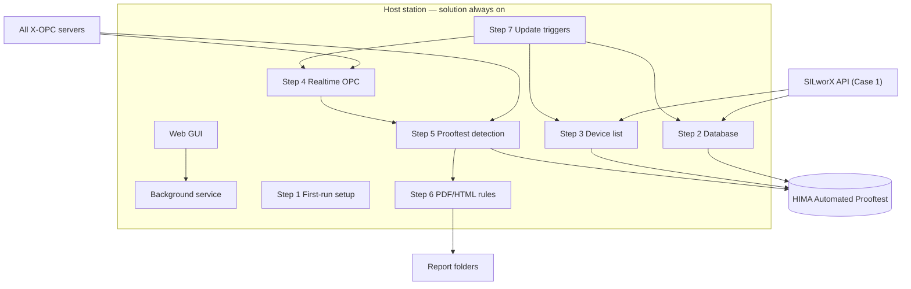
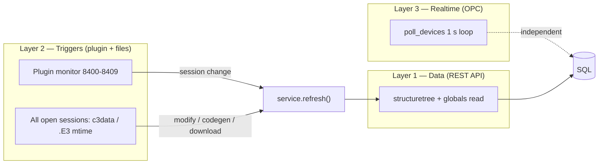

# SPEC-001 — HIMA Automated Prooftest Reporting Solution

| Field | Value |
|-------|--------|
| **Document ID** | SPEC-001 |
| **Title** | HIMA Automated Prooftest — Background Service, SILworX API, Multi-OPC, SQL, PDF/HTML, Web GUI |
| **Version** | 1.33 |
| **Date** | 2026-07-01 |
| **Status** | Draft |
| **Project** | Report Solution |
| **Location** | `Z:\Project\Report Solution` |
| **Filename** | `SPEC-001-v1.33-HART-Prooftest-OPC-Collection-and-PDF-Reporting.md` |
| **Supersedes** | v1.32 |

> **Versioning:** Updates require a new file (e.g. `SPEC-001-v1.15-...`). See [README.md](./README.md). Code changes require a new folder per [Codes/README.md](../Codes/README.md).

---

## Summary of changes

Cumulative record of specification and implementation updates. **The current version (1.33) is listed first**; summaries from all prior gated releases are retained below for audit. Active code: `HIMA-Prooftest-Solution-Current`.

### Version 1.33 (2026-07-01) — current

**Supersedes v1.32.** Active code folder: `HIMA-Prooftest-Solution-Current`.

#### What changed from v1.32 to v1.33

| Topic | v1.32 | v1.33 (change) |
|-------|-------|----------------|
| **Auto-start trigger** | At **system startup** as **SYSTEM** only | **`auto_start_trigger`** — default **`logon`** (current user; mapped **Z:** works); optional **`startup`** (SYSTEM + UNC path resolution) |
| **Health check wait** | `run_service.ps1` fixed **25 s** sleep | **`health_check_wait_sec`** (default **120 s**), poll every 10 s until `/api/health` responds |
| **Task action** | Script path on **Z:** | **WorkingDirectory** set; mapped drives resolved to **UNC** for SYSTEM tasks |

#### Files touched for v1.33

| File | Change |
|------|--------|
| `solution.ini` | `auto_start_trigger = logon`, `health_check_wait_sec = 120` |
| `Tool Steps/config.py` | `auto_start_trigger`, `health_check_wait_sec` |
| `Annex codes/Stop service/annex_windows_auto_start.ps1` | Logon vs startup trigger; UNC path; WorkingDirectory |
| `run_service.ps1` | Poll health up to `health_check_wait_sec`; stderr log; relative `solution.ini` |
| `SPEC-001-v1.33-...md` | §5.6 auto-start trigger; health wait |

### Version 1.32 (2026-06-19)

**Supersedes v1.31.** Active code folder: `HIMA-Prooftest-Solution-Current` (archived as `HIMA-Prooftest-Solution-v1.33` before v1.33 edits).

#### What changed from v1.31 to v1.32

| Topic | v1.31 | v1.32 (change) |
|-------|-------|----------------|
| **Windows auto-start** | Manual `run_service.ps1` only | **`auto_start = true`** — Task Scheduler task **`HIMA-Prooftest-Service`** runs `run_service.ps1` **at Windows startup** (delay `auto_start_delay_sec`, default 90 s) |
| **Install / remove** | — | `install_auto_start.ps1`, `uninstall_auto_start.ps1`; `run_service.ps1` **syncs** task when `auto_start=true` |

#### Files touched for v1.32

| File | Change |
|------|--------|
| `solution.ini` | `auto_start = true`, `auto_start_delay_sec = 90` |
| `Tool Steps/config.py` | `auto_start`, `auto_start_delay_sec` |
| `Annex codes/Stop service/annex_windows_auto_start.ps1` | Task Scheduler register / sync |
| `install_auto_start.ps1`, `uninstall_auto_start.ps1` | Operator scripts |
| `run_service.ps1` | Sync auto-start task after start |
| `SPEC-001-v1.32-...md` | §5.6 Windows auto-start |

### Version 1.31 (2026-06-19)

#### What changed from v1.29 to v1.31

| Topic | v1.29 | v1.31 (change) |
|-------|-------|----------------|
| **Device list search** | Scroll list only | **Search field** above device list — type to highlight matches and scroll to the first; **Enter** cycles matches; **all devices remain visible** |
| **Report list search** | Scroll list only | **Search field** above report list — same behaviour for report file names |

#### Files touched for v1.31

| File | Change |
|------|--------|
| `Graphic Interface/static/index.html` | `#device-search`, `#report-search` inputs |
| `Graphic Interface/static/app.js` | `applyListSearch`, `setupListSearch` |
| `Graphic Interface/static/style.css` | `.list-search-input`, `.search-hit`, `.search-current` |
| `Annex codes/Tool test/test_step11_web_ui.py` | Search field markers |
| `SPEC-001-v1.31-...md` | §5.1 list search behaviour |

### Version 1.29 (2026-06-19)

**Supersedes v1.28.** Active code folder was `HIMA-Prooftest-Solution-v1.29` (now **frozen**).

#### What changed from v1.28 to v1.29

| Topic | v1.28 | v1.29 (change) |
|-------|-------|----------------|
| **Report storage location** | Step 1.2 names `C:\HIMA Automated Prooftest Reports`, but `solution.ini` used `Z:\Project\Report Solution\Reports` as `output_directory` | **All PDF/HTML reports** are written under **`C:\HIMA Automated Prooftest Reports`** (same as `first_run_folder` / Step 1.2). `[Reports] output_directory` must match that path |
| **Mirror copy** | Optional `local_mirror` could differ from output | Mirror copy is **skipped** when `local_mirror` equals `output_directory`; default is the same `C:\` root |
| **Code folder** | Misplaced `X-HART_*_Results` could appear under solution root if paths were wrong | Config normalizes empty/relative output to `first_run_folder`; report roots deduplicated in Step 1 |

#### Files touched for v1.29

| File | Change |
|------|--------|
| `solution.ini` | `output_directory` → `C:\HIMA Automated Prooftest Reports` |
| `Tool Steps/config.py` | Default `report_output` to `first_run_folder` |
| `Tool Steps/step01_setup.py` | Deduplicate report roots before creating hierarchy |
| `Annex codes/PDF generation/annex_pdf_generation.py` | Skip mirror write when mirror equals output |
| `SPEC-001-v1.29-...md` | Step 1.2 / §6 clarified |

#### Gate 12 update (same v1.29 — no new spec/code version)

| Topic | Before Gate 12 | After Gate 12 (v1.29) |
|-------|----------------|------------------------|
| **Gate 11** | In progress | **Approved** 2026-06-18 |
| **Gate 12** | Code done; validation pending | **`test_step12_case2.py`** — **Approved** 2026-06-19; Case 2 OPC device list, schema sync, background poll |

#### Files touched for Gate 12 (v1.29)

| File | Change |
|------|--------|
| `Annex codes/Tool test/test_step12_case2.py` | **New** gate test |
| `SPEC-001-v1.29-...md` | §5 gate table + Gate 12 criteria |

#### Gate 12 approval (v1.29)

Gate 12 (**Case 2 deployment**, `test_step12_case2.py`) is **formally approved**. Gate 13 may proceed.

#### Gate 13 update (same v1.29 — no new spec/code version)

| Topic | Before Gate 13 | After Gate 13 (v1.29) |
|-------|----------------|------------------------|
| **`/api/health` blocking** | Could call blocking OPC browse | **`OpcManager.health_snapshot()`** — cached server list only |
| **Web auth** | Not specified | Optional `[Web] auth_enabled` + `auth_token`; `X-Prooftest-Token` or `?token=`; localhost bypass |
| **Column mapping** | Partial | **`verify_template_placeholder_mapping()`** — all twelve HIMA templates |

#### Files touched for Gate 13 (v1.29)

| File | Change |
|------|--------|
| `Annex codes/OPC/annex_opc.py` | `health_snapshot()` (non-blocking) |
| `Tool Steps/service.py` | `health()` uses snapshot |
| `Graphic Interface/app.py` | Auth middleware |
| `Graphic Interface/static/app.js` | Token header + `?token=` persistence |
| `Tool Steps/config.py` | `auth_*` settings; disable auth if token empty |
| `Annex codes/PDF generation/annex_pdf_generation.py` | `verify_template_placeholder_mapping()` |
| `Annex codes/Tool test/test_step13_hardening.py` | **New** gate test |
| `solution.ini` | `[Web] auth_*` documented |

#### Gate 13 approval (v1.29)

Gate 13 (**Hardening**, `test_step13_hardening.py`) is **formally approved**. Roadmap gates **0–13** are complete on v1.29.

### Version 1.28 (2026-06-19)

**Supersedes v1.27.** Active code folder was `HIMA-Prooftest-Solution-v1.28` (now **frozen**).

#### What changed from v1.27 to v1.28

| Topic | v1.27 | v1.28 (change) |
|-------|-------|----------------|
| **Web UI — service control** | Stop via `POST /api/shutdown` / `stop_service.ps1` only | **Start service** and **Stop service** buttons in the Web GUI; `POST /api/start` (localhost) spawns background `main.py` (same as `run_service.ps1`) |
| **Web UI — scroll lists** | Placeholders varied; lists could appear empty without visible panel | Device and report **scrolling lists always visible**; show **`(No device selected)`** and **`(No report selected)`** when empty |
| **Specification file** | `SPEC-001-v1.27-...md` (active) | **`SPEC-001-v1.28-...md`** (active); v1.27 file **immutable** |
| **Code folder** | `HIMA-Prooftest-Solution-v1.27` (active) | **`HIMA-Prooftest-Solution-v1.28`** (active); v1.27 frozen in `VERSION.json` |

#### Description of v1.28 modifications

1. **Start / Stop service buttons (§5.1 #7).** Operators can start the background Prooftest process from the Web GUI (`POST /api/start`, localhost only) or stop it completely (`POST /api/shutdown`). Start is disabled while the service is already running; Stop triggers graceful shutdown (G-11).

2. **Persistent scroll list placeholders (§5.1 #1–2).** The device list and report list panels remain visible with fixed minimum height. When no devices are detected or none is selected, the device list shows **`(No device selected)`**. When no report is available or selected, the report list shows **`(No report selected)`**.

#### Files touched for v1.28

| File | Change |
|------|--------|
| `Graphic Interface/static/index.html` | Start / Stop service buttons; default list placeholders |
| `Graphic Interface/static/app.js` | Service control handlers; placeholder text |
| `Graphic Interface/app.py` | `POST /api/start` |
| `Annex codes/Stop service/annex_start_service.py` | **New** — spawn background `main.py` |
| `Tool Steps/config.py` | `ini_path` on `AppConfig` |
| `SPEC-001-v1.28-...md` | This document |
| `VERSION.json` | `spec_version` 1.28, `status: active` |

### Version 1.27 (2026-06-18)

**Supersedes v1.26.** Active code folder was `HIMA-Prooftest-Solution-v1.27` (now **frozen**).

#### What changed from v1.26 to v1.27

| Topic | v1.26 | v1.27 (change) |
|-------|-------|----------------|
| **Gate 8 status** | Done — *await your approval before Gate 9* | **Approved** 2026-06-18; Gate 9 may proceed |
| **Gate 9** | Code for Step 5 insert existed; gate test **pending** | Gate test **`test_step9_prooftest_sql.py`** — **Approved** 2026-06-18 |
| **Step 5 SQL insert (`insert_snapshot`)** | Used `SCOPE_IDENTITY()` after INSERT — often returned **`0`** on SQL Server (with `SET NOCOUNT ON`), so `ReportPath` update and row verification failed | Uses **`OUTPUT INSERTED.[ID]`** so every insert returns the real row ID |
| **§3.5 Mode B / plugin session** | One-shot plugin conflict fix was **implemented in v1.26 code** but **not fully written in the v1.26 spec** | **Documented in spec:** when `plugin_monitor_enabled = true` and monitor is running, API refresh uses monitor cache or waits — **no second** `prooftest_session_plugin` register; service log line table added |
| **Summary of changes** | Not present as a cumulative section | **New section** at top of spec (this section) with descriptions and retained prior-version summaries |
| **Specification file** | `SPEC-001-v1.26-...md` (active) | **`SPEC-001-v1.27-...md`** (active); v1.26 file **immutable** |
| **Code folder** | `HIMA-Prooftest-Solution-v1.26` (active) | **`HIMA-Prooftest-Solution-v1.27`** (active); v1.26 frozen in `VERSION.json` |
| **Gates 10–13** | Scope defined; not started | **Gates 10–13 approved** (roadmap complete) |
| **G-22 architecture, plugin monitor, OPC poll** | Introduced in v1.26 | **No behavioural change** — copied into v1.27 codebase as-is |

#### Description of v1.27 modifications

1. **Gate 8 approved.** The G-22 trigger layer from v1.26 (persistent plugin monitor on `8400`–`8409`, multi-session `c3data`/`.E3` watchers, `test_step8_triggers.py`) is formally approved for use on engineering stations. No new trigger code in v1.27 — only spec status update.

2. **Gate 9 — Prooftest SQL insert verification.** New script `Annex codes/Tool test/test_step9_prooftest_sql.py` proves Step 5 end-to-end on a test database:
   - `insert_snapshot` writes to the correct `ProofTest_*` table with `Device_TAG`, `OPC_Server`, `CollectedAt`, `SequenceInBatch`.
   - `ProoftestMonitor` detects `Running` FALSE→TRUE→FALSE (mock OPC) and the background worker inserts the SQL row.
   - Uses isolated SQLite (`Tool test/data/gate9_prooftest.db`) so production `HIMA Automated Prooftest` data is not modified.

3. **SQL Server insert ID fix.** `annex_database.py` → `insert_snapshot()`: SQL Server path changed from `SCOPE_IDENTITY()` to `OUTPUT INSERTED.[ID]` because the former returned `0` when `SET NOCOUNT ON` was set on the cursor, breaking `update_report_path()` and gate checks.

4. **Spec clarification for plugin session (v1.26 code, v1.27 spec).** §3.5 now states explicitly that with `plugin_monitor_enabled = true` the service must not run the short-lived one-shot WebSocket (`acquire_open_project_session_id`) while the monitor is up — that behaviour was added in **v1.26 code** (`resolve_gui_session_id`, `wait_for_session_id`, monitor before `refresh()`); **v1.27 only documents it** in the specification.

5. **Versioning policy applied.** New spec file and new code folder per [Codes/README.md](../Codes/README.md); v1.26 spec and code tree left unchanged for audit.

#### Gate 10 update (same v1.27 — no new spec/code version)

| Topic | Before Gate 10 | After Gate 10 (v1.27) |
|-------|----------------|------------------------|
| **Gate 9** | Done — await approval | **Approved** 2026-06-18 |
| **Gate 10** | Code existed; template hardening pending | **`test_step10_reports.py`**; HIMA HTML templates from `1- HTML Reports Template`; SAMSON FST/PST folders; `html_templates` in `solution.ini` |
| **Report paths** | Flat under `report_output` | **`device_report_dir()`** — matches Step 1.2 folder hierarchy |
| **Spec/code version** | 1.27 | **Still 1.27** — gates advance within one version until a release bump is needed |

#### Files touched for Gate 10 (v1.27)

| File | Change |
|------|--------|
| `Annex codes/PDF generation/annex_pdf_generation.py` | FST/PST template key, subfolder paths, `decimal_places`, mirror copy fix |
| `Annex codes/Tool test/test_step10_reports.py` | **New** gate test |
| `SPEC-001-v1.27-...md` | Gate 9 approved; Gate 10 criteria in §6; gate table updated |

#### Gate 11 update (same v1.27 — no new spec/code version)

| Topic | Before Gate 11 | After Gate 11 prep (v1.27) |
|-------|----------------|----------------------------|
| **Gate 10** | Done — await approval | **Approved** 2026-06-18 |
| **Gate 11** | Code existed; polish pending | **`test_step11_web_ui.py`**; `AlarmLog` persistence on `raise_alarm`; health panel shows SILworX; `/api/reports?results_type=` |
| **sqlite_path** | Pointed at v1.25 folder | **v1.27** `Annex codes/data/prooftest.db` |
| **Spec/code version** | 1.27 | **Still 1.27** |

#### Files touched for Gate 11 prep (v1.27)

| File | Change |
|------|--------|
| `Tool Steps/alarms.py` | `set_persist_callback` — write to `AlarmLog` on raise |
| `Tool Steps/service.py` | Wire alarm persistence after DB connect |
| `Annex codes/Database/annex_database.py` | `list_recent_alarms()` for API alarm zone |
| `Graphic Interface/app.py` | `results_type` on reports; alarms from DB; version `1.27.0` |
| `Graphic Interface/static/app.js` | SILworX in health; pass `results_type` to reports API |
| `Annex codes/Tool test/test_step11_web_ui.py` | **New** gate test |
| `solution.ini` | `sqlite_path` → v1.27 data folder |
| `requirements.txt` | `httpx` for gate-test `TestClient` |
| `Graphic Interface/static/` | HIMA-branded UI redesign; `img/` logos from `7- Images for the graphical interface` |

| File | Change |
|------|--------|
| `Annex codes/Tool test/test_step9_prooftest_sql.py` | **New** gate test |
| `Annex codes/Database/annex_database.py` | `insert_snapshot` → `OUTPUT INSERTED.[ID]` on SQL Server |
| `VERSION.json` | `spec_version` 1.27, `status: active` |
| `SPEC-001-v1.27-...md` | **New** spec (this file) |
| `HIMA-Prooftest-Solution-v1.26/VERSION.json` | `status: frozen` (only edit allowed on frozen tree) |

---

### Version 1.26 (2026-06-17) — frozen

**G-22 three-layer architecture.** Separated concerns into: **(1) Data layer** — device list and metadata read only via SILworX REST API; **(2) Trigger layer** — persistent plugin WebSocket monitor on ports `8400`–`8409` plus `c3data`/`.E3` mtime on all open sessions; **(3) Realtime layer** — independent OPC poll loop (1 s), never blocked by API or plugin work.

**Plugin monitor (`annex_plugin_monitor.py`).** Background listener on every reachable API/plugin port pair; caches `user_session_id` from `TRIGGER_SESSION_ID_CHANGED`; rescan when SILworX instances appear.

**One-shot plugin conflict fix (code).** `resolve_gui_session_id()` waits on monitor cache when monitor is active; `service.py` starts monitor before first `refresh()`; `PluginPortMonitor.is_running()` and `wait_for_session_id()` added.

**Multi-session triggers.** `step07_triggers.py` watches all open SILworX sessions for project modify and code generation, not only the preferred session.

---

### Version 1.25 (2026-06-16) — frozen

**Gate 8 complete.** Wired `code_generation` and `download` triggers to `service.refresh()`; added `run_plugins_all.ps1`, `Plugin/README.md`, `test_step8_triggers.py`; service state `silworx_plugin_ports_configured`.

---

### Version 1.24 (2026-06-16) — frozen

**Gate 7 approved; Gate 8 started.** Separate `code_generation` / `download` trigger names; roadmap gates 0–13 table; `test_step8_triggers.py` introduced.

---

### Version 1.23 (2026-06-16) — frozen

**G-21 multi-instance API.** Scan and connect to all SILworX API/plugin port pairs `51710`–`51719` / `8400`–`8409`; `discover_available_instances()`, `api_session_for_port()`; merged device list across instances.

---

### Version 1.22 (2026-06-16) — frozen

**G-20 rewrite.** Removed API-based kill logic; kill `c3.exe` only after confirmed SILworX close (`lock.ini` gone, `OLixClient.exe` gone, 8 s grace); never on startup.

---

### Version 1.21 (2026-06-16) — frozen

**G-20 fix v2.** Reset `_silworx_seen_running` after cleanup so kill gate cannot fire during the next SILworX startup; `down_streak` reset after clean shutdown.

---

### Version 1.20 (2026-06-16) — frozen

**G-20 fix.** Never kill `c3.exe` while SILworX is opening, running, or a project is open; process kill only after four consecutive “closed” polls with `_silworx_seen_running`.

---

### Version 1.19 (2026-06-16) — frozen

**G-19 API session release.** Release SILworX API connection when SILworX closes (`is_silworx_running` via `POST /silworx/info`); `release_api_connection` in `step07_triggers.py`. **G-19 fix:** `_service_owns_api_session`, consecutive-probe release, `is_api_suspended`. **G-20 addition:** `annex_silworx_cleanup.py` for stale `c3.exe` / `hima.*` after confirmed close.

---

### Versions 1.17–1.18 — frozen

**G-17 layout.** Annex modules in purpose-named root folders (`Database`, `API connexion`, `OPC`, `PDF generation`, `Plugin`, `Stop service`); web GUI in `Graphic Interface\`; `prooftest/__init__.py` import bootstrap.

**G-16.** Flat step modules + `annex_*` files. **G-15.** `Tool test\` folder for gate scripts. **G-14.** Step files under `prooftest/steps`.

---

### Versions 1.11–1.16 — frozen

**G-11** graceful shutdown (`POST /api/shutdown`, `stop_service.ps1`). **G-12** code folder versioning policy. **G-13** no globals CSV export; `prooftest_session_plugin` session bridge only.

---

### Versions 1.9–1.10 — frozen

**1.9** user requirements rewrite: Steps 1–7, Case 1 API device list, Case 2 OPC+CSV, Step 7 codegen triggers, error catalog. **1.10** gates 0–6 record: nine `ProofTest_*` tables, `TEMPLATE_MAP`, OI-3 OPC fallback, §3.5 API session modes, `solution.ini` alignment.

---

### Versions 1.0–1.8 — frozen

Initial OPC-centric spec through Case 1 OPC-only device list, background service, multi-OPC, web GUI, SILworX `lock.ini` session detection. See §10 Document history for full row-per-version detail.

---

## 1. Purpose

To obtain **realtime CPU data**, this solution **must run on the same station where the X-OPC server is running**.

Two deployment architectures (**cases**) are supported with a **selection philosophy**:

| Case | SILworX | X-OPC server | This solution |
|------|---------|--------------|---------------|
| **Case 1** | Engineering station | Engineering station (same PC) | Engineering station |
| **Case 2** | Engineering station (remote) | HMI station | **HMI station** (with OPC) |

The report solution must support **both cases** via configuration (`deployment_case = 1` or `2`) and, on first run, **automatic case detection** (see Step 1).

---

## 2. General specifications of the Report Solution

| # | Requirement |
|---|-------------|
| **G-01** | The solution/code must run **continuously in the background** (Windows Service or equivalent daemon). |
| **G-02** | The solution must be **flexible** across different SILworX application programs: multiple device manufacturers, multiple X-OPC servers, multiple **Configurations**, and multiple **Resources**. |
| **G-03** | The solution is divided into **Steps 1–7** (see §4). |
| **G-04** | If an error occurs in any Step, an **error message** must be generated and shown in the graphical interface, naming the **Step** and the **specific action** that failed. |
| **G-05** | On **first start** on a station, create the folder **`C:\HIMA Automated Prooftest Reports`** (see Step 1 for internal structure). |
| **G-06** | The solution must provide a **web server graphical interface**. |
| **G-07** | The solution must support **automatic and manual** update of the device list, X-OPC server list, and SQL database. |
| **G-08** | The solution must **automatically detect** when a Prooftest is initiated, **wait until the test ends**, take a **snapshot** of the Results structure, and store it in the dedicated SQL table. |
| **G-09** | **Immediately after** the database table row is written, generate a **PDF or HTML** report automatically and store it under the report folder structure (§4 Step 5–6). |
| **G-10** | To identify the device list, device types, and updates, the solution must use the **SILworX integrated API** where applicable (details per Step below). Realtime values are always read from **X-OPC**. |
| **G-11** | The background service **must stop** (release OPC, SILworX API sessions, and worker threads) so the user can **uninstall SILworX** without the Prooftest process blocking files or COM/API resources. The service must expose a **graceful shutdown** path for uninstallers and operators (see §5.5). |
| **G-12** | **Solution code versioning:** when a new specification version requires code changes, **do not modify** the previous version’s code folder. Copy the latest `HIMA-Prooftest-Solution-v{x.y}` tree to a new folder matching the new spec version and implement changes **only** there. Prior code folders remain **frozen** (see [Codes/README.md](../Codes/README.md)). |
| **G-13** | **No globals CSV export:** the solution must **not** export, read, or depend on a global-variables CSV file (e.g. `Globale variable.csv`, `data/globals.csv`). Case 1 device discovery uses **SILworX OpenAPI only** (`structuretree/info` + `globalvariables/content/read`). Remove all export scripts, plugins, and config keys for globals CSV. |
| **G-14** | **SPEC step-based code layout:** organize implementation under `prooftest/steps/` with one consolidated module per Step 1-7 (`step01_setup.py` ... `step07_triggers.py`). Legacy module names are retained only as thin re-export shims for compatibility. |
| **G-15** | **Tool test separation:** all scripts used to test, audit, or probe the solution (gate tests, SQL/OPC probes, monitors) live in **`Tool test\`** beside the solution folder — not mixed with runtime service code. |
| **G-16** | **Steps + annex file layout:** SPEC Step modules (`step01_setup.py` … `step07_triggers.py`) live **alongside** main service code under `prooftest\` (not in a `steps\` subfolder). Cross-cutting infrastructure is split into purpose-named **annex** files: `annex_database.py`, `annex_api_connexion.py`, `annex_opc.py`, `annex_pdf_generation.py`, `annex_stop_service.py`; solution root `annex_plugin.py` and `annex_stop_service.ps1`. Legacy module names remain thin re-export shims. |
| **G-17** | **Purpose-named annex folders:** `prooftest\` contains **only** Steps + main service code (`service.py`, `config.py`, `alarms.py`, `results_csv.py`, `step01_setup.py` … `step07_triggers.py`). Annex modules live in purpose-named folders at solution root: `Database\`, `API connexion\`, `OPC\`, `PDF generation\`, `Stop service\`, `Plugin\`. Web GUI lives in `Graphic Interface\`. Solution root keeps `main.py`, `run_service.ps1`, `stop_service.ps1` (forwarder), `solution.ini`, `VERSION.json`, `README.md`, and `Tool test\`. Annex imports are bootstrapped in `prooftest/__init__.py` via `importlib` so `from prooftest.annex_*` remains valid. Legacy re-export shims under `prooftest\` are removed. |
| **G-19** | **Stop API when SILworX is closed:** when the SILworX software which is connected to is closed (`is_silworx_running` false for **two consecutive** background polls — API unreachable via `POST /silworx/info`), the solution **must release** the SILworX API connection — clear any cached `user_session_id`, call `project/close` for sessions opened by this service via `open/local` (tracked persistently outside `api_session` context), and discard the cached API client. On the **first** failed probe, attempt `project/close` with a short timeout while the API may still be shutting down. While SILworX is down, **suspend** API opens (`is_api_suspended`) so background refresh does not immediately call `open/local` again. Do **not** call `project/close` for GUI-attached plugin sessions (that would close the engineer's project). Closing a project while SILworX remains running does **not** trigger API release. Record `silworx_api_connected = 0` in `ServiceState`. `api_port` / `api_plugin_port` must match the running SILworX GUI instance (e.g. `51711` / `8401`). Full process shutdown on SILworX **uninstall** remains governed by **G-11**. |
| **G-20** | **Kill leftover `c3.exe` only after confirmed SILworX close:** track session activity via `lock.ini` (project open) and `OLixClient.exe` (GUI). When both become absent after a previously active session, wait **8 s**, then terminate leftover `c3.exe` only (`annex_silworx_cleanup.py`, `taskkill /F /T`). **Never** kill on `c3.exe` presence alone or on API unavailability — SILworX startup always begins with `c3.exe` before the GUI or project lock appear. Record killed-count in `ServiceState.silworx_cleanup_killed`. |
| **G-21** | **Multi-instance API/plugin port scan:** scan all **10** SILworX port pairs `51710/8400` … `51719/8409` (`api_port_start`, `api_port_count`, `api_plugin_port_start` in `solution.ini`). For each reachable instance, connect via the matching plugin port (Mode B) or `open/local` on the preferred `api_port` only (Mode A). Merge device-list results from all instances; record active pairs in `ServiceState.silworx_api_ports_active` and `/api/health` → `silworx_api_instances`. |
| **G-22** | **Three-layer architecture (v1.26):** **(1) Data layer** — device list, `Results_Type`, `Configuration`, and `Resource` are read **only** via SILworX REST API (`structuretree/info` + `globalvariables/content/read`) on every reachable API instance; OPC is never the primary metadata source (fallback OI-3 only). **(2) Trigger layer** — persistent plugin WebSocket monitors on **all 10** plugin ports (`annex_plugin_monitor.py`) detect session open/close (`TRIGGER_SESSION_ID_CHANGED`); **all** open SILworX sessions (not one preferred session) are watched for project modify and code generation (`c3data` mtime) and for download (`.E3` mtime when SILworX closed); any trigger calls `service.refresh()` to re-read via layer 1. SILworX exposes no plugin triggers for codegen/download — file watchers remain for those events. **(3) Realtime layer** — X-OPC polling runs on an **independent** thread (`poll_interval_sec`, default 1 s); never blocked by API or plugin work (G-10). |



---

## 3. SILworX projects and Prooftest Results structures

### 3.1 Supported Results data types (library)

Each device type/manufacturer has a dedicated Prooftest **Results** structure in the SILworX library (name ends with `_Results`):

| # | SILworX data type |
|---|-------------------|
| 1 | `X-HART_ABB_FCB400_Results` |
| 2 | `X-HART_Emerson_3051S_Results` |
| 3 | `X-HART_E+H_PMx7xB_Results` |
| 4 | `X-HART_E+H_FTL5xB/6x_Results` |
| 5 | `X-HART_E+H_FMR6xB_Results` |
| 6 | `X-HART_E+H_Promass300/500_Results` |
| 7 | `X-HART_SAMSON_Results` |
| 8 | `X-HART_WIKA_T32_Results` |
| 9 | `X-HART_WIKA_T38_Results` |

**CSV definitions** for each structure:

- Primary path: `Z:\Project\Report Solution\3- Results Structures\`
- Alternate reference path: `Z:\Project\Report Solution\Results Structures\` (if deployed)

### 3.2 Global variables

1. Each device’s Prooftest Results must be declared as a **global variable** in the SILworX application program.
2. The library Results structures are used as the **data type** of those global variables.
3. A SILworX project may contain **several Configurations**; each Configuration may contain **several Resources**. Each Configuration may have one **Global Variables** node; each Resource may have its own Global Variables node.
   - *Example:* Two configurations — first with two resources, second with one resource — yields up to **five** Global Variable elements in the project tree.
4. **All Results structure realtime values** are published on the **X-OPC servers** (read in Step 4).

### 3.3 SQL table naming

Replace prefix `X-HART_` with `ProofTest_` and sanitize `/` → `_` for SQL identifiers.

| SILworX structure | SQL table name |
|-------------------|----------------|
| `X-HART_ABB_FCB400_Results` | `ProofTest_ABB_FCB400_Results` |
| `X-HART_Emerson_3051S_Results` | `ProofTest_Emerson_3051S_Results` |
| `X-HART_E+H_PMx7xB_Results` | `ProofTest_E+H_PMx7xB_Results` |
| `X-HART_E+H_FTL5xB/6x_Results` | `ProofTest_E+H_FTL5xB_6x_Results` |
| `X-HART_E+H_FMR6xB_Results` | `ProofTest_E+H_FMR6xB_Results` |
| `X-HART_E+H_Promass300/500_Results` | `ProofTest_E+H_Promass300_500_Results` |
| `X-HART_SAMSON_Results` | `ProofTest_SAMSON_Results` |
| `X-HART_WIKA_T32_Results` | `ProofTest_WIKA_T32_Results` |
| `X-HART_WIKA_T38_Results` | `ProofTest_WIKA_T38_Results` |

Use bracket-quoted names where required: `dbo.[ProofTest_E+H_Promass300_500_Results]`.

**SAMSON 3730 / 3793:** Both device types share the **same** Results structure (`X-HART_SAMSON_Results`) and **one** SQL table (`ProofTest_SAMSON_Results`). There is **no** separate `ProofTest_SAMSON_3730_*` table. The SQL template file `Prooftest_SAMSON_3793_V1_5.sql` is the canonical DDL source for this single table.

### 3.4 SAMSON FST / PST and report templates

SAMSON valve devices may appear as separate global variables (e.g. `100-XV-001_FST`, `100-XV-001_PST`) with the **same** Results data type (`X-HART_SAMSON_Results`).

| Concern | Rule |
|---------|------|
| **Database** | One row per `Device_TAG` in `ProofTest_SAMSON_Results` |
| **Device list** | Each FST/PST tag is a separate device if declared as a top-level global |
| **Report template (Step 6)** | Select FST vs PST **HTML/PDF template** from the related HART function block type (e.g. `X-HART_SAMSON_3793_FST`, `X-HART_SAMSON_3793_PST`) — **report layout only**, not separate DB tables |

---

## 4. Part 1 — Solution code (Steps 1–7)

### Implementation gates (roadmap 0–13)

Development follows **gated steps** with user approval before each coding phase:

| Gate | Scope | Status |
|------|--------|--------|
| **0** | SPEC baseline | **Approved / Done** |
| **1** | Environment (`_step1_audit.py`) | **Done** |
| **2** | Service smoke test | **Done** |
| **3** | SAPI client (`SilworxApiClient`) | **Done** |
| **4** | First-run folders | **Done** |
| **5** | SQL templates (nine Results types) | **Done** |
| **6** | API device list + OPC fallback | **Done** |
| **7** | OPC read (Step 4) + update triggers (SPEC Step 7) + G-19/G-20/G-21 | **Approved 2026-06-16** |
| **8** | Triggers + plugin bridge (multi-port monitor, `test_step8_triggers.py`) | **Approved 2026-06-18** (v1.26 G-22) |
| **9** | Prooftest SQL insert on completion (Step 5, `test_step9_prooftest_sql.py`) | **Approved 2026-06-18** |
| **10** | HIMA PDF/HTML reports (Step 6, `test_step10_reports.py`) | **Approved 2026-06-18** |
| **11** | Web UI + alarms (`test_step11_web_ui.py`) | **Approved** 2026-06-18 |
| **12** | Case 2 deployment (`test_step12_case2.py`) | **Approved** 2026-06-19 |
| **13** | Hardening (`test_step13_hardening.py`) | **Approved** 2026-06-19 |

Legacy table (gates 0–6 detail):

| Gate | Scope | Spec section | Status |
|------|--------|--------------|--------|
| **0** | SPEC v1.9 baseline (Steps 1–7 structure, Cases 1/2, error catalog) | Entire document | **Done** |
| **1** | Environment baseline: 32-bit Python, OpenSSL, SILworX v16, API port, nine Results CSVs | §6, §9 | **Done** (`Tool test/_step1_audit.py`) |
| **2** | Background service smoke test, `solution.ini`, SQL Server / SQLite fallback | §4 Step 1 (partial) | **Done** (`Tool test/test_smoke.py`) |
| **3** | `SilworxApiClient` REST wrapper | §4 Step 3.1 | **Done** (`prooftest/step03_device_list.py`, `Tool test/test_silworx_api.py`) |
| **4** | First-run folders (nine Results-type folders + per-device subfolders), `deployment_case` | §4 Step 1 | **Done** (`prooftest/step01_setup.py`, `Tool test/test_step4_install.py`) |
| **5** | All nine `ProofTest_*` SQL tables; generate missing `.sql` from CSV | §4 Step 2 | **Done** (`prooftest/step02_database.py`, `Tool test/test_step5_sql.py`) |
| **6** | Case 1 device list via API globals + OPC fallback; persist `device_list_source` | §4 Step 3.1 | **Done** (`Tool test/test_step6_devices.py`) |
| **7** | OPC read, update triggers, API multi-port, session release, c3 cleanup | §4 Steps 4–7 | **Approved** |

**Resolved open items (gates 0–6):** OI-2 code-gen trigger = `c3data` mtime watch; OI-3 API conflict = Warning + OPC fallback; OI-4/5 = create all five missing SQL templates; SAMSON = single DB table; SAMSON FST/PST = report template selection by related HART FB type only.

---
### Step 1 — First use / station setup (run once per station)

Executed on **first start** of the solution on a station (recorded in `installation.json`).

#### 1.1 Use-case selection

| Check | Result |
|-------|--------|
| SILworX installation detected on host (e.g. `Program Files\HIMA\SILworX_*` or active `ProgramData\SILworX_v*`) | Select **Case 1** |
| SILworX **not** detected | Select **Case 2** |

Persist `deployment_case` in `solution.ini` and `dbo.ServiceState`. Allow manual override in config if auto-detection is wrong.

#### 1.2 Report root folder

Create folder:

```text
C:\HIMA Automated Prooftest Reports\
```

This folder stores **all** generated Prooftest PDF/HTML report files. Step 6 (report generation) and the Web GUI report list read from this path. **`[Reports] output_directory` in `solution.ini` must be the same folder** (default: identical to `first_run_folder`).

**Internal structure** (created at first run and maintained when the device list changes):

```text
C:\HIMA Automated Prooftest Reports\
  X-HART_ABB_FCB400_Results\
    <Device_TAG>\          ← one subfolder per device of this Results type
  X-HART_E+H_Promass300-500_Results\   ← `/` in type name → `-` on disk (Windows)
    <Device_TAG>\
  … (one folder per Results type — 09 total)
  X-HART_WIKA_T38_Results\
    <Device_TAG>\
```

On Windows, replace `/` in Results type folder names with `-` (e.g. `X-HART_E+H_Promass300-500_Results`). Sanitize invalid path characters in `Device_TAG` when creating device subfolders.

*Example:* Inside `X-HART_WIKA_T32_Results\`, create `200-TT-1001\` for each WIKA T32 device in the Device Prooftest Result List.

**Optional mirror:** `[Reports] local_mirror` may point to the same `C:\HIMA Automated Prooftest Reports` path (default). If set to a different path for engineering backup only, the solution writes reports to `output_directory` first and copies to `local_mirror` only when the two paths differ.

---

### Step 2 — Database creation and update

#### 2.1 Initial creation

1. Create SQL database **`HIMA Automated Prooftest`** on SQL Server (if not exists).
2. For each of the **nine** Results types, create a table named per §3.3 (e.g. `ProofTest_E+H_Promass300_500_Results`).
3. Use SQL table templates from:

   ```text
   Z:\Project\Report Solution\2- SQL Tables template\
   ```

   *(User reference path `C:\Project\Report Solution\2- SQL Tables template\` applies when the project is deployed to `C:\`.)*

4. Create system table **`dbo.DeviceProoftestResultList`** (Step 3) and supporting tables (`AlarmLog`, `SchemaVersion`, `ServiceState`) per implementation.

**Template map (implementation Step 5):** Each of the nine Results types maps to a `.sql` file under `2- SQL Tables template\` via `TEMPLATE_MAP` in `prooftest/step02_database.py`. If a template file is missing, generate it from the Results Structure CSV before `CREATE TABLE`. SAMSON 3730 and 3793 both use `Prooftest_SAMSON_3793_V1_5.sql` → `ProofTest_SAMSON_Results`.

**Mandatory metadata columns** on each Results table (add if not in template):

| Column | Type | Description |
|--------|------|-------------|
| `Device_TAG` | `NVARCHAR(128)` | Device identifier |
| `Configuration` | `NVARCHAR(64)` NULL | SILworX configuration |
| `Resource` | `NVARCHAR(64)` NULL | SILworX resource |
| `OPC_Server` | `NVARCHAR(128)` NULL | Source X-OPC ProgID |
| `CollectedAt` | `DATETIME2` | Snapshot timestamp |
| `ReportPath` | `NVARCHAR(512)` NULL | Generated report path |
| `SequenceInBatch` | `INT` NULL | Parallel test order (Step 5) |

#### 2.2 Database update — Case 1

When triggered by **Step 7**, update `HIMA Automated Prooftest` by:

- Detecting **new** Results structures (via SILworX API / project scan).
- Creating tables for new types using templates or CSV-derived DDL.
- `ALTER TABLE` for new columns from updated CSV/templates.

#### 2.3 Database update — Case 2

Every **1 second**, check `2- SQL Tables template\` for **new template files**; create corresponding tables in `HIMA Automated Prooftest` when a new template appears.

---

### Step 3 — Prooftest Device List (`dbo.DeviceProoftestResultList`)

Central list columns (minimum):

| Column | Description |
|--------|-------------|
| `Device_TAG` | Device identifier (PK) |
| `Results_Type` | SILworX Results structure name |
| `Configuration` | NULL allowed — Case 1 from API |
| `Resource` | NULL allowed — Case 1 from API |
| `OPC_Server` | Resolved X-OPC ProgID (Step 4) |
| `OPC_ItemPrefix` | OPC branch prefix for this device |
| `IsActive` | `0` = removed from list |
| `LastSeenAt` | Last successful sync |
| `LastRunning` | Edge detection helper |
| `TestInProgress` | `1` while `Running` is TRUE |

**Service state:** Persist `device_list_source` in `dbo.ServiceState` as `api` or `opc_fallback` after each Case 1 sync.

#### 3.1 Case 1 — Engineering station (SILworX API + OPC)

**Primary path — SILworX OpenAPI (no CSV export):**

1. Obtain a valid **`HIMA_SAPI_user_session_id`** (see §3.5).
2. `POST /project/structuretree/info` — locate all **Global Variables** nodes (per Configuration and per Resource — see §3.2).
3. For each Global Variables node, `POST /node/globalvariables/content/read?internal_address=...` and scan variables:
   - **Top-level globals only** — variable name must not contain `.` (nested members are not devices).
   - If the variable **data type** matches one of the nine `_Results` structures, add an entry to **Device Prooftest Result List**.
   - Use the global variable **name** as **`Device_TAG`**.
   - Store **`Results_Type`** = data type name.
   - Store **Configuration** / **Resource** from the structure-tree path.
4. **Enrich** each row with **`OPC_Server`** and **`OPC_ItemPrefix`** by browsing X-OPC (Step 4 bindings). API globals alone do not provide OPC addresses.
5. On each **Step 7** trigger: **add** new devices, **mark inactive** (`IsActive = 0`) devices no longer present, sync per-device report subfolders.

**Not used for Case 1 device list (forbidden — G-13):**

- CSV export of global variables to any file (`Globale variable.csv`, `data/globals.csv`, SILworX plugin CSV export).
- Reading device list from an exported globals file.
- `globals_export` path in `solution.ini`.
- `POST /project/open/local` when a GUI project is already open (returns HTTP 417 — *"A project is still open"*).
- `POST /project/close` when attached to an engineer’s open GUI session (would close their project).

**Fallback path — OI-3 (API conflict / unavailable):**

When the API session cannot be obtained or validated:

1. Log alarm **S2-C1** (Warning, optional popup).
2. Build the device list from **OPC tag matching** (prior v1.8 behaviour).
3. Set `Configuration` / `Resource` to **NULL**; set `device_list_source = opc_fallback`.
4. Continue service operation — **do not crash**.

#### 3.5 SILworX API session acquisition

| Item | Value |
|------|--------|
| Base URL | `https://{api_host}:{api_port}/api/v1` (e.g. `https://127.0.0.1:51711/api/v1` on this station) |
| Default port | `51710` (SILworX instance 0); up to **10 instances** on `51710`–`51719` |
| Plugin WebSocket port | `api_plugin_port_start + (api_port - api_port_start)` → `8400`–`8409` |
| Port scan | `discover_available_instances()` probes `POST /silworx/info` on every pair in range |
| Preferred port | `api_port` in `solution.ini` — tried first; only this port may use Mode A `open/local` during multi-instance device-list scan |
| Development plugin name | `api_plugin_name` = `prooftest_session_plugin` in `solution.ini`; register in `settings.ini` `[Plugin_Server] Development=` — **session bridge only**, no globals CSV export |
| Server CA | `C:\ProgramData\SILworX_v{version}\settings\api_cert.pem` |
| Client certificate | **Extras → Create SILworX-API certificate** or `hima.ssl_certificates_creator --default-api-cert` |
| Session header | `HIMA_SAPI_user_session_id` on all `/project/*` and `/node/*` calls |
| `POST /silworx/info` | **No JSON body** (empty POST) |
| Session timeout | `SessionTimeoutSec` in SILworX `settings.ini` (default 300 s) |
| API open timeout | `api_open_timeout_sec` in `solution.ini` (default 600 s) |

**Mode A — No GUI project open (headless / API-only):**

1. `POST /project/open/local?projectfile=...&suppress_ldap_login=true`
2. Use returned `user_session_id` for structuretree and globals read.
3. On context exit: `POST /project/close` (**API-opened session only**).

**Mode B — GUI project already open:**

1. `open/local` is blocked → `SilworxProjectConflictError` (HTTP 417).
2. Obtain session via SILworX **plugin WebSocket** `TRIGGER_SESSION_ID_CHANGED` (`API connexion/annex_api_connexion.py` + `Plugin/annex_plugin_monitor.py`).
3. Plugin name in `settings.ini` `[Plugin_Server] Development=` must match `api_plugin_name` (default `prooftest_session_plugin` — see `Plugin/annex_plugin.py`).
4. Validate session with `structuretree/info` before use.
5. **Do not** call `project/close` — engineer’s project stays open.

**Mode B session resolution (G-22 / v1.26+):**

When `plugin_monitor_enabled = true` and the background **plugin port monitor** is running (`annex_plugin_monitor.py`):

| Step | Behaviour |
|------|-----------|
| 1 | `resolve_gui_session_id()` reads the cached `user_session_id` from the monitor — **no extra WebSocket register**. |
| 2 | If cache is empty, **wait** briefly (default 15 s) for the monitor to receive `TRIGGER_SESSION_ID_CHANGED` — **one-shot registration is disabled**. |
| 3 | Service starts the monitor **before** the first `refresh()` so startup does not open a second plugin client. |

**One-shot fallback** (`acquire_open_project_session_id` — short-lived register → session → disconnect) is used **only** when:

- `plugin_monitor_enabled = false`, or
- the monitor is not running (standalone scripts / `test_silworx_api.py` without `start_monitor()`).

This prevents two clients named `prooftest_session_plugin` on the same plugin port (monitor vs API refresh), which caused register/unregister flicker in the SILworX Plug-In Server log (~2 ms).

**Service log lines:**

| Log | Meaning |
|-----|---------|
| `plugin monitor connected api=… plugin=…` | Persistent listener — single registration in SILworX |
| `plugin session from monitor cache api=…` | API refresh reused monitor token |
| `plugin monitor active — waiting for session cache …` | Waiting for monitor; one-shot skipped |
| `plugin one-shot register …` | Fallback path only (monitor off or not started) |

**Session facts:**

- The `lock.ini` session folder name (e.g. `0x7990`) is **not** the API `user_session_id` token.
- Multiple SILworX instances may run on different ports (e.g. `51710/8400` headless vs `51711/8401` GUI). The service scans **all** configured pairs and connects to every reachable instance (G-21). `api_port` is the **preferred** instance when several are up.
- Prefer the versioned project file for API open (e.g. `ProofTest-Reporting solution - V16.0.0.E3`).

**SILworX configuration (manual — operator only):**

This solution **does not modify** SILworX installation or `ProgramData` files. The engineer applies these in SILworX / Windows manually:

| File / action | Required value / purpose |
|---------------|-------------------------|
| `C:\ProgramData\SILworX_v*\settings\settings.ini` → `[Plugin_Server]` `Development=` | `prooftest_session_plugin` (Mode B session bridge) |
| `Extras → Create SILworX-API certificate` (or `hima.ssl_certificates_creator`) | Client cert in `settings\api_client\` |
| Confirm API port in SILworX UI / Plug-In Server log | Must match `api_port` / `api_plugin_port` in `solution.ini` (e.g. GUI `51711` / `8401`) |
| Close extra headless `c3.exe` on wrong port | If a prior misconfigured service left port `51710` busy, close that SILworX instance manually |

`run_plugin.ps1` reads `api_port` / `api_plugin_port` from `solution.ini` — no hardcoded ports in the plugin launcher.

**Reference implementation:** `5- API Application Example\sapi.py`, `prooftest/step03_device_list.py`.

#### 3.2 Case 2 — HMI station (OPC only)

1. Compare **realtime OPC tags** on all running X-OPC servers to each Results structure definition in the **CSV files** (§3.1).
2. On structural match, add to Device Prooftest Result List:
   - **`Device_TAG`** = OPC variable name (parent of `.Running` or matched leaf).
   - **`Results_Type`** = matched structure name.
3. **Poll every 2 seconds** (`device_list_poll_sec`): add new devices, deactivate removed ones.

---

### Step 4 — Realtime data reading (X-OPC)

1. **Identify all running X-OPC servers** on the host (`discover_all_servers = true`; filter `*X_OPC*`, `*HIMA*`).
2. For every device in **Device Prooftest Result List**, read realtime values from OPC when required by **Step 5** (all members of the Results structure, especially **`Running`**).
3. **Re-discover** and refresh the X-OPC server list when triggered by **Step 7**.

**Technical requirements:**

- Use **32-bit Python** for OPC Classic DA.
- Browse **Prooftest branches** (`OTS ProofTest`, `OPC ProofTest`) and full tree per server.
- Poll interval default **1 s** (`poll_interval_sec`).

---

### Step 5 — Prooftest execution detection, SQL snapshot, report file

1. Continuously monitor the **`Running`** member for every active device:
   - **FALSE → TRUE** → Prooftest **started** (`TestInProgress = 1`).
   - **TRUE → FALSE** → Prooftest **ended** → take snapshot.
2. When the test ends, copy **all other Results members** (excluding transient flags per report rules) into the device’s **`ProofTest_*`** SQL table row.
3. **Immediately after** the INSERT completes, generate PDF/HTML (Step 6) and store under:

   ```text
   Z:\Project\Report Solution\Reports\<Results_Type>\<Device_TAG>\
   ```

   and mirror to:

   ```text
   C:\HIMA Automated Prooftest Reports\<Results_Type>\<Device_TAG>\
   ```

   **Filename** must include **`Device_TAG`** and generation **date/time** (e.g. `100-FZH-001_2026-06-12_15-30-00.pdf`).

#### 5.1 Parallel Prooftests (same Results table)

When multiple devices finish tests concurrently and target the **same** `ProofTest_*` table:

1. **Preferred:** Create **staging copies** of the table (or per-test staging rows), generate reports in **order** (first, second, third, …), then **delete staging copies**.
2. **Fallback:** If staging fails (disk space, lock timeout), process **sequentially**: fill table for test 1 → generate report → fill for test 2 → generate report → until all complete.

Record `SequenceInBatch` on each row.

**Gate test (`test_step9_prooftest_sql.py`):**

1. `insert_snapshot` writes one row into the correct `ProofTest_*` table with metadata columns (`Device_TAG`, `OPC_Server`, `CollectedAt`, `SequenceInBatch`).
2. `ProoftestMonitor` detects `Running` FALSE→TRUE→FALSE on a mock OPC device and the completion worker inserts SQL.
3. Optional live OPC note when X-OPC servers and devices exist on the station.

---

### Step 6 — Prooftest PDF/HTML report generation (rules and design)

1. Report content is derived from the **SQL snapshot row** written in Step 5.
2. **Writing rules** (examples):
   - If `Error` member is **TRUE** → result line shows **“Prooftest Unsuccessful”**.
   - Map BOOL/REAL/STRING members per device-type template (`result_types.ini` / HTML template).
   - Decimal places configurable (`decimal_places` in `solution.ini`).
3. Output format: `pdf`, `html`, or `both` (`[Reports] format`).
4. Templates: `Z:\Project\Report Solution\1- HTML Reports Template\<DeviceFolder>\report.html` (configured as `html_templates` in `solution.ini`). Each folder contains `report.html` and `img/` (CSS, logos). Placeholders use `$(Name)` syntax; snapshot SQL columns are substituted case-insensitively. SAMSON FST/PST and 3730/3793 select the folder per §3.4. Results types without a HIMA template use a built-in fallback HTML table.

**Template folder map (implementation):** eight Results types use the same folder name as `TEMPLATE_MAP` / SQL table short name; SAMSON uses four FST/PST folders (§3.4). All twelve folders under `1- HTML Reports Template` must contain `report.html` + `img/`.

**Gate test (`test_step10_reports.py`):**

1. `result_line_text` — `Error=TRUE` → “Prooftest Unsuccessful”; `Error=FALSE` → “Prooftest Successful”.
2. `resolve_report_template_key` / `resolve_html_template_folder` — SAMSON `_FST` / `_PST` → correct HIMA folder (§3.4).
3. Cerabar device — output uses `Cerabar_PMx7xB_V1_5/report.html`, `img/` copied beside report.
4. WIKA T32 — uses `WIKA_T32_V1_5/report.html` (all nine types covered; no generic fallback when template exists).

---

### Step 7 — Update triggering (G-22)

Three independent layers (see **G-22**):



Monitor continuously for events that require refresh of **Steps 2, 3, and 4** (metadata via API only):

| Trigger | Detection (v1.26) | Actions |
|---------|-------------------|---------|
| **SILworX session open/close** | `TRIGGER_SESSION_ID_CHANGED` on **each** plugin port `8400`–`8409` (`annex_plugin_monitor.py`) | `service.refresh()` → API re-read all open instances |
| **SILworX project modify / save** | `c3data` mtime on **every** open session (`discover_open_projects`) | Same |
| **SILworX code generation** | `c3data` mtime on every open session *(SILworX has no codegen plugin trigger — OI-2)* | Same |
| **Project download** | `.E3` mtime when no session open (Case 1) | Step 2 + 3 via API |
| **New Results Structures CSV** | Folder mtime under `3- Results Structures` | Step 2 |
| **New SQL template (Case 2)** | 1 s poll on template folder | Step 2 |
| **Manual refresh** | Web UI **Refresh / Reset** or `POST /api/refresh` | All of Steps 2–4 |

On any Case 1 trigger: `service.refresh()` calls `sync_device_list_case1_via_api()` — **REST API only** for device list and `Results_Type` (OPC fallback only when API unavailable per OI-3).

Default Case 1 background poll: **2 s** (`case1_sync_poll_sec`). Plugin monitor runs continuously in its own thread. OPC realtime poll: **1 s** (`poll_interval_sec`) — **never** gated by triggers.

#### 7.1 API session release when SILworX is closed (G-19)

On each Case 1 background poll, probe `is_silworx_running()` (`POST /silworx/info` on configured `api_port`):

| Probe result | Action |
|--------------|--------|
| **Success** | Clear down-streak; resume API if previously suspended |
| **1st consecutive failure** | `try_close_owned_session()` — best-effort `POST /project/close` with short timeout for `open/local` sessions owned by this service |
| **2nd+ consecutive failure** | `release_api_connection()` — discard client, clear session ids, set `silworx_api_connected = 0`, set `is_api_suspended` |
| **Session was active, now inactive** | Record close timestamp; after **8 s** grace, `kill_leftover_c3_after_close()` — terminate `c3.exe` only; **never** while project open or OLixClient running |

1. **Release** the cached SILworX API client (`Case1SyncTriggers.release_api_connection()`).
2. **Clear** `HIMA_SAPI_user_session_id` from the HTTP client (plugin-attached sessions).
3. **Close** via `POST /project/close` when this service opened the project with `open/local` (`_service_owns_api_session` / `_owned_session_id` — persists outside the `api_session` context manager).
4. Set `ServiceState.silworx_api_connected = 0`.

When the engineer **closes the project** but SILworX remains open, the API connection is **retained** (no release). Project-open detection (`lock.ini` / `is_silworx_open`) remains used for sync triggers only, not for G-19.

**Port configuration:** `api_port` must match the SILworX instance serving the open project (GUI instance often `51711` with plugin port `8401`). Probing or opening on the wrong port leaves the real instance session open and port busy.

Config example (`solution.ini`):

```ini
[SILworX]
sync_triggers = silworx_session, code_generation, download, results_structures
plugin_monitor_enabled = true
```

---

### 4.8 Code layout (G-17)

SPEC Step modules sit **next to** `service.py` under `prooftest\`. Annex modules and the web GUI live in purpose-named folders at solution root:

```text
HIMA-Prooftest-Solution-v1.17/
  main.py, run_service.ps1, stop_service.ps1, solution.ini
  prooftest/
    service.py, config.py, alarms.py, results_csv.py
    step01_setup.py            ← Step 1
    step02_database.py         ← Step 2 (re-exports annex_database)
    step03_device_list.py      ← Step 3 device sync
    step04_opc.py              ← Step 4 (re-exports annex_opc)
    step05_detection.py        ← Step 5
    step06_reports.py          ← Step 6 (re-exports annex_pdf_generation)
    step07_triggers.py         ← Step 7
    __init__.py                ← importlib bootstrap for annex + web
  Database/
    annex_database.py          ← SQL Server / SQLite + SQL templates
  API connexion/
    annex_api_connexion.py     ← SILworX HTTPS API + session bridge
  OPC/
    annex_opc.py               ← X-OPC DA connexion
  PDF generation/
    annex_pdf_generation.py    ← PDF / HTML reports
  Stop service/
    annex_stop_service.py      ← graceful shutdown logic
    annex_silworx_cleanup.py   ← kill leftover c3.exe after SILworX close (G-20)
    annex_stop_service.ps1     ← graceful shutdown for uninstall (G-11)
  Plugin/
    annex_plugin.py            ← SILworX plugin WebSocket bridge
  Graphic Interface/
    app.py, static/            ← web GUI (G-06)
```

**Tool test (G-15):** verification and audit scripts are **not** in the solution root:

```text
HIMA-Prooftest-Solution-v1.17/
  main.py, run_service.ps1, solution.ini, prooftest/...
  Tool test/
    run_tests.ps1
    test_smoke.py, test_step4_install.py, ...
    _step1_audit.py, _check_sql.py, ...
    data/          ← test snapshots only
```

## 5. Part 2 — Graphical interface, errors, and alarms

### 5.1 Web UI components

| # | Component | Behavior |
|---|-----------|----------|
| **1** | **Device list** (scrolling) | All tags from the latest **Device Prooftest Result List** (`IsActive = 1`); user selects one device. **Search field** (`#device-search`): matches tag or Results type text — highlights matches, scrolls to the current match; **does not hide** other rows. **Enter** cycles to the next match |
| **2** | **Report list** (scrolling) | PDF/HTML reports for the **selected device** (newest first). **Search field** (`#report-search`): highlights and scrolls to matching file names; **does not hide** other reports. Press **Enter** to jump to the next match |
| **3** | **Open report** button | Opens selected report (HTML in browser / PDF download) |
| **4** | **Refresh / Reset** button | Manual update: Steps 2–4 + clear transient errors |
| **5** | **Alarm / Error** zone | Persistent panel: active alarms, last error, health summary |
| **6** | **Error popups** | Modal on **first occurrence**; re-shown on **Refresh** if error persists |
| **7** | **Start / Stop service** buttons | **Start service** launches the background Prooftest process (`POST /api/start`, localhost only — same effect as `run_service.ps1`). **Stop service** performs complete graceful shutdown (`POST /api/shutdown`, G-11). Start is disabled while the service is running; Stop is disabled while stopped. |

**Scroll list placeholders:** The device list and report list panels (§5.1 #1–2) must **always** show a bordered scrolling area. When no devices are detected in the Device Prooftest Result List, the device list displays **`(No device available)`**. When no report is available for the selected device, the report list displays **`(No report available)`**. Lists remain visible even when empty.

**Visual design:** The web GUI follows the HIMA proof-test report layout (three-column header with HIMA logo, HART/SIL badges, Verdana typography). Branding assets are copied from `Z:\Project\Report Solution\7- Images for the graphical interface` into `Graphic Interface/static/img/` (HIMA, HART, SIL, and manufacturer logos). Device list rows show the vendor logo mapped from `Results_Type`; footer displays supported manufacturer logos.

### 5.2 Error popup content

Each popup must state:

1. **Step and action** (e.g. Step 1 — create `C:\HIMA Automated Prooftest Reports`, Step 4 — OPC read).
2. **Reason** when known (exception, SQL code, OPC quality).
3. **Possible solutions** (actionable checklist).

**De-duplication:** Same error key shown once until cleared or Refresh while still failing.

Log to `dbo.AlarmLog` (`Timestamp`, `Severity`, `Step`, `Device_TAG`, `Message`, `SolutionHint`).

### 5.3 Diagnostic and troubleshooting catalog

| Step | Error condition | Likely cause | Possible solutions |
|------|-----------------|--------------|-------------------|
| **Step 1** | Cannot create `C:\HIMA Automated Prooftest Reports` | Permissions, disk full | Grant write access on `C:\`; free disk space |
| **Step 1** | Cannot create Results-type subfolder | Invalid path character in `Device_TAG` | Sanitize tag for filesystem; check alarm |
| **Step 2** | Cannot create database | SQL Server stopped, login failed | Start SQL Server; verify `solution.ini` |
| **Step 2** | Table creation failed | Template syntax, permissions | Review SQL log; check `CREATE TABLE` rights |
| **Step 2-C1** | No new Results type detected | API session failed, project not open | Close/reopen project via API; check client certificate; verify `api_port` |
| **Step 2-C2** | Template folder missing | Path not deployed on HMI | Copy `2- SQL Tables template` to station |
| **Step 3-C1** | SILworX API `open/local` failed | Project already open in GUI | Use Mode B plugin session bridge (§3.5); or close project for Mode A |
| **Step 3-C1** | No globals with Results types | No devices configured in SILworX | Add globals; run code generation |
| **Step 3-C2** | No OPC device match | Tags not on CPU, wrong branch | Verify download; check `prooftest_branches` |
| **Step 3-C3** | API session id rejected | Stale plugin session, wrong `api_port` | Restart SILworX; align `api_port`/`api_plugin_port`; re-register plugin |
| **Step 3-C4** | OPC fallback active (OI-3) | API session unavailable | Informational Warning — devices discovered without Configuration/Resource |
| **Step 4** | No X-OPC server | Service stopped | Start X-OPC Windows service; use 32-bit Python |
| **Step 4** | OPC connect/read failed | DCOM, wrong ProgID, stale cache | Fix DCOM; browse OPC tree; refresh prefixes |
| **Step 5** | Snapshot skipped | `Running` still TRUE | Expected guard; verify poll interval |
| **Step 5** | SQL INSERT failed | Schema mismatch | Re-run Step 2 sync |
| **Step 5** | Staging table copy failed | Disk full | Free space; use sequential fallback |
| **Step 6** | PDF/HTML generation failed | Missing template engine | Install WeasyPrint / check template path |
| **Step 6** | Report folder not writable | Missing `Z:\` or `C:\` path | Create folders; fix permissions |
| **Part 2** | Web port in use | Conflict on 8080 | Change `[Web] port` |
| **G-11** | SILworX uninstall blocked | Prooftest service still running | Run `stop_service.ps1` or `POST /api/shutdown`; wait for process exit |

### 5.4 Web API (minimum)

| Endpoint | Purpose |
|----------|---------|
| `GET /api/health` | DB, OPC, SILworX, queue status |
| `GET /api/devices` | Device Prooftest Result List |
| `GET /api/reports?device={tag}` | Reports for device |
| `GET /api/reports/open?path=...` | Open/download report |
| `POST /api/refresh` | Manual Steps 2–4 sync |
| `POST /api/start` | Start background service (`main.py`) on localhost — same as `run_service.ps1` |
| `POST /api/shutdown` | Graceful service stop (localhost only; for SILworX uninstall) |
| `GET /api/alarms` | Alarm zone data (recent rows from `AlarmLog` + pending popups) |

**Gate test (`test_step11_web_ui.py`):**

1. Static assets — `index.html`, `app.js`, `style.css` present under `Graphic Interface/static/`.
2. API routes — `GET /`, `/api/health`, `/api/devices`, `/api/reports`, `/api/alarms` return 200 with mocked service.
3. `GET /api/reports?device={tag}&results_type={type}` — scoped lookup under Results-type subfolder.
4. `raise_alarm` persists to `AlarmLog` (`Timestamp`, `Severity`, `Step`, `Device_TAG`, `Message`, `SolutionHint`).
5. Health payload includes `silworx` and `opc_servers` (UI health summary).

**Known issue (gate 2):** ~~`GET /api/health` may block when OPC is busy~~ — **resolved in Gate 13** (`health_snapshot`).

**Gate test (`test_step12_case2.py`):**

1. `detect_deployment_case` — no SILworX on host → **Case 2** (HMI / OPC-only station).
2. `sync_schema_case2` — creates all nine `ProofTest_*` tables from `2- SQL Tables template\`.
3. `sync_device_list_case2` — discovers devices from X-OPC tag matching; `Configuration` / `Resource` remain **NULL**; devices deactivated when absent from OPC scan.
4. `service.refresh()` with `deployment_case = 2` — uses OPC path only (no SILworX API device list).
5. `run_background_sync_iteration` — Case 2 template poll (`template_poll_sec`) and device poll (`device_list_poll_sec`).

**Gate test (`test_step13_hardening.py`):**

1. `service.health()` calls `opc.health_snapshot()` only — does **not** invoke blocking `server_status()` / OPC browse.
2. When `[Web] auth_enabled = true` and `auth_localhost_bypass = false`, `GET /api/health` returns **401** without token and **200** with `X-Prooftest-Token` or `?token=`.
3. `auth_enabled = true` with empty `auth_token` is **disabled** at load time.
4. `verify_template_placeholder_mapping()` — no unresolved required placeholders in any HIMA `report.html` template.

**Web authentication (plant networks):** Set in `solution.ini`:

```ini
[Web]
auth_enabled = true
auth_token = <shared-secret>
auth_localhost_bypass = true   ; engineers on 127.0.0.1 skip token; remote clients must pass ?token=
```

Operators open `http://<host>:8080/?token=<shared-secret>` once; the UI stores the token in `sessionStorage` for subsequent API calls.

### 5.5 Service shutdown (SILworX uninstall)

The background Prooftest process holds resources that can block or interfere with SILworX uninstall (OPC DA COM, HTTPS API calls to SILworX, periodic reads under `ProgramData`).

| Requirement | Behaviour |
|-------------|-----------|
| **Graceful stop** | On shutdown: stop background threads, disconnect OPC, release SILworX API session id, close database connection, exit process |
| **Operator / uninstaller** | `POST /api/shutdown` on **localhost only** (`127.0.0.1` / `::1`) — companion script `stop_service.ps1` |
| **Signals** | `SIGINT`, `SIGTERM`, `SIGBREAK` (Windows) trigger the same shutdown path |
| **SILworX removed** | Case 1: when `is_silworx_installed()` becomes false, service **auto-stops** (SILworX uninstall in progress) |
| **Before SILworX uninstall** | Run `stop_service.ps1` (or `POST /api/shutdown`) and confirm the Python process has exited |

**Uninstall pre-step (recommended):**

```powershell
cd "Z:\Project\Report Solution\Codes\HIMA-Prooftest-Solution-Current"
.\stop_service.ps1
```

### 5.6 Windows auto-start (logon or boot)

When `[Service] auto_start = true`, the solution registers a **Windows Task Scheduler** task so the background service starts without manual `run_service.ps1`.

| Requirement | Behaviour |
|-------------|-----------|
| **Task name** | `HIMA-Prooftest-Service` |
| **Trigger** | **`auto_start_trigger`**: **`logon`** (default, current user — use when code is on mapped **Z:**) or **`startup`** (SYSTEM at boot; script path resolved to **UNC**) |
| **Delay** | `auto_start_delay_sec` (default **90** seconds) after trigger |
| **Action** | `powershell.exe -ExecutionPolicy Bypass -File run_service.ps1` with **WorkingDirectory** set |
| **Health wait** | `run_service.ps1` polls `/api/health` for up to **`health_check_wait_sec`** (default **120** s) |
| **Registration** | `install_auto_start.ps1` (administrator) or automatic **sync** at end of `run_service.ps1` when `auto_start=true` |
| **Removal** | `uninstall_auto_start.ps1` or set `auto_start=false` and run sync |
| **Disable without uninstall** | `auto_start = false` in `solution.ini` — sync removes the scheduled task |

**One-time setup (engineering station, run as Administrator):**

```powershell
cd "Z:\Project\Report Solution\Codes\HIMA-Prooftest-Solution-Current"
powershell -ExecutionPolicy Bypass -File .\install_auto_start.ps1
```

After reboot and **logon**, wait ~90 s (task delay) plus ~90–120 s (service startup), then open **http://127.0.0.1:8080/**.

`stop_service.ps1` stops the running process but **does not** remove the boot task unless `auto_start=false`.

---

## 6. Configuration (`solution.ini`)

```ini
[Service]
run_mode = background
auto_start = true
auto_start_trigger = logon
auto_start_delay_sec = 90
health_check_wait_sec = 120
deployment_case = 1          ; 1 = Engineering, 2 = HMI (auto-set in Step 1)
auto_detect_case = false     ; set true to re-run SILworX presence check on start

[Paths]
first_run_folder = C:\HIMA Automated Prooftest Reports
results_structures = Z:\Project\Report Solution\3- Results Structures
sql_templates = Z:\Project\Report Solution\2- SQL Tables template

[Database]
name = HIMA Automated Prooftest
server = DESKTOP-U961SG0\SQLEXPRESS   ; instance name varies per station
sqlite_path = Z:\Project\Report Solution\Codes\HIMA-Prooftest-Solution-v1.25\Annex codes\data\prooftest.db

[SILworX]
programdata_root = C:\ProgramData
projects = Z:\Project\SILworX\OTS Demo\ProofTest-Reporting solution\ProofTest-Reporting solution.E3
api_host = 127.0.0.1
api_port = 51711             ; preferred SILworX instance (tried first)
api_port_start = 51710       ; scan range start (G-21)
api_port_count = 10          ; 51710-51719
api_plugin_port_start = 8400 ; plugin ports 8400-8409
api_plugin_port = 8401       ; preferred instance plugin port
api_plugin_name = prooftest_session_plugin
api_timeout_sec = 30
api_open_timeout_sec = 600
api_client_cert_dir = C:\ProgramData\SILworX_v16.0.0 R3326\settings\api_client
sync_triggers = silworx_session, code_generation, download, results_structures
plugin_monitor_enabled = true

[OPC]
discover_all_servers = true
server_filter = *X_OPC*;*HIMA*
poll_interval_sec = 1
case1_sync_poll_sec = 2
device_list_poll_sec = 2       ; Case 2
template_poll_sec = 1          ; Case 2

[Reports]
format = pdf                   ; pdf | html | both
output_directory = C:\HIMA Automated Prooftest Reports
local_mirror = C:\HIMA Automated Prooftest Reports
filename_pattern = {Device_TAG}_{DateTime:yyyy-MM-dd_HH-mm-ss}
decimal_places = 3

[Web]
host = 127.0.0.1
port = 8080
auth_enabled = false
auth_token =
auth_localhost_bypass = true
```

---

## 7. Implementation alignment notes (gates 0–6)

| Area | v1.9 requirement | Implementation (2026-06-15) | Status |
|------|------------------|----------------------------|--------|
| Case 1 device list | SILworX API global variables | `step03_device_list.py` + `annex_api_connexion.py` — structuretree + globals read | **Code done** |
| API session (GUI open) | Coordinate API workflow | `api_session()` + plugin WebSocket bridge | **Code done** |
| API conflict (OI-3) | Not specified in v1.9 | Warning + OPC fallback; `device_list_source` | **Done** |
| OPC fallback | N/A in v1.9 | 11 devices on station; Configuration/Resource NULL | **Verified** |
| API path on station | Full Configuration/Resource | Pending valid `user_session_id` on `51711` | **Open** |
| First-run folders | 09 type folders + device subfolders | `step01_setup.py`; `/` → `-` on disk | **Done** |
| SQL templates (all 9) | Step 2 | `annex_database.py` + `TEMPLATE_MAP` | **Done** |
| SAMSON DB | Not explicit in v1.9 | Single `ProofTest_SAMSON_Results` table | **Done** |
| SAMSON FST/PST | Open in v1.9 | Report template by HART FB type only | **Specified** |
| Case auto-detect | Auto-detect SILworX in Step 1 | `step01_setup.py` + `auto_detect_case` | **Done** |
| Globals CSV file | Not required | **Removed (G-13)** — no export/read; API only | **Done** |
| Globals export plugin | `export_globals_plugin` | **`prooftest_session_plugin`** — session id only | **Done** |
| Code-gen trigger (OI-2) | SILworX Plugin signal | `c3data` mtime on **all** open sessions + plugin session monitor | **Done** (v1.26 — no native SILworX codegen plugin event) |
| Plugin monitor (G-22) | Persistent WebSocket `8400`–`8409` | `annex_plugin_monitor.py` in service | **Done** |
| `/api/health` hang | N/A | Blocks when OPC busy | **Resolved** (Gate 13 — `health_snapshot`) |

**Production session strategy (choose one):**

| Option | Description |
|--------|-------------|
| **A** | Dedicated API-only SILworX instance (e.g. port `51710`) for background service; GUI on separate port |
| **B** | Development plugin passes `session_id` while engineer’s GUI project stays open |
| **C** | OPC fallback when API session unavailable (**implemented** as OI-3) |

---

## 8. Open items

- [x] Complete SQL templates for ABB, Emerson, FMR, WIKA Results types (gate 5).
- [x] SAMSON 3730 / 3793 — single `ProofTest_SAMSON_Results` table (gate 5).
- [x] SAMSON FST/PST — report template selection by related HART FB type (§3.4).
- [x] OI-3 — API conflict → Warning + OPC fallback.
- [ ] Verify Case 1 API device list on station (`device_list_source = api`, Configuration/Resource populated).
- [ ] Deploy `prooftest_session_plugin` on engineering stations (`settings.ini` `[Plugin_Server] Development=`).
- [x] Full column mapping OPC/CSV → SQL placeholder aliases for all nine types (`verify_template_placeholder_mapping`).
- [x] Web UI authentication on plant networks (`[Web] auth_enabled`, `X-Prooftest-Token`).
- [x] Fix `/api/health` blocking when OPC is busy (`health_snapshot`).
- [x] Gate 7 — OPC read + update triggers (SPEC Step 7) approved 2026-06-16.
- [x] Gate 8 — plugin monitor on all port pairs (`annex_plugin_monitor.py`, `test_step8_triggers.py`, multi-session triggers, G-22) — **approved 2026-06-18**.
- [x] Gate 9 — prooftest SQL gate test (`test_step9_prooftest_sql.py`): `Running` edge → `insert_snapshot` → `ProofTest_*` row with metadata columns.
- [x] Gate 10 — PDF/HTML report gate test (`test_step10_reports.py`): SAMSON FST/PST folders, twelve HIMA templates, Cerabar/WIKA rendering.
- [x] Gate 11 — Web UI + alarms gate test (`test_step11_web_ui.py`): API routes, `AlarmLog` persistence, health summary, device/report list search fields (`#device-search`, `#report-search`).
- [x] Gate 12 — Case 2 deployment gate test (`test_step12_case2.py`): OPC-only device list, schema sync from templates, background poll.
- [x] Gate 13 — Hardening gate test (`test_step13_hardening.py`): non-blocking health, web auth, template mapping.

---

## 9. References

| Item | Path |
|------|------|
| Solution code (active) | `Z:\Project\Report Solution\Codes\HIMA-Prooftest-Solution-Current\` |
| Solution code (frozen, v1.28) | `Z:\Project\Report Solution\Codes\HIMA-Prooftest-Solution-v1.28\` |
| Solution code (frozen, v1.27) | `Z:\Project\Report Solution\Codes\HIMA-Prooftest-Solution-v1.27\` |
| Solution code (frozen, v1.26) | `Z:\Project\Report Solution\Codes\HIMA-Prooftest-Solution-v1.26\` |
| Solution code (frozen, v1.25) | `Z:\Project\Report Solution\Codes\HIMA-Prooftest-Solution-v1.25\` |
| Solution code (frozen, v1.23) | `Z:\Project\Report Solution\Codes\HIMA-Prooftest-Solution-v1.23\` |
| Solution code (frozen, v1.22) | `Z:\Project\Report Solution\Codes\HIMA-Prooftest-Solution-v1.22\` |
| Solution code (frozen, v1.21) | `Z:\Project\Report Solution\Codes\HIMA-Prooftest-Solution-v1.21\` |
| Solution code (frozen, v1.20) | `Z:\Project\Report Solution\Codes\HIMA-Prooftest-Solution-v1.20\` |
| Solution code (frozen, v1.19) | `Z:\Project\Report Solution\Codes\HIMA-Prooftest-Solution-v1.19\` |
| Solution code (frozen, v1.18) | `Z:\Project\Report Solution\Codes\HIMA-Prooftest-Solution-v1.18\` |
| Tool test scripts (G-15) | `Z:\Project\Report Solution\Codes\HIMA-Prooftest-Solution-v1.17\Tool test\` |
| Solution code (frozen, v1.16) | `Z:\Project\Report Solution\Codes\HIMA-Prooftest-Solution-v1.16\` |
| SILworX plugin bridge (G-13) | `HIMA-Prooftest-Solution-v1.17\Plugin\annex_plugin.py` |
| Steps + annex layout (G-17) | `HIMA-Prooftest-Solution-v1.17\` (see §4.8) |
| Code versioning policy | [Codes/README.md](../Codes/README.md) |
| OPC client | `Z:\Project\Report Solution\Codes\Report-Tool\Connection-opc.py` |
| Results CSVs | `Z:\Project\Report Solution\3- Results Structures\` |
| SQL templates | `Z:\Project\Report Solution\2- SQL Tables template\` |
| Versioning | [README.md](./README.md) |

---

## 10. Document history

| Version | Date | Author | Changes |
|---------|------|--------|---------|
| 1.0 | 2026-05-20 | Report Solution | Initial OPC-centric specification |
| 1.1 | 2026-05-20 | Report Solution | SILworX globals; per-device tables; Running edge |
| 1.2 | 2026-05-20 | Report Solution | Background service; multi-OPC; CSV-driven tables |
| 1.3 | 2026-05-20 | Report Solution | Web GUI; Case 1/2; Refresh; PDF/HTML |
| 1.4 | 2026-06-11 | Report Solution | All X-OPC servers scanned |
| 1.5 | 2026-06-12 | Report Solution | OPC Prooftest tree; Device_TAG rules |
| 1.6 | 2026-06-12 | Report Solution | Case 1 globals CSV sync triggers |
| 1.7 | 2026-06-12 | Report Solution | SILworX session detection via `lock.ini` |
| 1.8 | 2026-06-12 | Report Solution | Case 1 device list from OPC only |
| **1.9** | **2026-06-12** | **Report Solution** | **User requirements rewrite:** Steps 1–7 structure; first-run folder hierarchy (09 Results types + device subfolders); **Case 1 device list via SILworX API**; Case 2 OPC+CSV; Step 7 codegen triggers; error catalog by Step; auto case detection |
| **1.10** | **2026-06-15** | **Report Solution** | **Gates 0–6 implementation record:** full §3.3 SQL table map; §3.4 SAMSON FST/PST rules; §3.5 API session modes (open/local vs GUI plugin bridge); OI-3 OPC fallback; `api_port`/`api_plugin_port`; no CSV export for device list; `TEMPLATE_MAP` / all nine SQL templates; implementation status table; updated `solution.ini`; closed open items from gates 0–6 |
| **1.11** | **2026-06-15** | **Report Solution** | **G-11:** background service must stop for SILworX uninstall; §5.5 graceful shutdown (`POST /api/shutdown`, `stop_service.ps1`, signal handlers, auto-stop when SILworX uninstalled) |
| **1.12** | **2026-06-15** | **Report Solution** | **G-12:** solution code versioning — new spec version → new `HIMA-Prooftest-Solution-v{x.y}` folder; prior code trees frozen; [Codes/README.md](../Codes/README.md); active code path `HIMA-Prooftest-Solution-v1.12` |
| **1.13** | **2026-06-15** | **Report Solution** | **G-13:** no globals CSV export or file dependency; removed `globals_export` config, export scripts/plugins; `prooftest_session_plugin` for API session bridge only; active code `HIMA-Prooftest-Solution-v1.13` |
| **1.14** | **2026-06-16** | **Report Solution** | **G-14:** organize code by SPEC steps under `prooftest/steps` with one file per step and compatibility shims for legacy imports; active code `HIMA-Prooftest-Solution-v1.14` |
| **1.15** | **2026-06-16** | **Report Solution** | **G-15:** separate test/audit scripts into `Tool test\` folder; active code `HIMA-Prooftest-Solution-v1.15` |
| **1.16** | **2026-06-12** | **Report Solution** | **G-16:** flat step modules under `prooftest\` + purpose-named annex files (`annex_database`, `annex_api_connexion`, `annex_opc`, `annex_pdf_generation`, `annex_stop_service`, `annex_plugin`); active code `HIMA-Prooftest-Solution-v1.16` |
| **1.17** | **2026-06-16** | **Report Solution** | **G-17:** annex modules moved to purpose-named root folders; web GUI in `Graphic Interface\`; `prooftest\` holds Steps + main code only; `importlib` bootstrap in `prooftest/__init__.py`; active code `HIMA-Prooftest-Solution-v1.17` |
| **1.33** | **2026-07-01** | **Report Solution** | **Auto-start at logon** (mapped Z: fix); **health_check_wait_sec** 120; UNC + WorkingDirectory for scheduled task |
| **1.32** | **2026-06-19** | **Report Solution** | **Windows auto-start:** Task Scheduler `HIMA-Prooftest-Service` at boot; `auto_start` / `install_auto_start.ps1`; active code `HIMA-Prooftest-Solution-Current` |
| **1.31** | **2026-06-19** | **Report Solution** | **List search:** device/report list search UI; active code `HIMA-Prooftest-Solution-v1.31` |
| **1.29** | **2026-06-19** | **Report Solution** | **Report storage:** all PDF/HTML under `C:\HIMA Automated Prooftest Reports`; `output_directory` aligned with Step 1.2; active code `HIMA-Prooftest-Solution-v1.29` |
| **1.28** | **2026-06-19** | **Report Solution** | **Web GUI:** Start/Stop service buttons; scroll list placeholders; active code `HIMA-Prooftest-Solution-v1.28` |
| **1.27** | **2026-06-18** | **Report Solution** | **Gate 9** complete; **Summary of changes** with explicit **v1.26→v1.27** table; Gate 8 approved; `test_step9_prooftest_sql.py`; `insert_snapshot` `OUTPUT INSERTED.ID`; §3.5 one-shot rule documented; active code `HIMA-Prooftest-Solution-v1.27` |
| **1.26** | **2026-06-17** | **Report Solution** | **G-22 three-layer architecture** + **one-shot plugin fix:** `resolve_gui_session_id()` waits on monitor cache when `plugin_monitor_enabled`; monitor starts before first `refresh()`; active code `HIMA-Prooftest-Solution-v1.26` |
| **1.25** | **2026-06-16** | **Report Solution** | **Gate 8 complete:** `code_generation`/`download` trigger refresh wiring, `run_plugins_all.ps1`, `Plugin/README.md`, `test_step8_triggers.py`, `silworx_plugin_ports_configured` service state; active code `HIMA-Prooftest-Solution-v1.25` |
| **1.24** | **2026-06-16** | **Report Solution** | **Gate 7 approved; Gate 8 started:** separate `code_generation`/`download` triggers, `run_plugins_all.ps1`, `test_step8_triggers.py`; roadmap gates 0–13 table; active code `HIMA-Prooftest-Solution-v1.24` |
| **1.23** | **2026-06-16** | **Report Solution** | **G-21:** scan and connect to all SILworX API/plugin port pairs 51710-51719 / 8400-8409; multi-instance device list; `discover_available_instances`, `api_session_for_port`; active code `HIMA-Prooftest-Solution-v1.23` |
| **1.22** | **2026-06-16** | **Report Solution** | **G-20 rewrite:** remove API-based kill logic; kill `c3.exe` only after confirmed SILworX close (`lock.ini` + `OLixClient.exe` gone, 8 s grace); never on startup; active code `HIMA-Prooftest-Solution-v1.22` |
| **1.21** | **2026-06-16** | **Report Solution** | **G-20 fix v2:** reset `_silworx_seen_running` to `False` after cleanup so the kill gate cannot fire again during the very next SILworX startup; `down_streak` also reset to 0 after clean shutdown; doc comment update in `should_kill_hung_silworx_processes`; active code `HIMA-Prooftest-Solution-v1.21` |
| **1.20** | **2026-06-16** | **Report Solution** | **G-20 fix:** never kill `c3.exe` while SILworX is opening, running, or project is open; process kill only after confirmed close (4 polls, `_silworx_seen_running`); active code `HIMA-Prooftest-Solution-v1.20` |
| **1.19** | **2026-06-16** | **Report Solution** | **G-19:** release SILworX API connection when SILworX software is closed (`is_silworx_running` via `POST /silworx/info`, `release_api_connection` in `step07_triggers.py`); active code `HIMA-Prooftest-Solution-v1.19`. **G-19 fix:** persistent `open/local` session ownership (`_service_owns_api_session`), consecutive-probe release, `try_close_owned_session` on first failure, `is_api_suspended` blocks re-open while SILworX down; `solution.ini` `api_port=51711` / `api_plugin_port=8401` for GUI instance. **G-20 addition:** `annex_silworx_cleanup.py` kills stale `c3.exe` / `hima.*` helper processes after SILworX close is confirmed |

---

*End of document*
