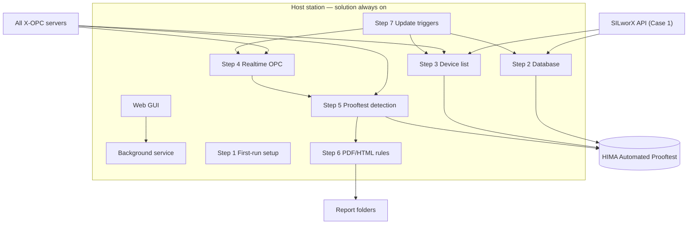
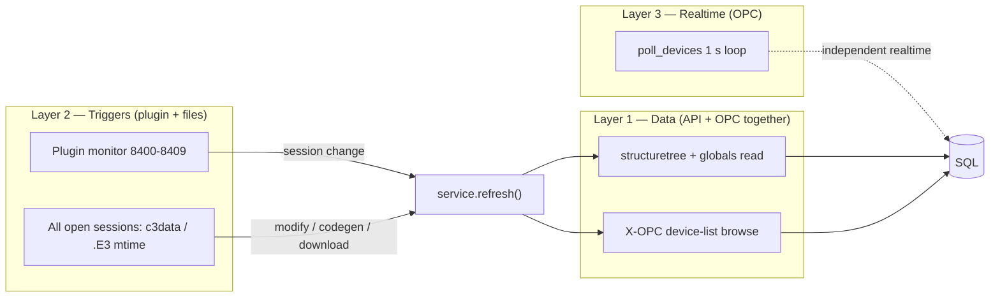

# SPEC-001 — HIMA Automated Prooftest Reporting Solution

| Field | Value |
|-------|--------|
| **Document ID** | SPEC-001 |
| **Title** | HIMA Automated Prooftest — Background Service, SILworX API, Multi-OPC, SQL, PDF/HTML, Web GUI |
| **Version** | 1.59 |
| **Date** | 2026-08-18 |
| **Status** | Draft |
| **Project** | Report Solution |
| **Location** | `Z:\Project\Report Solution` |
| **Filename** | `SPEC-001-v1.59-HART-Prooftest-OPC-Collection-and-PDF-Reporting.md` |
| **Supersedes** | v1.58 |

## Versioning

Specification and code versioning are **project process rules**, not runtime behaviour of the Report Solution.

| Rule | Description |
|------|-------------|
| **SPEC files** | Updates require a **new** file (e.g. `SPEC-001-v1.15-...`). Do not edit published SPEC versions in place. See [README.md](./README.md). |
| **Summary of changes** | Each SPEC file documents **only** the delta from its immediate predecessor. Full history: [History of Modifications.md](./History%20of%20Modifications.md). |
| **Code history** | Cumulative code archive log: [Codes/Code History of Modifications.md](../Codes/Code%20History%20of%20Modifications.md). |
| **G-12** | **Solution code versioning:** edit **only** `HIMA-Prooftest-Solution-Current`. **Before** any code change, archive Current to `Codes/Archive/HIMA-Prooftest-Solution-v{next}` (`archive_current.ps1`). Archived folders and legacy `HIMA-Prooftest-Solution-v*` trees remain **frozen**. Pair Current `VERSION.json` with the SPEC version the code implements. See [Codes/README.md](../Codes/README.md). |

---

## Solution structure

**G-14**, **G-15**, **G-16**, and **G-17** define how the solution **code tree** is organized.  
They are **project structure rules**, not runtime behaviour requirements of the Report Solution (same class as **Versioning** / **G-12**).

| Rule | Description |
|------|-------------|
| **G-14** | **SPEC step-based code layout:** the solution implementation is organized under `prooftest/steps/` with one consolidated module per Step 1-7 (`step01_setup.py` ... `step07_triggers.py`). Legacy module names are retained only as thin re-export shims for compatibility. |
| **G-15** | **Tool test separation:** all scripts used to test, audit, or probe the solution (gate tests, SQL/OPC probes, monitors) live in **`Tool test\`** beside the solution folder — not mixed with runtime service code. |
| **G-16** | **Steps + annex file layout:** SPEC Step modules (`step01_setup.py` … `step07_triggers.py`) live **alongside** main service code under `prooftest\` (not in a `steps\` subfolder). Cross-cutting infrastructure is split into purpose-named **annex** files: `annex_database.py`, `annex_api_connexion.py`, `annex_opc.py`, `annex_pdf_generation.py`, `annex_stop_service.py`; solution root `annex_plugin.py` and `annex_stop_service.ps1`. Legacy module names remain thin re-export shims. |
| **G-17** | **Purpose-named annex folders:** `prooftest\` contains **only** Steps + main service code (`service.py`, `config.py`, `alarms.py`, `results_csv.py`, `step01_setup.py` … `step07_triggers.py`). Annex modules live in purpose-named folders at solution root: `Database\`, `API connexion\`, `OPC\`, `PDF generation\`, `Stop service\`, `Plugin\`. Web GUI lives in `Graphic Interface\`. Solution root keeps `main.py`, `run_service.ps1`, `stop_service.ps1` (forwarder), `solution.ini`, `VERSION.json`, `README.md`, and `Tool test\`. Annex imports are bootstrapped in `prooftest/__init__.py` via `importlib` so `from prooftest.annex_*` remains valid. Legacy re-export shims under `prooftest\` are removed. |

---

## Summary of changes

**This version only** — relative to **v1.58**.  
Full history: [History of Modifications.md](./History%20of%20Modifications.md).

**Supersedes v1.58.** Active code: `HIMA-Prooftest-Solution-Current`.

#### What changed to v1.59

| Topic | Change |
|-------|--------|
| **Device list update** | Every automatic or manual device-list update/refresh queries **SILworX API and X-OPC simultaneously** (two worker threads), then **merges** the results once. |
| **Merge rules** | Union of Device_TAGs. API wins `Results_Type`, `Configuration`, and `Resource`. OPC wins `OPC_Server`, `OPC_ItemPrefix`, and `PresentOnOpc`. API-only devices are kept (not on OPC); OPC-only devices are added with NULL Configuration/Resource. |
| **`device_list_source`** | `api+opc` when both succeed; `api` when only API succeeds; `opc_fallback` when only OPC succeeds. Health card shows **API + OPC**. |
| **G-10 / G-21 / G-22 / §3.1** | Sequential “API then OPC fallback” is replaced by parallel scan. API still attaches **only** when the user has a project open (never `open/local`). If API cannot attach, its contribution is empty while OPC still runs. |
| **Architecture pictures** | Mermaid architecture, functionality catalogue, and Flow Diagram 01/02/04/05 show parallel API+OPC device-list update. |

---

## 1. Purpose

To obtain **realtime CPU data**, this solution **must run on the same station where the X-OPC server is running**.

**One unified operating mode** covers engineering stations (SILworX present) and HMI / OPC-only stations (SILworX remote, closed, or uninstalled):

| Aspect | Behaviour |
|--------|-----------|
| **Device list** | On every update/refresh, query **SILworX REST API and X-OPC simultaneously** and merge. API contributes only if the user has a project open. The tool **never** opens a SILworX project. |
| **Realtime Results** | Always from **X-OPC** |
| **Config** | `deployment_case = 1` (legacy value `2` is ignored and normalized to `1`) |

Stations without local SILworX simply use the OPC branch of the same mode — there is no separate Case 2 product mode.

---

## 2. General specifications of the Report Solution

Runtime behaviour of the Report Solution. **Solution structure** rules (**G-14**–**G-17**) are listed under [Solution structure](#solution-structure); **versioning** (**G-12**) under [Versioning](#versioning).

| # | Requirement |
|---|-------------|
| **G-01** | The solution/code must run **continuously in the background** (Windows Service or equivalent daemon). |
| **G-02** | The solution must be **flexible** across different SILworX application programs: multiple device manufacturers, multiple X-OPC servers, multiple **Configurations**, and multiple **Resources**. |
| **G-03** | The solution is divided into **Steps 1–7** (see §4). |
| **G-04** | If an error occurs in any Step, an **error message** must be generated and shown in the graphical interface, naming the **Step** and the **specific action** that failed. |
| **G-05** | On **first start** on a station: (1) create **`C:\HIMA Prooftest Reporting Tool`** with three folders — **`Database`**, **`HIMA Automated Prooftest Reports`**, **`Results Structures`**; (2) create database **`HIMA Automated Prooftest`** with data files under `Database\` when possible (else SQLite `Database\prooftest.db`) and a `ProofTest_*` table for **each** Results Structure CSV; (3) seed the nine baseline Results Structure CSVs into `Results Structures\`; (4) ensure a Proof-test **report template** exists for each type under `HIMA Automated Prooftest Reports\Report Templates\` (copy known HIMA layouts; **auto-generate** for any new CSV type). |
| **G-06** | The solution must provide a **web server graphical interface**. |
| **G-07** | The solution must support **automatic and manual** update of the device list, X-OPC server list, and SQL database. |
| **G-08** | The solution must **automatically detect** when a Prooftest is initiated, **wait until the test ends**, take a **snapshot** of the Results structure, and store it in the dedicated SQL table. |
| **G-09** | **Immediately after** the database table row is written, generate a **PDF or HTML** report automatically and store it under the report folder structure (§4 Step 5–6). |
| **G-10** | To identify the device list, device types, and updates, every automatic or manual refresh must query the **SILworX integrated API and X-OPC simultaneously**, then merge into one Device Prooftest Result List. The API is used **only when the user has a project open** in SILworX (attach to that session; details per Step below). The solution **must never open a SILworX project** (`POST /project/open/local` is forbidden for the report tool). If no project is open, or SILworX/API is closed, suspended, unreachable, or uninstalled, the API contribution is empty and the merged list is the **X-OPC scan** (`opc_fallback`). Realtime values are always read from **X-OPC**. |
| **G-11** | When the user **uninstalls SILworX** (install no longer detected): the Report Solution **must keep running**. It must **release only** the SILworX-related engines/resources that block uninstall — SILworX REST API sessions, plugin WebSocket monitors, and leftover ``c3.exe`` — then **continue** device-list updates via **OPC scanning** (same unified path; do **not** switch to a separate Case 2). Do **not** exit the Report Solution process automatically. Explicit full process exit remains available via ``POST /api/shutdown`` / ``stop_service.ps1`` when the operator chooses. **UI Stop** still stops the engine only and keeps the web host. |
| **G-13** | **No globals CSV export:** the solution must **not** export, read, or depend on a global-variables CSV file (e.g. `Globale variable.csv`, `data/globals.csv`). SILworX metadata comes from **OpenAPI** (`structuretree/info` + `globalvariables/content/read`) in parallel with X-OPC browse — never from a globals CSV. Remove all export scripts, plugins, and config keys for globals CSV. |
| **G-19** | **Stop API when SILworX is closed:** when the SILworX software which is connected to is closed (`is_silworx_running` false for **two consecutive** background polls — API unreachable via `POST /silworx/info`), the solution **must release** the SILworX API connection — clear any cached `user_session_id`, discard the cached API client. The report tool does **not** open projects, so it must **not** call `project/close` on the engineer’s GUI session. While SILworX is down, **suspend** API attach (`is_api_suspended`) so background refresh does not retry attach until SILworX is back. Do **not** call `project/close` for GUI-attached plugin sessions (that would close the engineer's project). Closing a project while SILworX remains running does **not** trigger API release. Record `silworx_api_connected = 0` in `ServiceState`. `api_port` / `api_plugin_port` must match the running SILworX GUI instance (e.g. `51711` / `8401`). Full process shutdown on SILworX **uninstall** remains governed by **G-11**. |
| **G-20** | **Kill leftover `c3.exe` only after confirmed SILworX close:** track session activity via `lock.ini` (project open) and `OLixClient.exe` (GUI). When both become absent after a previously active session, wait **8 s**, then terminate leftover `c3.exe` only (`annex_silworx_cleanup.py`, `taskkill /F /T`). **Never** kill on `c3.exe` presence alone or on API unavailability — SILworX startup always begins with `c3.exe` before the GUI or project lock appear. Record killed-count in `ServiceState.silworx_cleanup_killed`. |
| **G-21** | **Multi-instance API/plugin port scan:** scan all **10** SILworX port pairs `51710/8400` … `51719/8409` (`api_port_start`, `api_port_count`, `api_plugin_port_start` in `solution.ini`). For each reachable instance that has a **user-open project**, attach via the matching plugin port. **Never** `open/local`. API discovery runs **in parallel with** the X-OPC device-list browse. If no instance has a user-open project, the API contribution is empty; OPC still updates the list. Merge device-list results from attached instances **and** OPC; record active pairs in `ServiceState.silworx_api_ports_active` and `/api/health` → `silworx_api_instances`. |
| **G-22** | **Three-layer architecture (v1.26, device list v1.59):** **(1) Data layer** — every device-list update/refresh queries **SILworX REST API and X-OPC simultaneously**, then merges one Device Prooftest Result List. API (`structuretree/info` + `globalvariables/content/read`) on every reachable instance supplies `Results_Type`, `Configuration`, and `Resource` when the user has a project open — devices are **global variables** typed as one of the nine Results structures. OPC browse supplies `OPC_Server` / prefix / `PresentOnOpc` and devices that exist only on X-OPC. If no user-open project, the API contribution is empty (`opc_fallback` when OPC succeeds alone; `api+opc` when both succeed). Results Structure CSVs are the fixed **type catalogue** (DDL/members), not the device-add path. **(2) Trigger layer** — persistent plugin WebSocket monitors on **all 10** plugin ports (`annex_plugin_monitor.py`) detect session open/close (`TRIGGER_SESSION_ID_CHANGED`); **all** open SILworX sessions (not one preferred session) are watched for project modify and code generation (`c3data` mtime) and for download (`.E3` mtime when SILworX closed); any such trigger calls `service.refresh()` to re-read **globals and OPC** via layer 1. CSV folder mtime is **definition maintenance only**. SILworX exposes no plugin triggers for codegen/download — file watchers remain for those events. **(3) Realtime layer** — X-OPC polling runs on an **independent** thread (`poll_interval_sec`, default 1 s); never blocked by API or plugin work (G-10). **Plugin session refresh (v1.53):** a cached `user_session_id` from before the user opened a project must not be reused — drop it, re-register the plugin WebSocket, wait for a new token, retry attach. |



---

## 3. SILworX projects and Prooftest Results structures

### 3.1 Supported Results data types (library)

Each device type/manufacturer has a dedicated Prooftest **Results** structure in the SILworX library (name ends with `_Results`):

| # | SILworX data type |
|---|-------------------|
| 1 | `X-HART_ABB_FCB400_Results` |
| 2 | `X-HART_Emerson_3051S_Results` |
| 3 | `X-HART_E+H_PMx7xB_Results` |
| 4 | `X-HART_E+H_FTL5xB/6x_Results` |
| 5 | `X-HART_E+H_FMR6xB_Results` |
| 6 | `X-HART_E+H_Promass300/500_Results` |
| 7 | `X-HART_SAMSON_Results` |
| 8 | `X-HART_WIKA_T32_Results` |
| 9 | `X-HART_WIKA_T38_Results` |

**CSV definitions** for each structure (fixed **type catalogue**):

- **Runtime catalogue (station):** `C:\HIMA Prooftest Reporting Tool\Results Structures\` (watched; new `*.csv` = new Results type)
- Package seed (code tree): `HIMA-Prooftest-Solution-Current\Results Structures\` — copied into the station folder on first start
- Design reference: `Z:\Project\Report Solution\3- Results Structures\`

These CSVs describe the **members** of each of the nine Results **types** (for SQL DDL and OPC field mapping).  
They are **not** edited by the engineer when adding a device to a project. Updating a CSV is a rare **definition maintenance** action (e.g. HIMA library change).

### 3.2 Global variables (how devices appear in a project)

1. For each prooftest device, the engineer creates a **global variable** in the SILworX application program.
2. The **data type** of that global variable must be **one of the nine** Results structures listed in §3.1 (e.g. type `X-HART_WIKA_T32_Results`).
3. The global variable **name** becomes the device identity (**`Device_TAG`**) used by the Report Solution.
4. **Day-to-day device add/remove** = create/delete/rename those globals in SILworX (then the solution re-reads them via API on refresh / session trigger). It does **not** require changing the Results Structure CSV files.
5. A SILworX project may contain **several Configurations**; each Configuration may contain **several Resources**. Each Configuration may have one **Global Variables** node; each Resource may have its own Global Variables node.
   - *Example:* Two configurations — first with two resources, second with one resource — yields up to **five** Global Variable elements in the project tree.
6. **All Results structure realtime values** are published on the **X-OPC servers** (read in Step 4).

### 3.3 SQL table naming

Replace prefix `X-HART_` with `ProofTest_` and sanitize `/` → `_` for SQL identifiers.

| SILworX structure | SQL table name |
|-------------------|----------------|
| `X-HART_ABB_FCB400_Results` | `ProofTest_ABB_FCB400_Results` |
| `X-HART_Emerson_3051S_Results` | `ProofTest_Emerson_3051S_Results` |
| `X-HART_E+H_PMx7xB_Results` | `ProofTest_E+H_PMx7xB_Results` |
| `X-HART_E+H_FTL5xB/6x_Results` | `ProofTest_E+H_FTL5xB_6x_Results` |
| `X-HART_E+H_FMR6xB_Results` | `ProofTest_E+H_FMR6xB_Results` |
| `X-HART_E+H_Promass300/500_Results` | `ProofTest_E+H_Promass300_500_Results` |
| `X-HART_SAMSON_Results` | `ProofTest_SAMSON_Results` |
| `X-HART_WIKA_T32_Results` | `ProofTest_WIKA_T32_Results` |
| `X-HART_WIKA_T38_Results` | `ProofTest_WIKA_T38_Results` |

Use bracket-quoted names where required: `dbo.[ProofTest_E+H_Promass300_500_Results]`.

**SAMSON 3730 / 3793:** Both device types share the **same** Results structure (`X-HART_SAMSON_Results`) and **one** SQL table (`ProofTest_SAMSON_Results`). There is **no** separate `ProofTest_SAMSON_3730_*` table. DDL for this single table is **generated** from `X-HART_SAMSON_Results` (design reference: `Prooftest_SAMSON_3793_V1_5.sql`).

### 3.4 SAMSON FST / PST and report templates

SAMSON valve devices may appear as separate global variables (e.g. `100-XV-001_FST`, `100-XV-001_PST`) with the **same** Results data type (`X-HART_SAMSON_Results`).

| Concern | Rule |
|---------|------|
| **Database** | One row per `Device_TAG` in `ProofTest_SAMSON_Results` |
| **Device list** | Each FST/PST tag is a separate device if declared as a top-level global |
| **Report template (Step 6)** | Select FST vs PST **HTML/PDF template** from the related HART function block type (e.g. `X-HART_SAMSON_3793_FST`, `X-HART_SAMSON_3793_PST`) — **report layout only**, not separate DB tables |

---

## 4. Part 1 — Solution code (Steps 1–7)

### Implementation gates (roadmap 0–13)

Development follows **gated steps** with user approval before each coding phase:

| Gate | Scope | Status |
|------|--------|--------|
| **0** | SPEC baseline | **Approved / Done** |
| **1** | Environment (`_step1_audit.py`) | **Done** |
| **2** | Service smoke test | **Done** |
| **3** | SAPI client (`SilworxApiClient`) | **Done** |
| **4** | First-run folders | **Done** |
| **5** | SQL templates (nine Results types) | **Done** |
| **6** | API + OPC simultaneous device list | **Done** |
| **7** | OPC read (Step 4) + update triggers (SPEC Step 7) + G-19/G-20/G-21 | **Approved 2026-06-16** |
| **8** | Triggers + plugin bridge (multi-port monitor, `test_step8_triggers.py`) | **Approved 2026-06-18** (v1.26 G-22) |
| **9** | Prooftest SQL insert on completion (Step 5, `test_step9_prooftest_sql.py`) | **Approved 2026-06-18** |
| **10** | HIMA PDF/HTML reports (Step 6, `test_step10_reports.py`) | **Approved 2026-06-18** |
| **11** | Web UI + alarms (`test_step11_web_ui.py`) | **Approved** 2026-06-18 |
| **12** | OPC device-list path / unified mode (`test_step12_case2.py`) | **Approved** 2026-06-19; retargeted v1.51 |
| **13** | Hardening (`test_step13_hardening.py`) | **Approved** 2026-06-19 |

Legacy table (gates 0–6 detail):

| Gate | Scope | Spec section | Status |
|------|--------|--------------|--------|
| **0** | SPEC v1.9 baseline (Steps 1–7 structure, Cases 1/2, error catalog) | Entire document | **Done** |
| **1** | Environment baseline: 32-bit Python, OpenSSL, SILworX v16, API port, nine Results CSVs | §6, §9 | **Done** (`Tool test/_step1_audit.py`) |
| **2** | Background service smoke test, `solution.ini`, SQL Server / SQLite fallback | §4 Step 1 (partial) | **Done** (`Tool test/test_smoke.py`) |
| **3** | `SilworxApiClient` REST wrapper | §4 Step 3.1 | **Done** (`prooftest/step03_device_list.py`, `Tool test/test_silworx_api.py`) |
| **4** | First-run folders (nine Results-type folders + per-device subfolders), `deployment_case` | §4 Step 1 | **Done** (`prooftest/step01_setup.py`, `Tool test/test_step4_install.py`) |
| **5** | All nine `ProofTest_*` SQL tables; generate missing `.sql` from CSV | §4 Step 2 | **Done** (`prooftest/step02_database.py`, `Tool test/test_step5_sql.py`) |
| **6** | Case 1 device list via API and OPC together; persist `device_list_source` | §4 Step 3.1 | **Done** (`Tool test/test_step6_devices.py`) |
| **7** | OPC read, update triggers, API multi-port, session release, c3 cleanup | §4 Steps 4–7 | **Approved** |

**Resolved open items (gates 0–6):** OI-2 code-gen trigger = `c3data` mtime watch; OI-3 API conflict = Warning + OPC fallback; OI-4/5 = create all five missing SQL templates; SAMSON = single DB table; SAMSON FST/PST = report template selection by related HART FB type only.

---

### Step 1.0 — Station root (first run)

Create folder **`C:\HIMA Prooftest Reporting Tool`** containing:

| # | Folder | Contents |
|---|--------|----------|
| 1 | `Database\` | SQL database files (`.mdf`/`.ldf` when SQL Server creates them here) or SQLite `prooftest.db`; system + `ProofTest_*` tables |
| 2 | `HIMA Automated Prooftest Reports\` | Generated PDF/HTML prooftest reports (per Results type / Device_TAG). Subfolder `Report Templates\` holds HTML report templates |
| 3 | `Results Structures\` | CSV definitions of Results types. Seeded with the **nine** baseline structures. **Adding a new CSV** registers a **new device Results type** (SQL table + device matching + report template) |

When a new CSV appears under `Results Structures\`, the solution must:

1. Load it as a new Results structure type  
2. Create the matching `ProofTest_*` SQL table  
3. Create the Proof-test **report template** under `Report Templates\`  
4. Create the Results-type report output folder  

### Step 1 — First use / station setup (run once per station)

Executed on **first start** of the solution on a station (recorded in `installation.json`).

#### 1.1 Operating mode

The solution always runs in **unified mode** (`deployment_case = 1`):

| Check | Result |
|-------|--------|
| SILworX installed / API reachable | Device list via **API and OPC together**; OPC also for realtime |
| SILworX **not** installed or API unavailable | Device list via **OPC scan** (`opc_fallback`) — same mode; API is still attempted in parallel and returns empty |

Persist `deployment_case = 1` in `solution.ini` and `dbo.ServiceState`. Legacy `deployment_case = 2` values are ignored and normalized to `1`. `auto_detect_case` is obsolete.

#### 1.2 Report root folder

Create folder:

```text
C:\HIMA Prooftest Reporting Tool\HIMA Automated Prooftest Reports\
```

This folder stores **all** generated Prooftest PDF/HTML report files. Step 6 (report generation) and the Web GUI report list read from this path. **`[Reports] output_directory` in `solution.ini` must be the same folder** (default: identical to `first_run_folder`).

**Internal structure** (created at first run and maintained when the device list changes):

```text
C:\HIMA Prooftest Reporting Tool\HIMA Automated Prooftest Reports\
  X-HART_ABB_FCB400_Results\
    <Device_TAG>\          ← one subfolder per device of this Results type
  X-HART_E+H_Promass300-500_Results\   ← `/` in type name → `-` on disk (Windows)
    <Device_TAG>\
  … (one folder per Results type — 09 total)
  X-HART_WIKA_T38_Results\
    <Device_TAG>\
```

On Windows, replace `/` in Results type folder names with `-` (e.g. `X-HART_E+H_Promass300-500_Results`). Sanitize invalid path characters in `Device_TAG` when creating device subfolders.

*Example:* Inside `X-HART_WIKA_T32_Results\`, create `200-TT-1001\` for each WIKA T32 device in the Device Prooftest Result List.

**Optional mirror:** `[Reports] local_mirror` may point to the same `C:\HIMA Prooftest Reporting Tool\HIMA Automated Prooftest Reports` path (default). If set to a different path for engineering backup only, the solution writes reports to `output_directory` first and copies to `local_mirror` only when the two paths differ.

---


#### 1.3 Initial database and Results tables (first start)

On the same **first start** as §1.1–§1.2 (and on every subsequent engine start — idempotent):

1. Create SQL database **`HIMA Automated Prooftest`** on SQL Server if it does not exist.
2. For each of the **nine** Results types (§3.1), create a table named per §3.3  
   (replace prefix `X-HART_` with `ProofTest_`; sanitize `/` → `_`).  
   Example: Results type `X-HART_E+H_Promass300/500_Results` → table  
   `ProofTest_E+H_Promass300_500_Results` (user-facing example form:  
   `ProofTest_E+H_Promass300/500_Results` with `/` sanitized for SQL).
3. **Generate** `CREATE TABLE` for each Results type from the **Results Structure** definitions  
   shipped with the solution (default: `Results Structures\` under the solution folder,  
   or `[Paths] results_structures` in `solution.ini`). Column types and naming follow the style  
   of the project design reference:

   ```text
   C:\Project\Report Solution\2- SQL Tables template\
   ```

   That folder is for **developers** when implementing/verifying DDL. It is **not** required  
   when the solution runs on another PC.

4. Also create system tables (`DeviceProoftestResultList`, `AlarmLog`, `SchemaVersion`, `ServiceState`) per Step 2.1.

Column rules and **ongoing** schema updates remain in **Step 2**.

---

### Step 2 — Database creation and update

#### 2.1 Initial creation

**First-start obligation** is specified in **G-05** and **Step 1.3**. Step 2.1 details the same DDL:

1. Create SQL database **`HIMA Automated Prooftest`** on SQL Server (if not exists).
2. For each of the **nine** Results types, create a table named per §3.3 (e.g. `ProofTest_E+H_Promass300_500_Results`).
3. **Generate DDL in code** from Results Structure CSVs (members → columns). Match the style of the  
   design-reference scripts under `2- SQL Tables template\` (types such as `decimal(10,3)`, `bit`,  
   `nvarchar(50)`, optional `Error_code` byte computed columns). Do **not** require that folder on the station.
4. Create system table **`dbo.DeviceProoftestResultList`** (Step 3) and supporting tables (`AlarmLog`, `SchemaVersion`, `ServiceState`) per implementation.

**Design reference (not runtime):** Project folder `2- SQL Tables template\` and `TEMPLATE_MAP` document the  
expected table shape for implementers. SAMSON 3730 and 3793 share one table `ProofTest_SAMSON_Results`.

**Mandatory metadata columns** on each Results table (always included by the generator):

| Column | Type | Description |
|--------|------|-------------|
| `Device_TAG` | `NVARCHAR(128)` | Device identifier |
| `Configuration` | `NVARCHAR(64)` NULL | SILworX configuration |
| `Resource` | `NVARCHAR(64)` NULL | SILworX resource |
| `OPC_Server` | `NVARCHAR(128)` NULL | Source X-OPC ProgID |
| `CollectedAt` | `DATETIME2` | Snapshot timestamp |
| `ReportPath` | `NVARCHAR(512)` NULL | Generated report path |
| `SequenceInBatch` | `INT` NULL | Parallel test order (Step 5) |

#### 2.2 Database update — Case 1

When triggered by **Step 7**, update `HIMA Automated Prooftest` by:

- Detecting **new** Results structures (via SILworX API / project scan).
- Creating tables for new types using **CSV-derived DDL** (generator).
- `ALTER TABLE` for new columns when Results Structure CSVs change.

#### 2.3 Database update — schema ensure (OPC / catalogue path)

On engine start and when Results Structure definitions change, ensure `ProofTest_*` tables exist/match the loaded Results Structure definitions; create or alter tables when definitions change. **Do not** depend on new files appearing under `2- SQL Tables template\`. (Former Case 2 periodic template poll is folded into this unified schema ensure.)

---

### Step 3 — Prooftest Device List (`dbo.DeviceProoftestResultList`)

Central list columns (minimum):

| Column | Description |
|--------|-------------|
| `Device_TAG` | Device identifier (PK) |
| `Results_Type` | SILworX Results structure name |
| `Configuration` | NULL allowed — Case 1 from API |
| `Resource` | NULL allowed — Case 1 from API |
| `OPC_Server` | Resolved X-OPC ProgID (Step 4) |
| `OPC_ItemPrefix` | OPC branch prefix for this device |
| `PresentOnOpc` | `1` = device currently exists on X-OPC (discovered via `.Running`) |
| `IsActive` | `1` = shown in the Device list. Rows with no reports are **deleted** when the device is no longer detected (not left as `IsActive = 0`). |
| `LastSeenAt` | Last successful sync |
| `LastRunning` | Edge detection helper |
| `TestInProgress` | `1` while `Running` is TRUE |

**Service state:** Persist `device_list_source` in `dbo.ServiceState` as `api+opc`, `api`, or `opc_fallback` after each device-list sync. Persist `deployment_case = 1`.

#### 3.1 Primary path — simultaneous SILworX API and X-OPC

**Every update/refresh** starts **both** of the following at the same time, then merges **once** (do not browse OPC a second time after the API returns):

**A. SILworX OpenAPI (no CSV export) — only if the user has a project open:**

1. Obtain a valid **`HIMA_SAPI_user_session_id`** (see §3.5).
2. `POST /project/structuretree/info` — locate all **Global Variables** nodes (per Configuration and per Resource — see §3.2).
3. For each Global Variables node, `POST /node/globalvariables/content/read?internal_address=...` and scan variables:
   - **Top-level globals only** — variable name must not contain `.` (nested members are not devices).
   - If the variable **data type** matches one of the nine `_Results` structures, add an entry to **Device Prooftest Result List**.
   - Use the global variable **name** as **`Device_TAG`**.
   - Store **`Results_Type`** = data type name.
   - Store **Configuration** / **Resource** from the structure-tree path.
4. If no project is open, or attach fails, this branch contributes **no devices** (never `open/local`).

**B. X-OPC browse (always started with A):**

1. Discover matching X-OPC servers and match `.Running` tag trees to Results Structure types.
2. For each match: **`Device_TAG`**, **`Results_Type`**, **`OPC_Server`**, **`OPC_ItemPrefix`**, `PresentOnOpc = 1`.

**Merge:**

- Union of Device_TAGs from A and B.
- API wins `Results_Type`, `Configuration`, `Resource`.
- OPC wins `OPC_Server`, `OPC_ItemPrefix`, `PresentOnOpc`.
- API-only tags: not present on OPC (`PresentOnOpc = 0`); OPC-only tags: Configuration/Resource **NULL**.
- `device_list_source`: `api+opc` (both succeeded), `api` (API only), `opc_fallback` (OPC only).

5. On each **Step 7** trigger (and each device-list sync):
   - **Add** every newly detected device (`IsActive = 1`) so it appears in the Device list.
   - If a previously listed device is **no longer detected**: **delete** the row when it has **no** Prooftest report (no `ProofTest_*` snapshot and no HTML/PDF under the device report folder); **keep** the row (`IsActive = 1`) when it has **at least one** report.
   - Sync per-device report subfolders for devices that remain.
   - **Operator keep-OPC-only (manual):** On operator request, **delete** every Device Prooftest Result List row with `PresentOnOpc = 0`, including rows kept because they have reports. Do **not** delete HTML/PDF files or `ProofTest_*` snapshots. If no OPC devices are flagged, refuse the clear (operator must Refresh first). After a successful clear, persist `device_list_keep_opc_only = 1` so a later API sync **does not re-add** devices that are not on X-OPC. Automatic keep-if-reports still applies to devices that later leave OPC until the operator clears again.
   - **List archive / restore (manual):** The operator can write a timestamped archive of the device list and report list (CSV) and restore it later. Restore re-inserts archived device rows and copies missing report files back; it clears `device_list_keep_opc_only`.

**Not used for Case 1 device list (forbidden — G-13):**

- CSV export of global variables to any file (`Globale variable.csv`, `data/globals.csv`, SILworX plugin CSV export).
- Reading device list from an exported globals file.
- `globals_export` path in `solution.ini`.
- `POST /project/open/local` at any time (the report tool never opens a SILworX project).
- `POST /project/close` when attached to an engineer’s open GUI session (would close their project).

**When API cannot attach (no user-open project / API unavailable):**

OPC browse still ran in parallel. The merged list is OPC-only:

1. Log alarm **S2-C1** (Warning, optional popup) when API attach is expected but failed.
2. Keep OPC-discovered devices (`Configuration` / `Resource` **NULL**).
3. Set `device_list_source = opc_fallback`.
4. Continue service operation — **do not crash**.

#### 3.2 OPC contribution (always started with the API)

Used on **every** refresh in parallel with the API. When SILworX/API is not available (HMI station, closed SILworX, G-19 suspend, G-11 uninstall) the API branch is empty and this contribution is the whole list — **still unified mode**, not a separate Case 2:

1. Compare **realtime OPC tags** on all running X-OPC servers to each Results structure definition in the **CSV files** (§3.1).
2. On structural match, add to Device Prooftest Result List:
   - **`Device_TAG`** = OPC variable name (parent of `.Running` or matched leaf).
   - **`Results_Type`** = matched structure name.
   - **`Configuration` / `Resource`** remain **NULL** unless the parallel API branch supplied them for the same TAG.
3. **Poll every 2 seconds** (`device_list_poll_sec`) while API is unavailable: the same parallel update runs (API no-ops when suspended). Set `device_list_source` from the merge (`opc_fallback` when API is down).

#### 3.5 SILworX API session acquisition

| Item | Value |
|------|--------|
| Base URL | `https://{api_host}:{api_port}/api/v1` (e.g. `https://127.0.0.1:51711/api/v1` on this station) |
| Default port | `51710` (SILworX instance 0); up to **10 instances** on `51710`–`51719` |
| Plugin WebSocket port | `api_plugin_port_start + (api_port - api_port_start)` → `8400`–`8409` |
| Port scan | `discover_available_instances()` probes `POST /silworx/info` on every pair in range |
| Preferred port | `api_port` in `solution.ini` — tried first when attaching to a user-open project. **No** port may use `open/local`. |
| Development plugin name | `api_plugin_name` = `prooftest_session_plugin` in `solution.ini`; register in `settings.ini` `[Plugin_Server] Development=` — **session bridge only**, no globals CSV export |
| Server CA | `C:\ProgramData\SILworX_v{version}\settings\api_cert.pem` |
| Client certificate | **Extras → Create SILworX-API certificate** or `hima.ssl_certificates_creator --default-api-cert` |
| Session header | `HIMA_SAPI_user_session_id` on all `/project/*` and `/node/*` calls |
| `POST /silworx/info` | **No JSON body** (empty POST) |
| Session timeout | `SessionTimeoutSec` in SILworX `settings.ini` (default 300 s) |
| API open timeout | `api_open_timeout_sec` in `solution.ini` (default 600 s) |

**Attach only — user-open project (former Mode B; Mode A removed):**

The report tool **must not** call `POST /project/open/local`. If the user has **no** project open, the API branch contributes nothing while **X-OPC still runs in parallel**.

When the user **has** a project open:

1. Obtain session via SILworX **plugin WebSocket** `TRIGGER_SESSION_ID_CHANGED` (`API connexion/annex_api_connexion.py` + `Plugin/annex_plugin_monitor.py`).
2. Plugin name in `settings.ini` `[Plugin_Server] Development=` must match `api_plugin_name` (default `prooftest_session_plugin` — see `Plugin/annex_plugin.py`).
3. Validate session with `structuretree/info` before use.
4. **Do not** call `project/close` — engineer’s project stays open.

**Mode B session resolution (G-22 / v1.26+):**

When `plugin_monitor_enabled = true` and the background **plugin port monitor** is running (`annex_plugin_monitor.py`):

| Step | Behaviour |
|------|-----------|
| 1 | `resolve_gui_session_id()` reads the cached `user_session_id` from the monitor — **no extra WebSocket register**. |
| 2 | If cache is empty, **wait** briefly (default 15 s) for the monitor to receive `TRIGGER_SESSION_ID_CHANGED` — **one-shot registration is disabled**. |
| 3 | Service starts the monitor **before** the first `refresh()` so startup does not open a second plugin client. |
| 4 | **Fresh session after project open (v1.53):** when `lock.ini` gains a user-open project, or when `structuretree/info` rejects the cached token (“session ID is not valid” / “No project opened”) while a project is open, drop the cache, **re-register** the persistent plugin WebSocket on that port, wait for a new `user_session_id`, and retry attach. Do **not** keep using a token acquired before the project was opened. |

**One-shot fallback** (`acquire_open_project_session_id` — short-lived register → session → disconnect) is used **only** when:

- `plugin_monitor_enabled = false`, or
- the monitor is not running (standalone scripts / `test_silworx_api.py` without `start_monitor()`).

This prevents two clients named `prooftest_session_plugin` on the same plugin port (monitor vs API refresh), which caused register/unregister flicker in the SILworX Plug-In Server log (~2 ms).

**Service log lines:**

| Log | Meaning |
|-----|---------|
| `plugin monitor connected api=… plugin=…` | Persistent listener — single registration in SILworX |
| `plugin session from monitor cache api=…` | API refresh reused monitor token |
| `plugin monitor fresh-session requested …` | Cached token dropped; WebSocket will re-register |
| `plugin monitor re-registering … (fresh session after project open)` | Persistent listener reconnecting for a new `user_session_id` |
| `plugin monitor active — waiting for session cache …` | Waiting for monitor; one-shot skipped |
| `plugin one-shot register …` | Fallback path only (monitor off or not started) |

**Session facts:**

- The `lock.ini` session folder name (e.g. `0x7990`) is **not** the API `user_session_id` token.
- Multiple SILworX instances may run on different ports (e.g. `51710/8400` headless vs `51711/8401` GUI). The service scans **all** configured pairs and connects to every reachable instance (G-21). `api_port` is the **preferred** instance when several are up.
- Prefer the versioned project file for API open (e.g. `ProofTest-Reporting solution - V16.0.0.E3`).

**SILworX configuration (manual — operator only):**

This solution **does not modify** SILworX installation or `ProgramData` files. The engineer applies these in SILworX / Windows manually:

| File / action | Required value / purpose |
|---------------|-------------------------|
| `C:\ProgramData\SILworX_v*\settings\settings.ini` → `[Plugin_Server]` `Development=` | `prooftest_session_plugin` (Mode B session bridge) |
| `Extras → Create SILworX-API certificate` (or `hima.ssl_certificates_creator`) | Client cert in `settings\api_client\` |
| Confirm API port in SILworX UI / Plug-In Server log | Must match `api_port` / `api_plugin_port` in `solution.ini` (e.g. GUI `51711` / `8401`) |
| Close extra headless `c3.exe` on wrong port | If a prior misconfigured service left port `51710` busy, close that SILworX instance manually |

`run_plugin.ps1` reads `api_port` / `api_plugin_port` from `solution.ini` — no hardcoded ports in the plugin launcher.

**Reference implementation:** `5- API Application Example\sapi.py`, `prooftest/step03_device_list.py`.

---

### Step 4 — Realtime data reading (X-OPC)

1. **Identify all running X-OPC servers** on the host (`discover_all_servers = true`; filter `*X_OPC*`, `*HIMA*`).
2. For every device in **Device Prooftest Result List**, read realtime values from OPC when required by **Step 5** (all members of the Results structure, especially **`Running`**).
3. **Re-discover** and refresh the X-OPC server list when triggered by **Step 7**.

**Technical requirements:**

- Use **32-bit Python** for OPC Classic DA.
- Browse **Prooftest branches** (`OTS ProofTest`, `OPC ProofTest`) and full tree per server.
- Poll interval default **1 s** (`poll_interval_sec`).

---

### Step 5 — Prooftest execution detection, SQL snapshot, report file

1. Continuously monitor the **`Running`** member for every active device:
   - **FALSE → TRUE** → Prooftest **started** (`TestInProgress = 1`).
   - **TRUE → FALSE** → Prooftest **ended** → take snapshot.
2. When the test ends, copy **all other Results members** (excluding transient flags per report rules) into the device’s **`ProofTest_*`** SQL table row.
3. **Immediately after** the INSERT completes, generate PDF/HTML (Step 6) and store under:

   ```text
   Z:\Project\Report Solution\Reports\<Results_Type>\<Device_TAG>\
   ```

   and mirror to:

   ```text
   C:\HIMA Prooftest Reporting Tool\HIMA Automated Prooftest Reports\<Results_Type>\<Device_TAG>\
   ```

   **Filename** must include **`Device_TAG`** and generation **date/time** (e.g. `100-FZH-001_2026-06-12_15-30-00.pdf`).

#### 5.1 Parallel Prooftests (same Results table)

When multiple devices finish tests concurrently and target the **same** `ProofTest_*` table:

1. **Preferred:** Create **staging copies** of the table (or per-test staging rows), generate reports in **order** (first, second, third, …), then **delete staging copies**.
2. **Fallback:** If staging fails (disk space, lock timeout), process **sequentially**: fill table for test 1 → generate report → fill for test 2 → generate report → until all complete.

Record `SequenceInBatch` on each row.

**Gate test (`test_step9_prooftest_sql.py`):**

1. `insert_snapshot` writes one row into the correct `ProofTest_*` table with metadata columns (`Device_TAG`, `OPC_Server`, `CollectedAt`, `SequenceInBatch`).
2. `ProoftestMonitor` detects `Running` FALSE→TRUE→FALSE on a mock OPC device and the completion worker inserts SQL.
3. Optional live OPC note when X-OPC servers and devices exist on the station.

---

### Step 6 — Prooftest PDF/HTML report generation (rules and design)

1. Report content is derived from the **SQL snapshot row** written in Step 5.
2. **Writing rules** (examples):
   - If `Error` member is **TRUE** → result line shows **“Prooftest Unsuccessful”**.
   - Map BOOL/REAL/STRING members per device-type template (`result_types.ini` / HTML template).
   - Decimal places configurable (`decimal_places` in `solution.ini`).
3. Output format: `pdf`, `html`, or `both` (`[Reports] format`).
4. Templates: `Z:\Project\Report Solution\1- HTML Reports Template\<DeviceFolder>\report.html` (configured as `html_templates` in `solution.ini`). Each folder contains `report.html` and `img/` (CSS, logos). Placeholders use `$(Name)` syntax; snapshot SQL columns are substituted case-insensitively. SAMSON FST/PST and 3730/3793 select the folder per §3.4. Results types without a HIMA template use a built-in fallback HTML table.

**Template folder map (implementation):** eight Results types use the same folder name as `TEMPLATE_MAP` / SQL table short name; SAMSON uses four FST/PST folders (§3.4). All twelve folders under `1- HTML Reports Template` must contain `report.html` + `img/`.

**Gate test (`test_step10_reports.py`):**

1. `result_line_text` — `Error=TRUE` → “Prooftest Unsuccessful”; `Error=FALSE` → “Prooftest Successful”.
2. `resolve_report_template_key` / `resolve_html_template_folder` — SAMSON `_FST` / `_PST` → correct HIMA folder (§3.4).
3. Cerabar device — output uses `Cerabar_PMx7xB_V1_5/report.html`, `img/` copied beside report.
4. WIKA T32 — uses `WIKA_T32_V1_5/report.html` (all nine types covered; no generic fallback when template exists).

---

### Step 7 — Update triggering (G-22)

Three independent layers (see **G-22**):



Monitor continuously for events that require refresh of **Steps 2, 3, and 4** (device list = API and OPC together):

| Trigger | Detection (v1.26) | Actions |
|---------|-------------------|---------|
| **SILworX session open/close** | `TRIGGER_SESSION_ID_CHANGED` on **each** plugin port `8400`–`8409` (`annex_plugin_monitor.py`) | `service.refresh()` → API + OPC together |
| **SILworX project modify / save** | `c3data` mtime on **every** open session (`discover_open_projects`) | Same |
| **SILworX code generation** | `c3data` mtime on every open session *(SILworX has no codegen plugin trigger — OI-2)* | Same |
| **Project download** | `.E3` mtime when no session open (Case 1) | Step 2 + 3 via API + OPC |
| **New / changed SILworX globals** (device add) | Detected indirectly: session / project / codegen / download / manual refresh → API + OPC re-read | Step 3 (device list). **Not** by editing Results Structure CSVs |
| **Results Structure CSV added / updated** | Folder mtime under `C:\HIMA Prooftest Reporting Tool\Results Structures` | Step 2 (+ type folders). **New `*.csv` = new Results / device type** |
| **Manual refresh** | Web UI **Refresh / Reset** or `POST /api/refresh` | All of Steps 2–4 |

On any trigger: `service.refresh()` calls `sync_device_list_case1_via_api()` — **SILworX API and X-OPC at the same time**; merge `api+opc` / `api` / `opc_fallback`.

Default Case 1 background poll: **2 s** (`case1_sync_poll_sec`). Plugin monitor runs continuously in its own thread. OPC realtime poll: **1 s** (`poll_interval_sec`) — **never** gated by triggers.

#### 7.1 API session release when SILworX is closed (G-19)

On each Case 1 background poll, probe `is_silworx_running()` (`POST /silworx/info` on configured `api_port`):

| Probe result | Action |
|--------------|--------|
| **Success** | Clear down-streak; resume API if previously suspended |
| **1st consecutive failure** | Best-effort clear of cached session ids (never `project/close` on a GUI project) |
| **2nd+ consecutive failure** | `release_api_connection()` — discard client, clear session ids, set `silworx_api_connected = 0`, set `is_api_suspended` |
| **Session was active, now inactive** | Record close timestamp; after **8 s** grace, `kill_leftover_c3_after_close()` — terminate `c3.exe` only; **never** while project open or OLixClient running |

1. **Release** the cached SILworX API client (`Case1SyncTriggers.release_api_connection()`).
2. **Clear** `HIMA_SAPI_user_session_id` from the HTTP client (plugin-attached sessions).
3. **Do not** call `POST /project/close` — the report tool never owns a SILworX project.
4. Set `ServiceState.silworx_api_connected = 0`.

When the engineer **closes the project** but SILworX remains open, the API contribution is empty and the merged list is **OPC** until a project is open again. G-19 still does **not** kill SILworX merely because the project was closed.

**Port configuration:** `api_port` should match the SILworX instance serving the open project (GUI instance often `51711` with plugin port `8401`).

Config example (`solution.ini`):

```ini
[SILworX]
sync_triggers = silworx_session, code_generation, download, results_structures
plugin_monitor_enabled = true
```

---

### 4.8 Code layout (G-17)

SPEC Step modules sit **next to** `service.py` under `prooftest\`. Annex modules and the web GUI live in purpose-named folders at solution root:

```text
HIMA-Prooftest-Solution-v1.17/
  main.py, run_service.ps1, stop_service.ps1, solution.ini
  prooftest/
    service.py, config.py, alarms.py, results_csv.py
    step01_setup.py            ← Step 1
    step02_database.py         ← Step 2 (re-exports annex_database)
    step03_device_list.py      ← Step 3 device sync
    step04_opc.py              ← Step 4 (re-exports annex_opc)
    step05_detection.py        ← Step 5
    step06_reports.py          ← Step 6 (re-exports annex_pdf_generation)
    step07_triggers.py         ← Step 7
    __init__.py                ← importlib bootstrap for annex + web
  Database/
    annex_database.py          ← SQL Server / SQLite + SQL templates
  API connexion/
    annex_api_connexion.py     ← SILworX HTTPS API + session bridge
  OPC/
    annex_opc.py               ← X-OPC DA connexion
  PDF generation/
    annex_pdf_generation.py    ← PDF / HTML reports
  Stop service/
    annex_stop_service.py      ← graceful shutdown logic
    annex_silworx_cleanup.py   ← kill leftover c3.exe after SILworX close (G-20)
    annex_stop_service.ps1     ← graceful shutdown for uninstall (G-11)
  Plugin/
    annex_plugin.py            ← SILworX plugin WebSocket bridge
  Graphic Interface/
    app.py, static/            ← web GUI (G-06)
```

**Tool test (G-15):** verification and audit scripts are **not** in the solution root:

```text
HIMA-Prooftest-Solution-v1.17/
  main.py, run_service.ps1, solution.ini, prooftest/...
  Tool test/
    run_tests.ps1
    test_smoke.py, test_step4_install.py, ...
    _step1_audit.py, _check_sql.py, ...
    data/          ← test snapshots only
```

## 5. Part 2 — Graphical interface, errors, and alarms

### 5.1 Web UI components

| # | Component | Behavior |
|---|-----------|----------|
| **1** | **Device list** (scrolling) | Two exclusive views: **All devices (including deleted with reports)** and **OPC devices only (Running bit)**. Search and the archive-before-clear checkbox sit **bottom-right**, immediately above the list; the checkbox has no white fill. **Archive lists** and **Clear device list** are raised action buttons (hover on Clear: “Keep OPC devices only”). After Archive, show the archive folder path at the **bottom of the page**. Restore is **Browse restore file…** to upload `devices.csv` or a zip. |
| **2** | **Report list** (scrolling) | PDF/HTML reports for the **selected device** (newest first). **Search field** (`#report-search`): highlights and scrolls to matching file names; **does not hide** other reports. Press **Enter** to jump to the next match |
| **3** | **Open report** button | Opens selected report (HTML in browser / PDF download) |
| **4** | **Refresh / Reset** button | Manual update: Steps 2–4 + clear transient errors |
| **5** | **Alarm / Error** zone | Bottom-right cell of the **2×2** grid (Health \| Devices / Reports \| Alarms). Each alarm shows **still active** or **no longer exists** (recent re-raise window). Operator can **Acknowledge** an alarm and **Reset alarms**. Health card order: Service + Database; then Device list, SILworX session, Plugin session, Queue depth; last ALL DEVICES and OPC ACTIVE DEVICES (OPC green only) |
| **6** | **Error popups** | Modal on **first occurrence**; re-shown on **Refresh** if error persists |
| **7** | **Start / Stop service** buttons | **Stop service** stops the Prooftest **engine** (`POST /api/stop`, localhost only): release OPC, SILworX API, plugin monitors, and worker threads. The **web host and graphic interface stay up**. **Start service** restarts the engine in-process (`POST /api/start`). Start is disabled while the engine is running; Stop is disabled while stopped. Full process exit (G-11) is **not** this button — use `stop_service.ps1` / `POST /api/shutdown`. |

**Scroll list placeholders:** The device list and report list panels (§5.1 #1–2) must **always** show a bordered scrolling area. When no devices are detected in the Device Prooftest Result List, the device list displays **`(No device available)`**. When no report is available for the selected device, the report list displays **`(No report available)`**. Lists remain visible even when empty.

**Visual design:** The web GUI follows the HIMA proof-test report layout (three-column header with HIMA logo, HART/SIL badges, Verdana typography). Branding assets are copied from `Z:\Project\Report Solution\7- Images for the graphical interface` into `Graphic Interface/static/img/` (HIMA, HART, SIL, and manufacturer logos). Device list rows show the vendor logo mapped from `Results_Type`; footer displays supported manufacturer logos.

### 5.2 Error popup content

Each popup must state:

1. **Step and action** (e.g. Step 1 — create `C:\HIMA Prooftest Reporting Tool\HIMA Automated Prooftest Reports`, Step 4 — OPC read).
2. **Reason** when known (exception, SQL code, OPC quality).
3. **Possible solutions** (actionable checklist).

**De-duplication:** Same error key shown once until cleared or Refresh while still failing.

Log to `dbo.AlarmLog` (`Timestamp`, `Severity`, `Step`, `Device_TAG`, `Message`, `SolutionHint`).

### 5.3 Diagnostic and troubleshooting catalog

| Step | Error condition | Likely cause | Possible solutions |
|------|-----------------|--------------|-------------------|
| **Step 1** | Cannot create `C:\HIMA Prooftest Reporting Tool\HIMA Automated Prooftest Reports` | Permissions, disk full | Grant write access on `C:\`; free disk space |
| **Step 1** | Cannot create Results-type subfolder | Invalid path character in `Device_TAG` | Sanitize tag for filesystem; check alarm |
| **Step 2** | Cannot create database | SQL Server stopped, login failed | Start SQL Server; verify `solution.ini` |
| **Step 2** | Table creation failed | Template syntax, permissions | Review SQL log; check `CREATE TABLE` rights |
| **Step 2-C1** | No new Results type detected | API session failed, project not open | Close/reopen project via API; check client certificate; verify `api_port` |
| **Step 2-C2** | Results Structure definitions missing | Bundled `Results Structures\` or `results_structures` path wrong | Ship CSVs with the solution; fix `solution.ini` |
| **Step 3-C1** | No API device list | User has no SILworX project open | Expected — OPC still scanned in parallel (`opc_fallback` if API empty). Open the project in SILworX to add API metadata. |
| **Step 3-C1** | No globals with Results types | No devices configured in SILworX | Add globals; run code generation |
| **Step 3-C2** | No OPC device match | Tags not on CPU, wrong branch | Verify download; check `prooftest_branches` |
| **Step 3-C3** | API session id rejected | Stale plugin session from before the project was opened, or wrong `api_port` | Service **re-registers** the plugin and retries attach (v1.53). If still failing: align `api_port`/`api_plugin_port`; confirm `Development=prooftest_session_plugin`; reopen the project |
| **Step 3-C4** | OPC fallback active (OI-3) | API session unavailable | Informational Warning — devices discovered without Configuration/Resource |
| **Step 4** | No X-OPC server | Service stopped | Start X-OPC Windows service; use 32-bit Python |
| **Step 4** | OPC connect/read failed | DCOM, wrong ProgID, stale cache | Fix DCOM; browse OPC tree; refresh prefixes |
| **Step 5** | Snapshot skipped | `Running` still TRUE | Expected guard; verify poll interval |
| **Step 5** | SQL INSERT failed | Schema mismatch | Re-run Step 2 sync |
| **Step 5** | Staging table copy failed | Disk full | Free space; use sequential fallback |
| **Step 6** | PDF/HTML generation failed | Missing template engine | Install WeasyPrint / check template path |
| **Step 6** | Report folder not writable | Missing `Z:\` or `C:\` path | Create folders; fix permissions |
| **Part 2** | Web port in use | Conflict on 8080 | Change `[Web] port` |
| **G-11** | SILworX uninstall blocked by leftover engines | API/plugin/`c3.exe` still holding SILworX files | Solution auto-releases those engines and switches to OPC; if still blocked, kill leftover `c3.exe` / run `stop_service.ps1` only if a full exit is desired |

### 5.4 Web API (minimum)

| Endpoint | Purpose |
|----------|---------|
| `GET /api/health` | DB, OPC, SILworX, queue status |
| `GET /api/devices` | Device Prooftest Result List |
| `GET /api/reports?device={tag}` | Reports for device |
| `GET /api/reports/open?path=...` | Open/download report |
| `POST /api/refresh` | Manual Steps 2–4 sync |
| `POST /api/start` | Restart Prooftest **engine** in-process (localhost only; web host already running) |
| `POST /api/stop` | Stop engine only; **web host stays alive** (localhost only; UI Stop button) |
| `POST /api/shutdown` | Full process exit (localhost only; `stop_service.ps1` / SILworX uninstall — G-11) |
| `GET /api/alarms` | Alarm zone data (recent rows from `AlarmLog` + pending popups) |

**Gate test (`test_step11_web_ui.py`):**

1. Static assets — `index.html`, `app.js`, `style.css` present under `Graphic Interface/static/`.
2. API routes — `GET /`, `/api/health`, `/api/devices`, `/api/reports`, `/api/alarms` return 200 with mocked service.
3. `GET /api/reports?device={tag}&results_type={type}` — scoped lookup under Results-type subfolder.
4. `raise_alarm` persists to `AlarmLog` (`Timestamp`, `Severity`, `Step`, `Device_TAG`, `Message`, `SolutionHint`).
5. Health payload includes `silworx` and `opc_servers` (UI health summary).

**Known issue (gate 2):** ~~`GET /api/health` may block when OPC is busy~~ — **resolved in Gate 13** (`health_snapshot`).

**Gate test (`test_step12_case2.py`)** — OPC path within unified mode:

1. `detect_deployment_case` — always returns **1** (unified), even when SILworX is absent.
2. `sync_schema_case2` / schema ensure — creates all nine `ProofTest_*` tables from Results Structure CSVs (generator).
3. `sync_device_list_from_opc` — discovers devices from X-OPC tag matching; `Configuration` / `Resource` remain **NULL**; devices deactivated when absent from OPC scan.
4. `service.refresh()` when API unavailable — `device_list_source = opc_fallback`; `deployment_case` state stays **1**. Parallel OPC browse still runs.
5. `run_background_sync_iteration` — while API down, OPC device poll on `device_list_poll_sec`.

**Gate test (`test_step13_hardening.py`):**

1. `service.health()` calls `opc.health_snapshot()` only — does **not** invoke blocking `server_status()` / OPC browse.
2. When `[Web] auth_enabled = true` and `auth_localhost_bypass = false`, `GET /api/health` returns **401** without token and **200** with `X-Prooftest-Token` or `?token=`.
3. `auth_enabled = true` with empty `auth_token` is **disabled** at load time.
4. `verify_template_placeholder_mapping()` — no unresolved required placeholders in any HIMA `report.html` template.

**Web authentication (plant networks):** Set in `solution.ini`:

```ini
[Web]
auth_enabled = true
auth_token = <shared-secret>
auth_localhost_bypass = true   ; engineers on 127.0.0.1 skip token; remote clients must pass ?token=
```

Operators open `http://<host>:8080/?token=<shared-secret>` once; the UI stores the token in `sessionStorage` for subsequent API calls.

### 5.5 Engine stop vs process exit (SILworX uninstall)

The Prooftest process has two stop levels:

| Level | Trigger | Behaviour |
|-------|---------|-----------|
| **Engine stop** | Web GUI **Stop service** → `POST /api/stop` | Stop background threads, disconnect OPC, release SILworX API / plugin monitors, close DB. **Do not exit** the Python process. Graphic interface remains on `:8080`; `/api/health` reports `engine_running: false`, `web_host_alive: true`. |
| **Process exit (G-11)** | `stop_service.ps1`, `POST /api/shutdown`, OS signals, SILworX uninstalled | Same engine cleanup, then **exit process** so SILworX uninstall is not blocked |

| Requirement | Behaviour |
|-------------|-----------|
| **Operator day-to-day** | Use UI **Stop** / **Start** — UI must remain usable after Stop |
| **Operator / uninstaller** | `POST /api/shutdown` on **localhost only** (`127.0.0.1` / `::1`) — companion script `stop_service.ps1` |
| **Signals** | `SIGINT`, `SIGTERM`, `SIGBREAK` (Windows) trigger **process exit** |
| **SILworX removed** | When `is_silworx_installed()` becomes false, **release SILworX engines**, **keep running**, continue **OPC** device list (G-11) — stay in unified mode |
| **Before SILworX uninstall** | Optional: no process exit required — solution auto-releases SILworX locks and continues on OPC. Use `stop_service.ps1` only if you want a full process exit |

**Uninstall pre-step (recommended):**

```powershell
cd "Z:\Project\Report Solution\Codes\HIMA-Prooftest-Solution-Current"
.\stop_service.ps1
```

### 5.6 Windows auto-start (logon or boot)

When `[Service] auto_start = true`, the solution registers a **Windows Task Scheduler** task so the background service starts without manual `run_service.ps1`.

| Requirement | Behaviour |
|-------------|-----------|
| **Task name** | `HIMA-Prooftest-Service` |
| **Trigger** | **`auto_start_trigger`**: **`logon`** (default, current user — use when code is on mapped **Z:**) or **`startup`** (SYSTEM at boot; script path resolved to **UNC**) |
| **Delay** | `auto_start_delay_sec` (default **90** seconds) after trigger |
| **Action** | `powershell.exe -ExecutionPolicy Bypass -File run_service.ps1` with **WorkingDirectory** set |
| **Health wait** | `run_service.ps1` polls `/api/health` for up to **`health_check_wait_sec`** (default **120** s) |
| **Registration** | `install_auto_start.ps1` (administrator) or automatic **sync** at end of `run_service.ps1` when `auto_start=true` |
| **Removal** | `uninstall_auto_start.ps1` or set `auto_start=false` and run sync |
| **Disable without uninstall** | `auto_start = false` in `solution.ini` — sync removes the scheduled task |

**One-time setup (engineering station, run as Administrator):**

```powershell
cd "Z:\Project\Report Solution\Codes\HIMA-Prooftest-Solution-Current"
powershell -ExecutionPolicy Bypass -File .\install_auto_start.ps1
```

After reboot and **logon**, wait ~90 s (task delay) plus ~90–120 s (service startup), then open **http://127.0.0.1:8080/**.

`stop_service.ps1` stops the running process but **does not** remove the boot task unless `auto_start=false`.

---

## 6. Configuration (`solution.ini`)

```ini
[Service]
run_mode = background
auto_start = true
auto_start_trigger = logon
auto_start_delay_sec = 90
health_check_wait_sec = 120
deployment_case = 1          ; always 1 — unified mode (legacy 2 ignored)
auto_detect_case = false     ; obsolete — ignored

[Paths]
first_run_folder = C:\HIMA Prooftest Reporting Tool\HIMA Automated Prooftest Reports
results_structures = Results Structures      ; bundled under the solution folder
sql_templates =                              ; optional design-ref path only — not required at runtime

[Database]
name = HIMA Automated Prooftest
server = DESKTOP-U961SG0\SQLEXPRESS   ; instance name varies per station
sqlite_path = Z:\Project\Report Solution\Codes\HIMA-Prooftest-Solution-v1.25\Annex codes\data\prooftest.db

[SILworX]
programdata_root = C:\ProgramData
projects = Z:\Project\SILworX\OTS Demo\ProofTest-Reporting solution\ProofTest-Reporting solution.E3
api_host = 127.0.0.1
api_port = 51711             ; preferred SILworX instance (tried first)
api_port_start = 51710       ; scan range start (G-21)
api_port_count = 10          ; 51710-51719
api_plugin_port_start = 8400 ; plugin ports 8400-8409
api_plugin_port = 8401       ; preferred instance plugin port
api_plugin_name = prooftest_session_plugin
api_timeout_sec = 30
api_open_timeout_sec = 600
api_client_cert_dir = C:\ProgramData\SILworX_v16.0.0 R3326\settings\api_client
sync_triggers = silworx_session, code_generation, download, results_structures
plugin_monitor_enabled = true

[OPC]
discover_all_servers = true
server_filter = *X_OPC*;*HIMA*
poll_interval_sec = 1
case1_sync_poll_sec = 2
device_list_poll_sec = 2       ; OPC device-list poll while API unavailable
template_poll_sec = 1          ; legacy interval (schema ensure on start / CSV change)

[Reports]
format = pdf                   ; pdf | html | both
output_directory = C:\HIMA Prooftest Reporting Tool\HIMA Automated Prooftest Reports
local_mirror = C:\HIMA Prooftest Reporting Tool\HIMA Automated Prooftest Reports
filename_pattern = {Device_TAG}_{DateTime:yyyy-MM-dd_HH-mm-ss}
decimal_places = 3

[Web]
host = 127.0.0.1
port = 8080
auth_enabled = false
auth_token =
auth_localhost_bypass = true
```

---

## 7. Implementation alignment notes (gates 0–6)

| Area | v1.9 requirement | Implementation (2026-06-15) | Status |
|------|------------------|----------------------------|--------|
| Case 1 device list | SILworX API global variables | `step03_device_list.py` + `annex_api_connexion.py` — structuretree + globals read | **Code done** |
| API session (GUI open) | Coordinate API workflow | `api_session()` + plugin WebSocket bridge | **Code done** |
| API conflict (OI-3) | Not specified in v1.9 | Warning + OPC fallback; `device_list_source` | **Done** |
| OPC fallback | N/A in v1.9 | 11 devices on station; Configuration/Resource NULL | **Verified** |
| API path on station | Full Configuration/Resource | Pending valid `user_session_id` on `51711` | **Open** |
| First-run folders | 09 type folders + device subfolders | `step01_setup.py`; `/` → `-` on disk | **Done** |
| SQL templates (all 9) | Step 2 | `annex_database.py` + `TEMPLATE_MAP` | **Done** |
| SAMSON DB | Not explicit in v1.9 | Single `ProofTest_SAMSON_Results` table | **Done** |
| SAMSON FST/PST | Open in v1.9 | Report template by HART FB type only | **Specified** |
| Unified mode | Always `deployment_case=1`; API and OPC together; API only if user has project open | `step01_setup.py` + `step03` / `step07` | **Done** (v1.59 — parallel scan; never `open/local`) |
| Globals CSV file | Not required | **Removed (G-13)** — no export/read; API only | **Done** |
| Globals export plugin | `export_globals_plugin` | **`prooftest_session_plugin`** — session id only | **Done** |
| Code-gen trigger (OI-2) | SILworX Plugin signal | `c3data` mtime on **all** open sessions + plugin session monitor | **Done** (v1.26 — no native SILworX codegen plugin event) |
| Plugin monitor (G-22) | Persistent WebSocket `8400`–`8409`; re-register after project open | `annex_plugin_monitor.py` in service | **Done** (v1.53 session refresh) |
| `/api/health` hang | N/A | Blocks when OPC busy | **Resolved** (Gate 13 — `health_snapshot`) |

**Production session strategy:**

| Option | Description |
|--------|-------------|
| **User-open project** | Plugin passes `session_id` while the engineer’s GUI project stays open — **the only API path** |
| **No project open** | OPC contribution of the parallel scan (`opc_fallback`) — **required**; the tool never opens a project |

---

## 8. Open items

- [x] Complete SQL templates for ABB, Emerson, FMR, WIKA Results types (gate 5).
- [x] SAMSON 3730 / 3793 — single `ProofTest_SAMSON_Results` table (gate 5).
- [x] SAMSON FST/PST — report template selection by related HART FB type (§3.4).
- [x] OI-3 — API conflict → Warning + OPC fallback.
- [ ] Verify Case 1 API+OPC device list on station (`device_list_source = api+opc`, Configuration/Resource populated).
- [ ] Deploy `prooftest_session_plugin` on engineering stations (`settings.ini` `[Plugin_Server] Development=`).
- [x] Full column mapping OPC/CSV → SQL placeholder aliases for all nine types (`verify_template_placeholder_mapping`).
- [x] Web UI authentication on plant networks (`[Web] auth_enabled`, `X-Prooftest-Token`).
- [x] Fix `/api/health` blocking when OPC is busy (`health_snapshot`).
- [x] Gate 7 — OPC read + update triggers (SPEC Step 7) approved 2026-06-16.
- [x] Gate 8 — plugin monitor on all port pairs (`annex_plugin_monitor.py`, `test_step8_triggers.py`, multi-session triggers, G-22) — **approved 2026-06-18**.
- [x] Gate 9 — prooftest SQL gate test (`test_step9_prooftest_sql.py`): `Running` edge → `insert_snapshot` → `ProofTest_*` row with metadata columns.
- [x] Gate 10 — PDF/HTML report gate test (`test_step10_reports.py`): SAMSON FST/PST folders, twelve HIMA templates, Cerabar/WIKA rendering.
- [x] Gate 11 — Web UI + alarms gate test (`test_step11_web_ui.py`): API routes, `AlarmLog` persistence, health summary, device/report list search fields (`#device-search`, `#report-search`).
- [x] Gate 12 — OPC path in unified mode (`test_step12_case2.py`): OPC device list, schema sync, background poll while API down.
- [x] Gate 13 — Hardening gate test (`test_step13_hardening.py`): non-blocking health, web auth, template mapping.

---

## 9. References

| Item | Path |
|------|------|
| Solution code (active) | `Z:\Project\Report Solution\Codes\HIMA-Prooftest-Solution-Current\` |
| Solution code (frozen, v1.28) | `Z:\Project\Report Solution\Codes\HIMA-Prooftest-Solution-v1.28\` |
| Solution code (frozen, v1.27) | `Z:\Project\Report Solution\Codes\HIMA-Prooftest-Solution-v1.27\` |
| Solution code (frozen, v1.26) | `Z:\Project\Report Solution\Codes\HIMA-Prooftest-Solution-v1.26\` |
| Solution code (frozen, v1.25) | `Z:\Project\Report Solution\Codes\HIMA-Prooftest-Solution-v1.25\` |
| Solution code (frozen, v1.23) | `Z:\Project\Report Solution\Codes\HIMA-Prooftest-Solution-v1.23\` |
| Solution code (frozen, v1.22) | `Z:\Project\Report Solution\Codes\HIMA-Prooftest-Solution-v1.22\` |
| Solution code (frozen, v1.21) | `Z:\Project\Report Solution\Codes\HIMA-Prooftest-Solution-v1.21\` |
| Solution code (frozen, v1.20) | `Z:\Project\Report Solution\Codes\HIMA-Prooftest-Solution-v1.20\` |
| Solution code (frozen, v1.19) | `Z:\Project\Report Solution\Codes\HIMA-Prooftest-Solution-v1.19\` |
| Solution code (frozen, v1.18) | `Z:\Project\Report Solution\Codes\HIMA-Prooftest-Solution-v1.18\` |
| Tool test scripts (G-15) | `Z:\Project\Report Solution\Codes\HIMA-Prooftest-Solution-v1.17\Tool test\` |
| Solution code (frozen, v1.16) | `Z:\Project\Report Solution\Codes\HIMA-Prooftest-Solution-v1.16\` |
| SILworX plugin bridge (G-13) | `HIMA-Prooftest-Solution-v1.17\Plugin\annex_plugin.py` |
| Steps + annex layout (G-17) | `HIMA-Prooftest-Solution-v1.17\` (see §4.8) |
| Code versioning policy | [Codes/README.md](../Codes/README.md) |
| OPC client | `Z:\Project\Report Solution\Codes\Report-Tool\Connection-opc.py` |
| Results CSVs | `Z:\Project\Report Solution\3- Results Structures\` |
| SQL templates (design ref only) | `C:\` / `Z:\Project\Report Solution\2- SQL Tables template\` — **not** a runtime dependency |
| Results Structures (runtime) | Solution `Results Structures\` (bundled CSVs) |
| Versioning | [README.md](./README.md) |

---

## 10. Document history

| Version | Date | Author | Notes |
|---------|------|--------|-------|
| **1.59** | **2026-08-18** | **Report Solution** | Device list update/refresh: SILworX API and X-OPC simultaneously; merge `api+opc` / `api` / `opc_fallback` |

Prior versions: see [History of Modifications.md](./History%20of%20Modifications.md).

---

*End of document*
