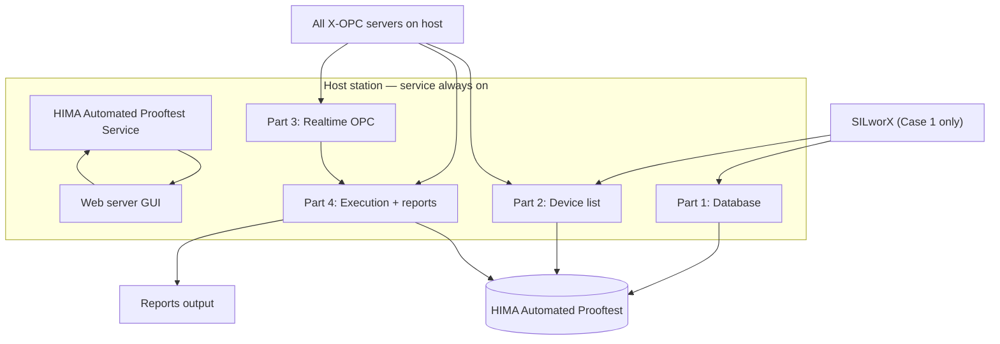

# SPEC-001 — HIMA Automated Prooftest Reporting Solution

| Field | Value |
|-------|--------|
| **Document ID** | SPEC-001 |
| **Title** | HIMA Automated Prooftest — Background Service, Multi-OPC, SQL, PDF/HTML, Web GUI |
| **Version** | 1.8 |
| **Date** | 2026-06-12 |
| **Status** | Draft |
| **Project** | Report Solution |
| **Location** | `Z:\Project\Report Solution` |
| **Filename** | `SPEC-001-v1.8-HART-Prooftest-OPC-Collection-and-PDF-Reporting.md` |
| **Supersedes** | v1.7 |

> **Versioning:** Updates require a new file (e.g. `SPEC-001-v1.4-...`). See [README.md](./README.md).

---

## 1. Purpose

Define a **continuously running** reporting solution that:

1. Runs **continuously in the background** on the station where realtime CPU data is available via X-OPC.
2. On **first start** on a station, creates the installation marker **`C:\HIMA Automated Prooftest Reports`** (folder).
3. Exposes a **web server graphical interface** for operators and engineers.
4. Supports **automatic and manual** update of device lists and the SQL database.
5. **Detects Prooftest initiation**, waits until the test **ends**, takes a **snapshot** of the Results structure, and stores it in the dedicated SQL table.
6. Generates a **PDF or HTML** report automatically after any Prooftest type completes.
7. Is **flexible** across SILworX projects, manufacturers, multiple X-OPC servers, and multiple configurations/resources.
8. Supports **two deployment architectures** (Case 1 and Case 2) defined in §3.

---

## 2. Global solution requirements

| # | Requirement | Detail |
|---|-------------|--------|
| **G-01** | Background operation | Windows Service (primary) or equivalent daemon; auto-start on boot; survives user logoff |
| **G-02** | First-run marker | On first start on a station, create folder `C:\HIMA Automated Prooftest Reports\` if it does not exist; write `installation.json` (version, station name, first-run timestamp) inside |
| **G-03** | Web GUI | Embedded HTTP server (e.g. Flask/FastAPI + browser UI); bind configurable host/port (default `localhost:8080`) |
| **G-04** | Auto + manual sync | Automatic triggers per architecture (§4–§5); **Refresh / Reset** button in GUI forces immediate DB schema sync, device list rebuild, and OPC re-discovery |
| **G-05** | Prooftest lifecycle | Detect `Running` **FALSE → TRUE** (test started); monitor until **TRUE → FALSE** (test ended); snapshot all other Results members at end |
| **G-06** | Report formats | Configurable `pdf`, `html`, or `both`; default `pdf` |
| **G-07** | Multi-project / multi-OPC | Not hard-coded to one plant; see §3.3 |
| **G-08** | Station placement | Must run on the station where X-OPC serves realtime CPU data (Case 1 or Case 2) |



---

## 3. Deployment architectures

Realtime CPU data is available only where the **X-OPC server** runs. SILworX may be co-located or remote.

### 3.1 Case 1 — OPC and SILworX on Engineering station

| Component | Location |
|-----------|----------|
| SILworX | Engineering station |
| X-OPC server(s) | Same Engineering station |
| This solution | Same Engineering station |

**Database and device list** are driven from the **SILworX running project** (global variables and Results data types).

### 3.2 Case 2 — OPC on HMI, SILworX on Engineering station

| Component | Location |
|-----------|----------|
| SILworX | Engineering station (remote) |
| X-OPC server(s) | HMI station |
| This solution | **HMI station** (with OPC) |

**Database** is driven from **SQL table templates** dropped into a watch folder. **Device list** is built by matching **OPC realtime tags** to Results structure definitions (CSV).

### 3.3 Flexibility (both cases)

| Dimension | Requirement |
|-----------|-------------|
| **SILworX projects** | Configurable project path(s); Case 1 reads globals from active project |
| **Manufacturers** | Nine HART Results types (§4); extensible when new CSV/template appears |
| **X-OPC servers** | Discover and connect to **all** running X-OPC servers on the host |
| **Configurations** | Multiple SILworX configurations; store `Configuration` per device |
| **Resources** | Multiple HIMA resources; store `Resource` per device |

Configuration file: `solution.ini` — includes `deployment_case = 1` or `2`, paths, SQL connection, OPC filters, report format.

---

## 4. Supported Results structures (SILworX library)

| # | SILworX data type | CSV file |
|---|-------------------|----------|
| 1 | `X-HART_ABB_FCB400_Results` | `X-HART_ABB_FCB400_Results.csv` |
| 2 | `X-HART_Emerson_3051S_Results` | `X-HART_Emerson_3051S_Results.csv` |
| 3 | `X-HART_E+H_PMx7xB_Results` | `X-HART_E+H_PMx7xB_Results.csv` |
| 4 | `X-HART_E+H_FTL5xB/6x_Results` | `X-HART_E+H_FTL5xB-6x_Results.csv` |
| 5 | `X-HART_E+H_FMR6xB_Results` | `X-HART_E+H_FMR6xB_Results.csv` |
| 6 | `X-HART_E+H_Promass300/500_Results` | `X-HART_E+H_Promass300-500_Results.csv` |
| 7 | `X-HART_SAMSON_Results` | `X-HART_SAMSON_Results.csv` |
| 8 | `X-HART_WIKA_T32_Results` | `X-HART_WIKA_T32_Results.csv` |
| 9 | `X-HART_WIKA_T38_Results` | `X-HART_WIKA_T38_Results.csv` |

**CSV root (configurable):**

- Spec reference path: `Z:\Project\Report Solution\Results Structures\`
- Project repository path: `Z:\Project\Report Solution\3- Results Structures\`

**CSV format:**

```text
Name, Data type, Initial Value, Sequence Number
X-HART_..._Results.<Member>, <SILworX type>, , <seq>
```

Example: `X-HART_E+H_Promass300/500_Results.Running` → `BOOL`

**SQL table naming rule (Part 1):**

Replace prefix `X-HART_` with `ProofTest_` and sanitize `/` → `_` for SQL identifiers.

| SILworX structure | SQL table name |
|-------------------|----------------|
| `X-HART_E+H_Promass300/500_Results` | `ProofTest_E+H_Promass300_500_Results` |
| `X-HART_E+H_FTL5xB/6x_Results` | `ProofTest_E+H_FTL5xB_6x_Results` |
| `X-HART_E+H_PMx7xB_Results` | `ProofTest_E+H_PMx7xB_Results` |

Bracket-quoted names: `dbo.[ProofTest_E+H_Promass300_500_Results]`

---

# Part 1 — Database creation and update

## P1.0 Common rules (both cases)

| Rule | Detail |
|------|--------|
| Database name | **`HIMA Automated Prooftest`** — create if not exists, else use existing |
| Engine | Microsoft SQL Server |
| Schema source | SQL table templates (§P1.2) adapted to `HIMA Automated Prooftest` (replace `USE [ProofTest]` in scripts) |

**SQL table templates directory (configurable):**

- Spec reference path: `C:\Project\Report Solution\2- SQL Tables template\`
- Project repository path: `Z:\Project\Report Solution\2- SQL Tables template\`

**Known templates (repository):**

| Template file | Legacy table name in script | Maps to Results type |
|---------------|----------------------------|----------------------|
| `Prooftest_Cerabar_V1_5.sql` | `Cerabar_PMx7xB_V1_5` | `X-HART_E+H_PMx7xB_Results` |
| `Prooftest_Promass_V1_5.sql` | `Promass_300_500_V1_5` | `X-HART_E+H_Promass300/500_Results` |
| `Prooftest_Liquiphant_V1_5.sql` | `Liquiphant_FTLxxB_V1_5` | `X-HART_E+H_FTL5xB/6x_Results` |
| `Prooftest_SAMSON_3793_V1_5.sql` | `SAMSON_3793_V1_5` | `X-HART_SAMSON_Results` (variant) |
| `Prooftest_SAMSON_3730_3_V1_5.sql` | `SAMSON_3730_3_V1_5` | `X-HART_SAMSON_Results` (variant) |

When creating tables from templates, **rename** to `ProofTest_*` per §4. Additional types without templates: generate DDL from CSV (v1.2 rule) until a template is supplied.

**Mandatory metadata columns** (add to every type table if not in template):

| Column | Type | Description |
|--------|------|-------------|
| `RecordID` | `BIGINT IDENTITY` | PK if template uses `ID` only — align with template |
| `Device_TAG` | `NVARCHAR(128)` | Device identifier (Part 2) |
| `Configuration` | `NVARCHAR(64)` NULL | SILworX configuration |
| `Resource` | `NVARCHAR(64)` NULL | SILworX resource |
| `OPC_Server` | `NVARCHAR(128)` NULL | Source X-OPC ProgID |
| `CollectedAt` | `DATETIME2` | Snapshot timestamp |
| `ReportPath` | `NVARCHAR(512)` NULL | Generated report path |
| `SequenceInBatch` | `INT` NULL | Parallel test order (Part 4) |

---

## P1.1 Case 1 — Engineering station (OPC + SILworX)

1. Create or connect to database **`HIMA Automated Prooftest`**.
2. For each Results type, read the **CSV** from Results Structures (§4).
3. Results structures are **data types** of global variables in the SILworX application program.
4. **Scan the running SILworX project** and identify all Results structures in use.
5. For each detected Results type, **create a SQL table** named per §4 (`ProofTest_*`), using the matching template from `2- SQL Tables template\` when available; otherwise derive from CSV.
6. **Update tables** every time SILworX **code generation** completes and the project is **downloaded**:
   - Create tables for **new** Results structures detected.
   - `ALTER TABLE` add new columns from updated CSV/template.
   - Do not drop columns without a migration script.

### P1.1.1 SILworX open-project detection (Case 1)

While SILworX is running with a project open, the solution **must**:

1. **Detect that SILworX is open** — scan `C:\ProgramData\SILworX_v*\sessions\*\lock.ini` (config: `programdata_root`).
2. **Identify the open project** from `lock.ini`:
   - **`src`** → original project file (e.g. `Z:\...\ProofTest-Reporting solution.E3`)
   - **`data`** → live session working copy (e.g. `C:\ProgramData\SILworX_v14.1.0 R673\sessions\0x485f\data\...`)
   - **Project name** → stem of the `.E3` file (e.g. `ProofTest-Reporting solution`)
3. **Publish status** in `ServiceState` and `GET /api/health` → `silworx` object:
   - `silworx_open`, `silworx_project_name`, `silworx_project_src`, `silworx_session_data`, `silworx_version`, `silworx_session_id`
4. **Prefer the configured project** in `solution.ini` `[SILworX] projects` when multiple sessions exist.

**Live session database (while open):** `...\data\<Project>.E3\c3data\objects.dat` (+ `objects.idx`, recovery, eventlog). Global variable edits are persisted here when the user **saves** in SILworX.

**Automatic sync triggers (Case 1):**

| Trigger | Detection | Config key |
|---------|-----------|------------|
| **SILworX session modified** | Aggregate mtime of open session `c3data\` tree increased | `sync_triggers` → `silworx_session` |
| Code generation completed | `.E3` on `src` mtime increased when SILworX **closed** (no active session) | `code_generation` |
| Project downloaded | Same as above when SILworX closed | `download` |
| New CSV in Results Structures | Aggregate mtime of `3- Results Structures\*.csv` | `results_structures` |
| Manual | Web GUI **Refresh / Reset** or `POST /api/refresh` | always |

When **`silworx_session`** fires: execute full update — OPC re-discovery, device list rebuild (Part 2.1), SQL schema sync (Part 1.1), OPC cache invalidation.

Background loop polls Case 1 triggers every **`case1_sync_poll_sec`** (default **2 s**). On any trigger: reload structures when needed, rebuild device list, sync SQL schema, commit sync markers.

> **Note:** Device list (Part 2.1) is **not** read from a manual globals CSV. After any SILworX session trigger, the solution rescans **X-OPC** and rebuilds the device list (same OPC matching rules as Part 2.2).

---

## P1.2 Case 2 — HMI station (OPC only)

1. Create or connect to database **`HIMA Automated Prooftest`**.
2. Create tables from templates in `2- SQL Tables template\`, renamed to `ProofTest_*` per §4.
3. **Every 1 second**, check the template directory for **new template files**; for each new template not yet applied, create the corresponding table in `HIMA Automated Prooftest`.

**Automatic sync (Case 2):** 1 s template folder poll.

**Manual sync:** Web GUI **Refresh / Reset** forces immediate template scan and table creation.

---

# Part 2 — Prooftest device list

## P2.0 Device Prooftest Result List (both cases)

**Table:** `dbo.DeviceProoftestResultList`

| Column | Type | Description |
|--------|------|-------------|
| `Device_TAG` | `NVARCHAR(128)` PK | Device identifier (see case rules) |
| `Results_Type` | `NVARCHAR(128)` | SILworX structure name |
| `Configuration` | `NVARCHAR(64)` NULL | |
| `Resource` | `NVARCHAR(64)` NULL | |
| `OPC_Server` | `NVARCHAR(128)` NULL | Resolved server |
| `OPC_ItemPrefix` | `NVARCHAR(256)` NULL | OPC branch prefix |
| `IsActive` | `BIT` | 0 = removed |
| `LastSeenAt` | `DATETIME2` | |
| `LastRunning` | `BIT` NULL | Edge detection |
| `TestInProgress` | `BIT` NULL | TRUE while `Running` is TRUE |

Each row must include **`Device_TAG`** and **`Results_Type` (Result structure)**.

---

## P2.1 Case 1 — From X-OPC after SILworX project sync

1. When a SILworX sync trigger fires (§P1.1.1) or on manual refresh, scan **all X-OPC servers** (Part 3).
2. Discover devices using the same OPC rules as Part 2.2 (`.Running` tags, structure member scoring).
3. Set **`Device_TAG`**, **`Results_Type`**, **`OPC_Server`**, **`OPC_ItemPrefix`** from the OPC match.
4. **No manual globals CSV** is required or used in normal operation.
5. On each sync:
   - **Add** new devices found in OPC.
   - **Update** types when OPC structure match changes.
   - **Deactivate** devices no longer present in OPC.
   - **Create / update** `ProofTest_*` tables for active Results types.

---

## P2.2 Case 2 — From OPC realtime vs CSV structures

1. Compare **realtime data on every running X-OPC server** to each Results structure defined in the CSV files (§4).
2. On **structural match**, add to Device Prooftest Result List with:
   - **`Device_TAG`** = **device node name** (e.g. `100-FZT-001`)
   - **`Results_Type`** = matched SILworX structure (e.g. `X-HART_E+H_PMx7xB_Results`)
   - **`OPC_Server`** = server where found (e.g. `HIMA.X-OPC_10406_ProofTes-DA.1`)
   - **`OPC_ItemPrefix`** = full OPC path to the device node (e.g. `OTS ProofTest.100-FZT-001`)
3. **Every 2 seconds**: re-scan all servers; add new devices; deactivate removed ones.

### OPC Prooftest tree (reference — OTS Demo)

Validated in Softing OPC Toolbox on server **`HIMA X-OPC DA (X-OPC_10406_ProofTes)`**:

```text
HIMA X-OPC DA (X-OPC_10406_ProofTes)
├── OPC ProofTest
└── OTS ProofTest
    ├── 100-FZT-001          ← Device_TAG (Results structure instance)
    │   ├── Running
    │   ├── Error
    │   ├── Actual Value 1 … 5
    │   ├── Block Running
    │   ├── Heartbeat Verification Result
    │   └── … (all CSV members)
    ├── 100-FZT-002
    ├── 100-XV-001_FST
    └── 100-XV-001_PST
```

**OPC item ID format:** `{Branch}.{Device_TAG}.{Member}`  
Example: `OTS ProofTest.100-FZT-001.Running`

| Field | Example | Rule |
|-------|---------|------|
| Device_TAG | `100-FZT-001` | **Last segment** of the device node under `OTS ProofTest` / `OPC ProofTest` |
| OPC_ItemPrefix | `OTS ProofTest.100-FZT-001` | Branch + device node; used for all member reads |
| Results type | `X-HART_E+H_PMx7xB_Results` | Highest CSV member match score (≥ 3), must include `Running` |

**Browse branches (config `prooftest_branches`):** `OTS ProofTest`, `OPC ProofTest` — not general I/O branches such as `OTS MIRO_T2_1`.

**Matching rule:** For each server and Prooftest branch, find tags ending in `.Running`; parent path = `OPC_ItemPrefix`; leaf name before `.Running` = `Device_TAG`; score member names against CSV (spaces ignored). Prefer highest score when duplicate tags exist on multiple servers.

**SILworX globals override (optional):** When `globals_export` is available, use the SILworX **data type** for a known `Device_TAG` instead of the highest OPC score (e.g. `100-FZT-001` → `X-HART_E+H_PMx7xB_Results`).

---

# Part 3 — Realtime data reading

1. All Results structure **realtime values** are read from **X-OPC servers** (OPC Classic DA).
2. The solution **must search every running X-OPC server on the host** — not a single primary server. Prooftest Results may be published on a different X-OPC instance than general I/O (e.g. `HIMA.X-OPC_ProofTest-DA.1` vs `HIMA.X_OPC-25138-DA.1`).

| Step | Action |
|------|--------|
| 1 | Enumerate **all** OPC DA servers (`opc.servers()` / OpcEnum) |
| 2 | Filter to X-OPC / HIMA (config: `*X_OPC*`, `*HIMA*`) |
| 3 | Connect to **each** running server |
| 4 | Browse tags on **each** server (configured branch **and** full tree; Prooftest servers prefer full-tree browse first) |
| 5 | For device discovery (Case 2): scan **all** servers for `.Running` tags; match Results structure members; store winning `(OPC_Server, ItemPrefix)` per device |
| 6 | For monitoring (Part 4): if cached server fails, **re-resolve** across all servers before each read cycle |
| 7 | Read **leaf** OPC items only; cache per `(server, prefix)`; invalidate on Refresh |

**Multi-server rules:**

| ID | Rule |
|----|------|
| P3-01 | Never limit discovery or reads to one X-OPC server unless only one is running |
| P3-02 | When the same device tag appears on multiple servers, keep the match with the **highest structure score** |
| P3-03 | Log server name and tag count for each connected X-OPC server in service health |
| P3-04 | Failed browse on one server must **not** stop scan of remaining servers |

**Poll intervals:**

| Loop | Interval |
|------|----------|
| `Running` monitor + snapshot (Part 4) | **1 second** |
| Case 1 sync trigger poll (globals / E3 / Results CSV) | **2 seconds** (`case1_sync_poll_sec`) |
| Device list Case 2 | **2 seconds** (Part 2.2) |
| Template watch Case 2 | **1 second** (Part 1.2) |

Reference OPC client: `Z:\Project\Report Solution\Codes\Report-Tool\Connection-opc.py` (32-bit Python, `HIMA.X_OPC-25138-DA.1`).

---

# Part 4 — Prooftest execution detection

## P4.1 Monitoring (1 second)

**Case 1:** Each cycle, refresh global-variable-based device list when sync trigger fired.

For each **active** device with a Results type:

1. Read `Running` via OPC (Part 3).
2. Track state transitions on `DeviceProoftestResultList`:

| Transition | Action |
|------------|--------|
| `FALSE → TRUE` | Set `TestInProgress = 1`; log test **started** (optional UI indicator) |
| `TRUE → FALSE` | Test **ended** — execute §P4.2 |

## P4.2 Snapshot on test end

When **`Running`** changes **`TRUE → FALSE`**:

1. Read **all other members** of that device's Results structure from OPC.
2. Map values into the row layout of the type's SQL table (`ProofTest_*`).
3. `INSERT` one row into that table with `Device_TAG`, metadata, `CollectedAt`.
4. Trigger report generation (Part 5).
5. Update `ReportPath` on the row; set `TestInProgress = 0`.

**Guard:** Do not snapshot or generate a report if `Running` is still `TRUE`.

## P4.3 Report output on database change

| Rule | Value |
|------|--------|
| Output directory | `Z:\Project\Report Solution\Reports\` (configurable) |
| Filename | `{Device_TAG}_{Report_Generation_DateTime}.pdf` or `.html` |
| DateTime format | `yyyy-MM-dd_HH-mm-ss` |
| Example | `100-FZT-001_2026-05-20_14-32-05.pdf` |

Also mirror or symlink to `C:\HIMA Automated Prooftest Reports\` if configured.

## P4.4 Parallel Prooftests (same device / same table)

When multiple completions occur while report generation is in progress for the same device/type:

### Preferred — staging table copies

1. Assign sequence (first, second, third, …) at enqueue time → `SequenceInBatch`.
2. Create a **temporary copy** of the target table (or single-row staging table) for that result.
3. Generate PDF/HTML from the copy.
4. **Delete** staging copy after successful report.
5. Persist final row in the permanent table.

### Fallback — sequential fill

If staging copy fails (e.g. insufficient storage):

1. Process queue **in order**.
2. Fill table with result 1 → generate report → proceed to result 2 → repeat.

| ID | Requirement |
|----|-------------|
| P4.4-01 | Never lose a completed result |
| P4.4-02 | Preserve order in `SequenceInBatch` |
| P4.4-03 | Log warning and surface alarm when fallback mode is used |

---

# Part 5 — Prooftest PDF / HTML report generation

## P5.1 Engine

Reuse **Alternative Reporting** stack: HTML template + optional WeasyPrint → PDF.

Reference: `Z:\Project\Report Solution\Alternative Reporting\2025-07-28\11-10\`

Templates per Results type under `Z:\Project\Report Solution\Templates\` (configurable).

**Format selection (`solution.ini`):**

```ini
[Reports]
format = pdf          ; pdf | html | both
output_directory = Z:\Project\Report Solution\Reports
local_mirror = C:\HIMA Automated Prooftest Reports
```

## P5.2 Structure and writing rules

| Condition | Report result line text |
|-----------|-------------------------|
| `Error = True` (or `1`) | **Prooftest Unsuccessful** |
| `Error = False` and success indicators | **Prooftest Successful** (or template-specific text) |
| `Heartbeat Verification Result = 809` | **Successful** |
| `Heartbeat Verification Result = 33161` | **Not done** |
| OPC quality not Good | **Data quality error — result may be incomplete** |
| `Running` still True at snapshot | Must not generate report |

**General rules:**

- BOOL: **Yes** / **No** where templates use yes/no styling.
- Timestamps: plant local time per config.
- REAL: configurable decimal places (e.g. 3 for mA).
- Null / missing: **—** or **N/A**.
- `Error Code` DWORD: expand per device manual where template defines bit masks.

## P5.3 Template mapping (examples)

| Results type | Template reference |
|--------------|-------------------|
| `X-HART_E+H_PMx7xB_Results` | Cerabar / `Prooftest_Cerabar_V1_5` |
| `X-HART_E+H_Promass300/500_Results` | `Prooftest_Promass_V1_5` |
| `X-HART_E+H_FTL5xB/6x_Results` | `Prooftest_Liquiphant_V1_5` |
| `X-HART_SAMSON_Results` | `Prooftest_SAMSON_3793_V1_5` or `3730_3` |

Full mapping in `result_types.ini`.

---

# Part 6 — Web graphical interface, errors, and alarms

## P6.1 Web UI components

Embedded HTTP server; browser-based UI (no separate desktop app required).

| # | Component | Behavior |
|---|-----------|----------|
| **1** | **Device list** (scrolling) | All `Device_TAG` from latest Device Prooftest Result List (`IsActive = 1`); user selects one device |
| **2** | **Report list** (scrolling) | PDF/HTML reports for **selected device** from output directory and/or `ReportPath` in SQL; newest first |
| **3** | **Open report** button | Opens selected report in browser (HTML) or downloads/opens PDF |
| **4** | **Refresh / Reset** button | Manual update: schema sync (Part 1), device list rebuild (Part 2), OPC re-discovery, clear transient errors; re-show persistent errors (§P6.3) |
| **5** | **Alarm / Error indication zone** | Persistent panel: active alarms, last error, service health (DB, OPC count, last poll) |
| **6** | **Error popups** | Modal on **first occurrence** of each distinct error; on **Refresh** if error still active |

## P6.2 Error popup content

Each popup must state:

1. **Step / action** where the error occurred (e.g. Part 1 — create `C:\HIMA Automated Prooftest Reports`, Part 3 — OPC read).
2. **Reason** when known (exception message, SQL error code, OPC quality).
3. **Possible solutions** (actionable checklist).

**De-duplication:** Same error key (step + code) shown once until cleared or Refresh pressed while still failing.

Log all errors to `dbo.AlarmLog` (`Timestamp`, `Severity`, `Step`, `Device_TAG`, `Message`, `SolutionHint`, `Acknowledged`).

## P6.3 Diagnostic and troubleshooting catalog

| Step | Error condition | Likely cause | Possible solutions |
|------|-----------------|--------------|-------------------|
| **G-02** | Cannot create `C:\HIMA Automated Prooftest Reports` | Permissions, disk full, path blocked | Run service as user with write access to `C:\`; free disk space; check antivirus policy |
| **P1** | Cannot create database `HIMA Automated Prooftest` | SQL Server stopped, wrong instance, login failed | Start SQL Server; verify `solution.ini` server name; grant `dbcreator` / appropriate role |
| **P1** | Table creation from template failed | Syntax error, name collision, permission | Review template SQL log; drop orphan staging tables; check `CREATE TABLE` rights |
| **P1-C1** | SILworX project not found | Wrong path, project locked, not downloaded | Update `solution.ini` project path; close SILworX lock; complete download |
| **P1-C1** | No Results structures in project | No globals use HART Results types | Add devices in SILworX; run code generation |
| **P1-C2** | Template folder not found | `C:\Project\...` not deployed on HMI | Copy `2- SQL Tables template` to station; set path in `solution.ini` |
| **P2-C1** | Global variable export failed | Export API/path unavailable | Use SILworX export file; trigger after code generation |
| **P2-C2** | No devices matched in OPC | Tags not deployed, wrong branch, server down | Verify OPC branch filter; confirm SILworX download to CPU; start X-OPC service |
| **P3** | No X-OPC server on host | Service stopped, wrong bitness, DLL not registered | Start `X_OPC-*` Windows service; use **32-bit** Python; register `OPCDAAuto.dll` |
| **P3** | OPC connect failed | Invalid ProgID, DCOM, firewall | Confirm `HIMA.X_OPC-*-DA.1` in OpcEnum; align DCOM identity; local firewall |
| **P3** | OPC read failed for device | Leaf tag missing, stale cache | Browse OPC tree; update `OPC_ItemPrefix`; use readable leaf (e.g. `.IN1`) |
| **P3** | Bad OPC quality | CPU offline, subscription error | Check HIMA CPU connection; restart OPC server |
| **P4** | Snapshot skipped — Running still True | Race condition, poll delay | Expected guard; increase poll rate only if needed |
| **P4** | INSERT into SQL failed | Type mismatch, missing column | Re-run schema sync; check CSV/template alignment |
| **P4.4** | Staging table copy failed | Disk full, lock timeout | Free space; fallback sequential mode; review alarm |
| **P4.4** | Queue overflow / timeout | Too many parallel tests | Increase queue size; sequential fallback; split devices |
| **P5** | PDF generation failed | WeasyPrint/GTK missing, template error | Install WeasyPrint deps; validate HTML template path |
| **P5** | HTML generation failed | Template missing, bad binding | Add template in `result_types.ini`; check SQL row mapping |
| **P5** | Report directory not writable | `Z:\` or `C:\` path missing, permissions | Create folder; grant service account write access |
| **P6** | Web server port in use | Another process on 8080 | Change `web_port` in `solution.ini` |
| **P6** | Web UI cannot reach service | Service stopped, wrong bind address | Start Windows service; set `web_host=0.0.0.0` only if network policy allows |

## P6.4 Web API (implementation note)

Minimum endpoints for UI:

- `GET /api/devices` — active device list
- `GET /api/reports?device={tag}` — reports for device
- `GET /api/reports/open?path=...` — serve or redirect to file
- `POST /api/refresh` — manual sync (Part 1 + 2 + OPC discovery)
- `GET /api/alarms` — alarm zone data
- `GET /api/health` — DB, OPC, queue status

Service process hosts web server; OPC 1 s loop must not block on HTTP (async or worker threads).

---

## 5. System tables summary

| Table | Purpose |
|-------|---------|
| `dbo.DeviceProoftestResultList` | Part 2 — devices |
| `dbo.[ProofTest_*]` | Part 1 / 4 — completed test rows per type |
| `dbo.AlarmLog` | Part 6 — errors and diagnostics |
| `dbo.SchemaVersion` | Last template/CSV hash per type |
| `dbo.ServiceState` | Last poll, OPC servers, queue depth, deployment case |

---

## 6. Configuration file (`solution.ini`)

```ini
[Service]
run_mode = windows_service
auto_start = true
deployment_case = 1          ; 1 = Engineering, 2 = HMI

[Paths]
first_run_folder = C:\HIMA Automated Prooftest Reports
results_structures = Z:\Project\Report Solution\3- Results Structures
sql_templates = Z:\Project\Report Solution\2- SQL Tables template

[Database]
name = HIMA Automated Prooftest
server = localhost\SQLEXPRESS

[SILworX]
; Case 1 only
programdata_root = C:\ProgramData
projects = Z:\Project\SILworX\OTS Demo\ProofTest-Reporting solution\ProofTest-Reporting solution.E3
sync_triggers = silworx_session, code_generation, download, results_structures

[OPC]
discover_all_servers = true
server_filter = *X_OPC*;*HIMA*
poll_interval_sec = 1
case1_sync_poll_sec = 2      ; Case 1 trigger poll
device_list_poll_sec = 2     ; Case 2 only
template_poll_sec = 1        ; Case 2 only
default_branch = OTS ProofTest
prooftest_branches = OTS ProofTest; OPC ProofTest

[Reports]
format = pdf                 ; pdf | html | both
output_directory = Z:\Project\Report Solution\Reports
local_mirror = C:\HIMA Automated Prooftest Reports
filename_pattern = {Device_TAG}_{DateTime:yyyy-MM-dd_HH-mm-ss}

[Web]
host = 127.0.0.1
port = 8080
```

---

## 7. Non-functional requirements

| ID | Requirement |
|----|-------------|
| NFR-01 | Service runs 24/7; automatic restart on failure |
| NFR-02 | 1 s OPC cycle for ≤ 200 active devices |
| NFR-03 | Case 1: schema sync within 60 s of SILworX download |
| NFR-04 | Report within 30 s of test end (single device, no queue) |
| NFR-05 | ≥ 3 simultaneous X-OPC connections |
| NFR-06 | Credentials outside source code |
| NFR-07 | Web UI responsive on localhost; no auth required in v1 (plant network policy may add later) |

---

## 8. Implementation phases

| Phase | Deliverable |
|-------|-------------|
| **P1** | Service shell + first-run folder + `HIMA Automated Prooftest` DB + Case 1/2 schema sync |
| **P2** | Device Prooftest Result List (Case 1 SILworX + Case 2 OPC match) |
| **P3** | Multi-OPC discovery + 1 s realtime read |
| **P4** | Running edge detection + snapshot + parallel queue |
| **P5** | PDF/HTML rules + templates |
| **P6** | Web GUI + alarms + diagnostic popups + manual refresh |

---

## 9. Acceptance criteria

1. Service runs continuously in background after install.
2. First start creates `C:\HIMA Automated Prooftest Reports\`.
3. Database **`HIMA Automated Prooftest`** exists with `ProofTest_*` tables per detected types.
4. **Case 1:** Device list updates after SILworX code generation / download; **Case 2:** list updates within 2 s of OPC tag appearance.
5. Realtime values read from **all** running X-OPC servers on the host.
6. Test start (`Running` FALSE→TRUE) and end (TRUE→FALSE) detected; snapshot stored with correct `Device_TAG`.
7. PDF and/or HTML saved under Reports path with `{Device_TAG}_{datetime}` naming.
8. `Error = True` renders **Prooftest Unsuccessful** in report.
9. Parallel completions produce ordered reports without data loss.
10. Web UI lists devices and reports; Open and Refresh work.
11. Errors show one-time popup with step, reason, and solutions per §P6.2–P6.3.

---

## 10. Related paths

| Item | Path |
|------|------|
| Results CSV files | `Z:\Project\Report Solution\3- Results Structures\` |
| SQL table templates | `Z:\Project\Report Solution\2- SQL Tables template\` |
| PDF/HTML output | `Z:\Project\Report Solution\Reports\` |
| Local mirror / first-run | `C:\HIMA Automated Prooftest Reports\` |
| SILworX reference project | `Z:\Project\SILworX\OTS Demo\ProofTest-Reporting solution\` |
| OPC client reference | `Z:\Project\Report Solution\Codes\Report-Tool\Connection-opc.py` |
| Report engine reference | `Z:\Project\Report Solution\Alternative Reporting\2025-07-28\11-10\` |
| Spec v1.2 | [SPEC-001-v1.2](./SPEC-001-v1.2-HART-Prooftest-OPC-Collection-and-PDF-Reporting.md) |
| Versioning | [README.md](./README.md) |

---

## 11. Open items

- [ ] Optional: dedicated SILworX **code generation log** watch (currently `.E3` mtime only).
- [ ] Complete SQL templates for remaining Results types (ABB, Emerson, FMR, WIKA).
- [ ] Map `ProofTest_*` table columns to OPC/CSV members for all nine types.
- [ ] Authentication for web UI on plant networks.
- [ ] SAMSON 3793 vs 3730 template selection rule when both match.

---

## 12. Document history

| Version | Date | Author | Changes |
|---------|------|--------|---------|
| 1.0 | 2026-05-20 | Report Solution | Initial OPC-centric specification |
| 1.1 | 2026-05-20 | Report Solution | SILworX globals; per-device tables; 1 s poll; Running edge |
| 1.2 | 2026-05-20 | Report Solution | Background service; multi-project/multi-OPC; CSV-driven type tables; parallel queue; desktop GUI; PDF rules |
| 1.3 | 2026-05-20 | Report Solution | **Web server GUI**; `C:\HIMA Automated Prooftest Reports` first-run folder; **Case 1 / Case 2** architectures for Part 1–2; `ProofTest_*` SQL naming + template directory; manual **Refresh**; test **start + end** detection; **PDF/HTML**; expanded error popups and **diagnostic catalog**; renumbered parts to match user specification |
| 1.4 | 2026-06-11 | Report Solution | **All X-OPC servers** scanned for device discovery and realtime reads (not one primary server); Prooftest-server full-tree browse; multi-server match scoring; **code-driven spec update** rule in README |
| 1.5 | 2026-06-12 | Report Solution | **OPC Prooftest tree** documented (`OTS ProofTest` / `OPC ProofTest`); **Device_TAG** = node name (`100-FZT-001`); browse `prooftest_branches`; exclusive per-server OPC connect; example server `X-OPC_10406_ProofTes` |
| 1.6 | 2026-06-12 | Report Solution | **Case 1 automatic sync**: watch `globals_export` CSV mtime and Results Structures folder; `case1_sync_poll_sec`; top-level globals-only device list; `globals_export` path example `Globale variable.csv` |
| 1.7 | 2026-06-12 | Report Solution | **SILworX session detection**: open-project identity via `ProgramData\SILworX_v*\sessions\*\lock.ini`; continuous `c3data` modification watch while project open; health/API `silworx` status fields; full refresh on session change |
| 1.8 | 2026-06-12 | Report Solution | **Case 1 device list from OPC** (not manual globals CSV); removed `globals_export` sync trigger; SILworX session change → OPC rescan |

---

*End of document*
