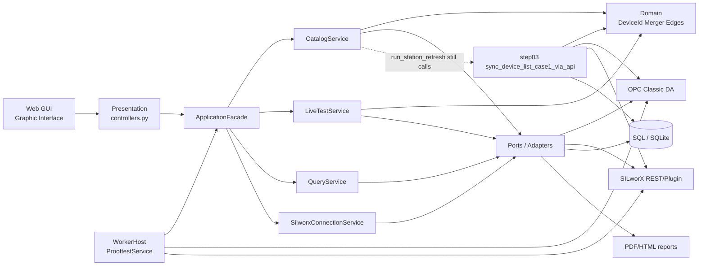

# Architecture as built (not the ideal prompt)

| Field | Value |
|-------|--------|
| **Code** | HIMA-Prooftest-Solution-Current **1.74+** |
| **Date** | 2026-08-20 |

## Hub diagram (what exists now)

## Implemented vs missing

| Piece | Status |
|-------|--------|
| Presentation → Application only | **Implemented** (1.74) |
| DeviceId composite | **Implemented** |
| Close/Resume SILworX (tool only) | **Implemented** |
| GUI Project / OPC columns | **Implemented** |
| Domain merger + edge detector | **Implemented** |
| Single production refresh without step03 | **Missing** (delegates to step03) |
| OPC-only without CSV score | **Missing** |
| LiveTestService-only poll | **Missing** (step05 monitor still production) |

## Station vs code

- **Code:** Documents `...\HIMA-Prooftest-Solution-Current`
- **Data:** `C:\HIMA Prooftest Reporting Tool\` (Reports, Results Structures, Database)
