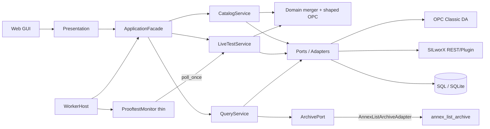

# Architecture as built (not the ideal prompt)

| Field | Value |
|-------|--------|
| **Code** | HIMA-Prooftest-Solution-Current **1.77** |
| **Date** | 2026-08-20 |
| **Path** | `C:\Users\Administrator\Documents\Report Solution\Codes\HIMA-Prooftest-Solution-Current` |

## Product mode

**Case 1 / Case 2 as product modes are retired.** One unified mode only:

- SILworX tool attached → identities + `Results_Type` from API; OPC = construct bind path + live values.
- SILworX not attached → OPC-only with **shape gate** (CSV as filter, not invent-as-identity).
- Names like `case1_*` / `sync_device_list_case1_via_api` are leftover UNIFIED path labels or **test-only shims** (aliases: `SilworxSyncTriggers`, `sync_device_list_via_api`).

## Hub diagram (what exists now)



## Gaps A / B / C

| Piece | Status | Evidence |
|-------|--------|----------|
| **A — OPC-only shaped (no invent)** | **Implemented** | `layers/domain/opc_discover.py`; adapter + `discover_devices_from_opc` use shape gate; invent scorer is test-only (`_discover_on_server_invent_legacy`) |
| **B — Single RefreshCatalog writer** | **Implemented** | `CatalogService.run_station_refresh` → `refresh_catalog` (ports); does **not** call `sync_device_list_case1_via_api`; step03 sync is deprecated shim for old gate tests only |
| **C — LiveTestService-only poll** | **Implemented** | `ProoftestMonitor.poll_devices` → `LiveTestService.poll_once`; production wires `live_service=app.live` |

### Shape gate vs invent

| Rule | Invent (REJECTED as main) | Shape gate (CURRENT) |
|------|---------------------------|----------------------|
| Candidate | Any `*.Running` | Only `{OTS\|OPC} ProofTest.{TAG}.Running`, TAG no `.` |
| CSV role | Score ≥3 **invents** type | ≥3 members shared = **admit**; type = last SQL **or** clear winner (best≥3 and best−second≥2) **or** unknown |
| Unknown type | N/A (always typed) | Listed; **no** `ProofTest_*` snapshot until type known; UI shows **unknown** |

### 1.77 hygiene (ports / safety)

| Piece | Status |
|-------|--------|
| `ArchivePort` + `AnnexListArchiveAdapter` | **Implemented** — QueryService does not import annex |
| HTML template seed resolve order | **Implemented** — config → Documents → packaged → Z last |
| `validate_sql_database_name` | **Implemented** |
| `require_auth_when_non_local` / `auth_bind_warning` | **Implemented** |

## Caller evidence (grep after 1.76 / 1.77)

```text
discover_devices_from_opc
  step03_device_list.py  — definition (shaped; calls opc_discover)
  step03_device_list.py  — _discover_opc_or_none / _sync_from_opc_discovery (shim helpers)
  NOT called from adapters.py or catalog_service.run_station_refresh

_score_structure_match
  step03_device_list.py  — definition (deprecated wrapper → opc_discover.score_structure_match)
  step03_device_list.py  — _discover_on_server_invent_legacy ONLY (test-only invent)
  NOT used by OpcManagerAdapter

sync_device_list_via_api / sync_device_list_case1_via_api
  step03_device_list.py  — definition (deprecated shim; case1 name is alias)
  test_step6_devices.py  — gate test
  test_step12_case2.py   — gate test
  catalog_service.py     — comment only: "NOT called"
  NOT called from run_station_refresh / step07 production path

ProoftestMonitor.poll_devices
  step05_detection.py    — definition → self._live.poll_once(devices)
  service.py             — _poll_loop → self.monitor.poll_devices()

annex_list_archive
  adapters.AnnexListArchiveAdapter  — sole Application-facing import site
  NOT imported from query.py
```

## Station vs code

- **Code:** Documents `...\HIMA-Prooftest-Solution-Current`
- **Data:** `C:\HIMA Prooftest Reporting Tool\`
